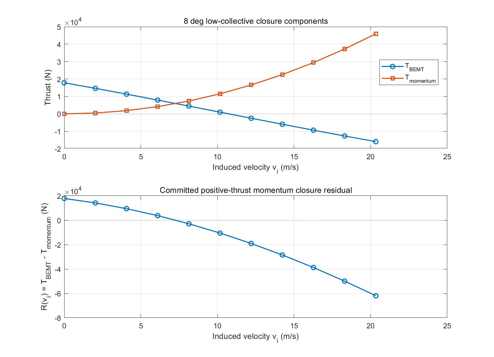

# 低总距悬停旋翼异常快速审计

## 1. 结论

本次快速审计的主分类为 **E：定义映射、构型差异、数值求解和物理分支缺失的组合问题**。

- **A 已确认**：NASA TM-86854 的 `COLL` 是 `0.75R` 处桨距，数据由总距作动器位置得到；当前代码输入是在 `rootCut=0.18R` 处零扭转基准上叠加的桨距命令。两者不能未经径向站位换算就逐度等同。
- **B 已确认**：两者桨叶数和半径近似一致，但弦长分布、实度数值、根部几何、扭转分布和翼型/极曲线不一致；转速只是在试验范围内，并非逐点同构。
- **C 已确认**：8°残差在有限物理区间内有一个清晰换号区间，但当前固定点迭代未找到；10°由 12°种子开始时在 20 次上限处已接近闭合，但仍不满足正式收敛判据。
- **D 已确认**：正式路径以 `max(loads.T,0)` 构造 Eq.13 的 `CT`，只给出非负诱导速度目标。负推力时求解器收敛到 `vi -> 0`，而不是满足原始 `T_BEMT-T_momentum=0`；负推力、零推力和风车分支未闭合。

后续独立一致性复核没有改变正式物理方程、默认参数、控制限位或负推力载荷，而是把“数值迭代返回”与“物理闭合成立”拆分为两个状态，并沿整机、配平和服务链传播。0°—10°的失败和负推力点均保留；负推力/风车分支仍未建立。

## 2. 基线与范围

|项目|值|
|---|---|
|仓库|`x162645/tiltrotor-matlab`|
|隔离 worktree（本次复核）|`E:\tiltrotor-worktrees\independent-logic-consistency-pr59-20260726`|
|审计分支（本次复核）|`codex/independent-logic-consistency-pr59-20260726`|
|PR #58 base|`codex/master-thesis-validation-full-expansion` @ `97694120eff16f0edab4b5671fb5606638d30f8e`|
|PR #58 实际远程 head|`codex/master-thesis-final-multiround-revision` @ `dad5be2f1257599301d5337e921805b61fd8c486`|
|PR #59 实际远程 head/本次基线|`codex/low-collective-quick-audit-pr58-20260726` @ `65e459504dd473f6dcf18326028f3a8a7991c55a`|
|包含关系|PR #59 head 完整包含 PR #58 当前 head；本次复核从 PR #59 实际 head 建立|

原工作区 `E:\tiltrotor` 在创建隔离 worktree 前后的分支、HEAD 和 `git status` 状态指纹完全一致。未读取或利用原工作区未提交文件内容，未对原工作区执行任何写操作。

计算量严格限制为：

1. 4°、8°、10°、12°四个代表点；
2. 8°的 11 个固定诱导速度残差点；
3. 8°和10°各两个邻点种子。

未执行 0°—22°新密集扫掠、参数优化、模型修复、负推力分支开发或整机重算。

## 3. 证据分级

### 3.1 NASA 文献直接证据

NASA 原文为 Felker、Young 和 Signor，*Performance and Loads Data from a Hover Test of a Full-Scale Advanced Technology XV-15 Rotor*，NASA TM-86854，1986。

- PDF 3、原文 1 页的 Nomenclature：`CT=T/(rho*A*Vtip^2)`。
- PDF 4、原文 2 页：试验对象为三桨叶、直径 7.62 m 的 XV-15 Advanced Technology Blade 旋翼。
- PDF 6、原文 4 页：试验旋翼实度 0.103；扭转、厚度、弦长和翼型分别见图 5—8。
- PDF 7、原文 5 页：基线根部 cuff 从约 `0.09R` 延伸到 `0.30R`；不同尖部构型占外侧 10%。
- PDF 9、原文 7 页：图 25 的总距来自作动器位置，控制系统几何非线性造成的误差估计小于约 ±1°。
- PDF 11、原文 9 页、表 1：3 片桨叶、平均弦长 0.411 m、实度 0.103、非线性扭转 -47°、翼型 V43030-1.58/VR7/VR8。
- PDF 12、原文 10 页、表 2：`COLL` 明确定义为 `blade collective pitch angle at .75 R, deg`。
- PDF 21、原文 19 页、图 5：非线性扭转在约 `0.75R` 附近通过 0°；输入 0°不表示整片桨叶安装角为 0°。
- PDF 22、原文 20 页、图 7—8：弦长沿径向变化，翼型按径向分区。
- PDF 54、原文 52 页、图 25：基线构型 `CT/sigma`—总距曲线。

NASA 表 1 把 7.62 m 标成 “Rotor radius”，但同一报告正文多次明确称其为直径；本审计采用内部一致的直径 7.62 m，即半径 3.81 m，并记录该原文矛盾。

### 3.2 代码直接证据

正式路径的关键表达式为：

```matlab
twist = P.rotor.twistTip*(rMid-r0)/(P.rotor.R-r0);
thetaBlade = rotorCtrl.collective + twist + theta1s*sin(psi);
alphaBlade = thetaBlade - phiInflow;
CT = max(loads.T,0)/(0.5*rho*A*tipSpeed^2);
viTarget = tipSpeed*CT/(4*max(sqrt(lambda1^2+mu^2),1e-12));
viNew = 0.5*(vi+viTarget);
```

因此当前 `collective=0` 的参考站位是 `rootCut=0.18R`，不是 `0.75R`。负推力不会被从最终叶素载荷中删除，但在诱导速度目标中被裁为 `CT=0`。

外部比较脚本重新使用 NASA 的

```text
CT = T/(rho*A*(Omega*R)^2)
sigma = Nb*c/(pi*R)
```

所以 `CT` 和 `sigma` 的归一化公式类别相同；这并不消除几何和总距参考站位差异。完整逐项映射见 `LOW_COLLECTIVE_DEFINITION_MAPPING.csv`。

## 4. 总距和实际几何桨距

当前线性扭转为

```text
theta(r) = collective - 6 deg * (r/R - 0.18)/(1 - 0.18)
```

|代码输入总距|0.25R|0.50R|0.75R|0.90R|
|---:|---:|---:|---:|---:|
|0°|-0.5122°|-2.3415°|-4.1707°|-5.2683°|
|4°|3.4878°|1.6585°|-0.1707°|-1.2683°|
|8°|7.4878°|5.6585°|3.8293°|2.7317°|
|10°|9.4878°|7.6585°|5.8293°|4.7317°|
|12°|11.4878°|9.6585°|7.8293°|6.7317°|

- 输入 0°时，除 `0.18R` 基准点外，所有被建模叶素的几何桨距均为负。
- 输入 2°时，`r/R > 0.4533` 的局部桨距为负。
- 输入 4°时，`r/R > 0.7267` 的局部桨距为负。

这给出了 0°—4°负局部载荷和负总推力的直接机制。它是高概率主因，但不能被写成唯一原因，因为翼型简化、非均匀入流和挥舞闭合也参与积分。

在4°诊断中，前8个径向单元的正推力贡献合计 `+2361.24 N`，外侧4个负桨距单元的贡献合计 `-3291.39 N`，得到总推力 `-930.15 N`。因此对4°点而言，“外段负几何桨距使负叶素贡献超过内段正贡献”不是仅凭符号的猜测，而是本次逐叶素计算的直接结果。

## 5. 四点诊断

下表中 8°和10°的载荷是外层失败后最后一次只读诊断状态，不是可接受的正式模型输出。

|总距|正式路径|诊断退出|外层次数|最终 `vi` (m/s)|最后 `T_BEMT` (N)|`CT/sigma`|最后原始残差 (N)|内层挥舞|
|---:|---|---|---:|---:|---:|---:|---:|---|
|4°|数值返回；物理拒绝|`UNSUPPORTED_NEGATIVE_THRUST_BRANCH`|18|0.0000621|-930.152|-0.003158|-930.152|收敛|
|8°|`CoupledSolveNotConverged`|`COUPLED_MAX_ITER`|20|5.9967|8065.600|0.027382|4068.890|每次收敛|
|10°|`CoupledSolveNotConverged`|`COUPLED_MAX_ITER`|20|9.9410|10949.051|0.037171|-34.526|每次收敛|
|12°|数值与物理均收敛|`PHYSICAL_CONVERGED`|17|12.1956|16532.180|0.056125|1.414|收敛|

4°的固定点序列虽然数值返回，但原始 `T_BEMT-T_momentum` 仍为约 -930 N。原因不是隐藏负推力，而是正推力守卫令动量目标为零，固定点只要求 `vi` 衰减到近零。生产路径现保留该原始载荷并返回 `physicalConverged=false`、`physicalStatus=UNSUPPORTED_NEGATIVE_THRUST_BRANCH`，因此配平和服务层不能再把它当成成功点。

四个主点的有效叶素/挥舞计算中均未出现 NaN、Inf 或非预期复数。8°迭代历史发生推力符号和正推力守卫状态切换；10°没有符号切换，主要表现为在 20 次上限处尚未满足诱导速度收敛判据。逐叶素径向推力、局部攻角范围、扭矩和标志位见 `LOW_COLLECTIVE_POINT_DIAGNOSTICS.csv`。

## 6. 8°残差

物理区间取

```text
0 <= vi <= 20.3371 m/s
```

依据为：

- 4°负推力邻点解 `vi=0.0000621 m/s`；
- 12°正推力邻点解 `vi=12.1956 m/s`；
- 默认悬停初值尺度 `vi=16.2697 m/s`；
- 上界取默认尺度的 1.25 倍。

11 个点全部得到有限实数。残差从

```text
R(6.1011 m/s) = +3762.93 N
R(8.1348 m/s) = -2912.15 N
```

发生一次换号，因此分类为：

```text
CLEAR_SINGLE_ROOT
```

这证明当前正推力闭合在该有限区间内有一个清晰根区间，也证明默认固定点迭代失败不能解释为“物理区间内无根”。11 点没有显示第二次换号，所以多根或多分支 **未确认**；本审计不宣称全局唯一。



## 7. 两个种子试验

|总距|种子|结果|最终 `vi`|最后推力|最后残差|分类|
|---:|---|---|---:|---:|---:|---|
|8°|4°近零负推力解|第2次外层时挥舞线搜索失败|1.2924e6 m/s|-1.4410e11 N|不可用|`SOLVER_ALGORITHM_LIMITATION`|
|8°|12°正推力解|20次外层上限|9.4716 m/s|2148.88 N|-7821.89 N|`SOLVER_ALGORITHM_LIMITATION`|
|10°|4°近零负推力解|第2次外层时挥舞线搜索失败|1.9097e6 m/s|-3.1426e11 N|不可用|`INCONCLUSIVE`|
|10°|12°正推力解|20次外层上限|9.9382 m/s|10953.71 N|-23.68 N|`INCONCLUSIVE`|

近零正分母与正 `T_BEMT` 组合会使 Eq.13 目标诱导速度暴涨，说明 4°种子不是安全延拓种子。8°已有独立残差换号证据，因此“两种种子均失败但曲线有根”严格归类为 `SOLVER_ALGORITHM_LIMITATION`。10°没有执行额外残差曲线，虽然正推力种子已经非常接近闭合，仍按纪律保守标记 `INCONCLUSIVE`，不借用 8°曲线替代 10°证据。

两种种子均没有收敛到不同根，故 `MULTIBRANCH_CONFIRMED` 不成立。

## 8. 必须回答的核心问题

1. **NASA Fig.25 与当前输入可否逐度直接比较？** 不可以。NASA 是 `0.75R` 桨距/作动器位置；当前输入以 `0.18R` 零扭转点为基准。
2. **当前输入0°时哪些径向范围为负？** 所有 `r/R > 0.18` 的建模范围。
3. **0°—4°负推力能否由局部负安装角解释？** 能给出直接主机制；0°几乎全展向为负，2°外侧约54.7%半径范围为负，4°外侧约27.3%半径范围为负。但不能据此排除模型形式影响。
4. **其他原因？** 有：桨叶构型/翼型不一致、简化极曲线、当前非均匀入流形式以及正推力专用动量闭合。
5. **6°—10°失败在哪一层？** 四点证据显示叶素计算有限、内层稳态挥舞收敛；正式报错发生在外层诱导速度—挥舞固定点闭合。近零种子还可诱发后续挥舞线搜索失败，但它是外层诱导速度暴涨的下游结果。
6. **8°残差有根吗？** 有，一个清晰换号区间位于 6.1011—8.1348 m/s。
7. **多个根或分支？** 未确认；11点只显示一个换号区间，不宣称全局唯一。
8. **失败依赖初值吗？** 迭代轨迹明显依赖初值，但两个规定种子均未在20次内收敛，未确认不同根。8°属于有根但算法未找到；10°保守为 `INCONCLUSIVE`。
9. **主要类别？** E，A+B+C+D 的组合。
10. **现在是否要改正式物理模型？** 不新增负推力/风车物理分支；但必须修复成功判定。当前实现保留原方程和载荷，只新增物理闭合残差、分支支持状态及其调用链传播。
11. **只改求解器是否足够？** 不足。求解器可能恢复正推力根，但不能修复总距站位/构型映射，也不能自动增加负推力或风车分支。
12. **是否应建立独立 XV-15 同构覆盖？** 是。应建立显式 opt-in、来源可追溯的 ATB 几何/翼型/转速/总距站位覆盖，不修改通用默认模型。
13. **12°—22°趋势关联是否保留？** 保留“各自报告总距坐标下斜率方向一致、幅值偏差显著”的有限关联；不能称为同一 `0.75R` 总距下的同构逐度比较。
14. **论文句子如何处理？** 摘要和结论中的“斜率方向一致但幅值偏差显著”保持。最终候选稿第 1343 行“比较前核对总距定义、实度和推力系数定义”需要改写为“已核对归一化定义，但总距参考站位和桨叶构型不完全同构”；不能删除 6°、8°、10°失败点。
15. **是否影响当前整机代表工况研究？** 不直接推翻。代表工况位于可收敛正推力区，内部增量、对称性和数值一致性仍可保留；绝对载荷基准和型号外推仍受影响。
16. **哪些整机结论敏感？** 总距配平值、功率、控制余度和配平边界直接敏感；动态增量和稳定导数可因配平点/载荷斜率变化而间接受影响。现有局部符号和内部一致性不会仅凭本审计自动失效。

## 9. 论文声明处置

### 保持

> 两条旋翼路径与试验曲线斜率方向一致，但 `CT/sigma` 幅值偏差显著。

该句是有限、负面结果充分暴露的部件级关联结论。

### 降级/改写

最终候选稿第 1343 行当前写“比较前核对总距定义、实度和推力系数定义”。其中 `CT` 和 `sigma` 的公式定义确已核对，但总距参考站位没有同构。建议改为：

> 比较前核对了 `CT` 和 `sigma` 的归一化定义；NASA 横轴为作动器位置推得的 `0.75R` 桨距，而当前代码输入以根切处零扭转为基准，且两者桨叶构型不完全同构，因此横轴只作报告坐标下的趋势关联，不作逐度同构误差解释。

### 暂不删除

不删除 12°—22°斜率方向结论，也不删除 0°—10°负推力/失败点。后续独立一致性复核已同步改写正式论文：明确区分数值返回、正推力物理闭合与负推力/风车分支缺失，不再把 4° 点写成正式成功。

## 10. 最小后续建议

1. 单独建立“总距站位与 ATB 构型映射”任务，先形成 `0.75R` 同构输入和来源可追溯的 XV-15/ATB opt-in 参数覆盖。
2. 单独建立“诱导速度求解与分支定义”任务。先在不改参数的前提下，用括区间求根验证 6°、8°、10°正推力根；再明确是否需要负推力/零推力/风车分支。
3. 不把邻点种子、增加迭代次数或固定总距偏置称为模型修复。
4. 在上述两项完成前，不开展全局参数优化、扭转拟合、翼型替换或整机重新验模。

快速审计已经足以给出 E 类组合判断，因此不标记 `QUICK_AUDIT_INCONCLUSIVE`；但 10°的严格根区间、负推力分支形式和各原因的定量贡献仍未解决。

## 11. MATLAB 验证

实际使用 `F:\matlab\R2021a\bin\matlab.exe`、MATLAB R2021a，在隔离 worktree 中执行：

|检查|结果|
|---|---:|
|`check_low_collective_quick_audit`|9/9 PASS|
|`check_rotor_force_moment_chain`|12/12 PASS|
|`check_flapping_model`|14/14 PASS|
|`check_nuaa_public_formula_reference`|7/7 PASS|
|新增两文件 `checkcode`|0 条消息|

聚焦检查验证：

- 4°和12°只读诊断的推力、扭矩和诱导速度与正式函数相对/绝对误差均低于 `1e-10` 门槛；
- 8°和10°仍返回原始 `rotor_model_bemt:CoupledSolveNotConverged`；
- 8°残差表为 11 个有限实数点；
- 四个主点有效叶素计算没有 NaN、Inf 或非预期复数；
- 无 MATLAB warning；
- 4°/10°近零种子失败行中的 NaN 表示“挥舞线搜索失败后没有可定义的最终闭合残差”，不是被替换或隐藏的物理结果。

本段记录的是 PR #59 的快速审计阶段；后续独立一致性复核另行执行完整 `run_all_checks`，其结果见独立复核报告和任务提交记录。

## 12. 交付索引

- `analysis/low_collective_quick_audit.m`：只读审计入口。
- `tests/check_low_collective_quick_audit.m`：聚焦回归。
- `LOW_COLLECTIVE_DEFINITION_MAPPING.csv`：定义与构型逐项映射。
- `LOW_COLLECTIVE_POINT_DIAGNOSTICS.csv`：四点逐径向载荷和退出状态。
- `LOW_COLLECTIVE_RESIDUAL_AT_8DEG.csv/.png`：8°残差证据。
- `LOW_COLLECTIVE_SEED_TESTS.csv`：双种子结果。
- `LOW_COLLECTIVE_AUDIT_SUMMARY.csv`：16项核心问题结构化结论。
- `LOW_COLLECTIVE_MATLAB_RUN.log`：审计入口运行日志。
- `LOW_COLLECTIVE_VALIDATION.log`：聚焦和既有旋翼相关检查完整日志。
- `LOW_COLLECTIVE_RUN_ENVIRONMENT.txt`：环境、SHA、命令和范围。

NASA 原文官方下载页：
<https://ntrs.nasa.gov/citations/19870014976>
