# 倾转旋翼机部件级飞行动力学建模、短舱动态状态扩展与模型验证研究

## 中文摘要

本文面向公开资料约束下的通用、低阶、部件级倾转旋翼机，建立由物理建模、可信配平、数值线性化、左右短舱动态状态扩展和分层验模组成的完整研究链。基础模型采用机体系九状态刚体方程，旋翼、左右半翼、机身、平尾和垂尾分别计算局部来流与载荷，所有力和力矩在统一坐标系下关于实际重心合成。在不改变正式物理模型和默认参数的前提下，引入左右短舱角及角速度，形成十三状态规定运动型短舱模型，用于区分对称与差动短舱运动对刚体纵向及横侧向—航向响应的影响。

本文把模型校核与外部验证严格分开。内部证据包括状态接口、坐标端点、左右镜像、质量矩、惯量正定、力臂矩、旋翼离散与迭代、配平回代、雅可比奇异值、线性化步长和时间步收敛。三处代表可信点为短舱角15°、速度20 m/s，45°、35 m/s和75°、80 m/s，完整刚体残差范数均小于4×10^-9；十三状态对称/差动跨子块范数小于3.1×10^-11；定量时域案例相邻两级时间步峰值变化均小于2%。对称2°阶跃主要激发纵向响应，差动1°阶跃在三点均产生非零侧向、滚转和偏航响应。

外部证据专项调查核实了XV-15全尺寸旋翼台架、整机风洞、飞行验证、频域辨识、配平基准与短舱操作资料。NASA TM-86854图25的悬停推力系数曲线经记录不确定度后用于未调参关联：两条旋翼路径在可计算区间均保持与试验相同的斜率方向，但平均绝对偏差约为0.063—0.064，且低总距区保留了不收敛或负推力未闭合点。因此该结果只支持“部件级外部数据关联且存在显著幅值偏差”，不支持XV-15型号验证。整机配平只完成与公开飞行数据转引曲线的趋势基准对照；短舱执行机构只获得约7.5°/s及端点附近约1.5°/s的外部速率约束，缺少左右时历、铰链载荷和双向反馈数据。

研究表明：短舱状态化对于表达运动历史、带宽、阻尼和左右不同步是必要的；前飞载荷与整机配平对旋翼模型形式及参数来源敏感；75°困难工况体现俯仰力矩能力、控制边界和模型适用性共同约束。本文最终将整机模型总体证据限定在L2，旋翼悬停特定量获得L4外部关联，配平趋势和执行机构范围获得L3基准证据。所得结果不能外推为型号级复现、飞行安全包线、真实机械卡滞载荷或完整铰链—伺服—结构耦合。

**关键词：** 倾转旋翼机；部件级建模；短舱动态状态；可信配平；数值线性化；模型验证；外部数据关联

## Abstract

A generic, low-order, component-level tiltrotor flight-dynamics model is developed under the constraints of publicly available information. The nine-state rigid-body model combines rotor, left/right wing, fuselage, horizontal-tail, and vertical-tail loads in a unified body-axis system about the instantaneous center of gravity. Without changing the production physics or default parameters, left and right nacelle angles and rates are introduced to form a thirteen-state prescribed-motion model. Symmetric and differential nacelle motions are then separated to identify longitudinal and lateral-directional load paths.

Verification is separated from validation. Internal evidence covers interfaces, coordinate limits, mirror symmetry, mass moments, inertia positive definiteness, moment arms, iterative convergence, trim substitution, Jacobian singular values, finite-difference steps, and time-step refinement. Three credible operating points are retained. External evidence is screened by source class, configuration, unit, angle convention, uncertainty, and whether it was used for tuning. Digitized full-scale XV-15 hover-stand data from NASA TM-86854 show the same thrust-curve slope direction as both untuned rotor implementations, but the mean absolute discrepancy in CT/solidity is about 0.063–0.064 and several low-collective cases explicitly fail. This is therefore a traceable component-level correlation, not aircraft-type validation.

The study concludes that nacelle state augmentation is necessary for representing motion history and left-right asynchrony, while quantitative response amplitudes remain sensitive to rotor formulation and assumed parameters. The overall aircraft model is supported primarily by L2 internal evidence; selected hover-rotor quantities reach L4 external correlation, and trim/actuator constraints reach L3 benchmark evidence. The results do not establish an XV-15 reproduction, a flight-safety envelope, mechanical-jam loads, or a fully coupled hinge-servo-structure model.

**Key words:** tiltrotor aircraft; component-level modeling; nacelle dynamic states; credible trim; numerical linearization; model verification; external-data correlation

## 符号表

|符号|含义|单位|
|---|---|---|
|$u,v,w$|机体系速度分量|m/s|
|$p,q,r$|机体系角速度|rad/s|
|$\phi,\theta,\psi$|滚转、俯仰、偏航欧拉角|rad|
|$\beta_L,\beta_R$|左右短舱角|rad|
|$\beta_s,\beta_d$|短舱对称、差动坐标|rad|
|$\mathbf F_b,\mathbf M_b$|机体系合力、关于实际重心的合力矩|N，N·m|
|$\mathbf I$|关于实际重心的惯量矩阵|kg·m²|
|$C_T,C_Q$|旋翼推力、扭矩系数|1|
|$\sigma$|旋翼实度|1|
|$\mathbf A,\mathbf B$|状态矩阵、输入矩阵|按变量定义|
|$\mathbf r_t$|尺度化配平残差|1|

## 缩写表

|缩写|中文含义|
|---|---|
|BEMT|叶素动量理论|
|CG|重心|
|SVD|奇异值分解|
|NDARC|NASA旋翼飞行器设计分析程序|
|GTRS|通用倾转旋翼仿真系统|
|V&V|校核与验证|
|MAE|平均绝对误差|
|RMSE|均方根误差|

# 第一章　绪论

## 1.1 研究背景

倾转旋翼机通过短舱和旋翼系统的转动在悬停、转换和飞机模式之间改变主要升力与推进方向。与固定翼或常规直升机相比，其难点不仅是气动力来源多，而且部件参考系、旋翼尾流覆盖、重心和惯量、短舱运动及操纵分配会随构型共同变化。若只把短舱角当作静态查表参数，就无法描述执行机构动态、左右不同步以及短舱角速度反作用力矩对刚体的影响。

公开文献提供了部件划分、六自由度方程、配平算法和部分型号资料，但公开数据不构成对本模型的完整辨识。本文采用“公式—代码—参数—测试—结论”五层追溯策略：文献明确给出的内容作为结构或数据依据；由公式推导的量标为推导量；缺少直接来源的概念参数明确列为工程假设；经优化得到的控制效能只称为标定等效参数。

## 1.2 国内外研究现状

Sheng、Zhang和Xiang在2022年的公开论文中采用旋翼、机翼、机身、平尾和垂尾的部件划分，并在PDF第3页给出随短舱倾转变化的重心与惯量关系，在第5—9页给出旋翼和机翼建模链，在第12页给出配平与稳定性分析结果。该文献支持本文的部件建模路线，但其公开内容没有给出本文所需的左右独立规定运动型短舱执行机构。

Berger于2019年完成的学位论文在PDF第90—96页（原文第55—61页，第2.1.3节）描述了包含9个机体状态、左右短舱角与角速度的高维旋翼飞行器模型，并在PDF第95页说明短舱角指令经控制环映射为广义转矩。该模型总计51个状态，研究对象和细节层级均不同于本文；本文只对照其状态组织和输入接口，不称为Berger模型复现。

Dreier教材中文译本在PDF第348、355和360页（原书第323、330和335页，第17章）分别讨论配平定义、控制匹配和雅可比迭代修正。NASA-TM-81244的PDF第4—6页给出XV-15的基本几何、操纵与转换系统，其中第6页明确0°为飞机模式、90°为直升机模式；NASA-TM-X-62407的PDF第11—20页给出重量、惯量、重心、尺寸和旋翼规格章节。两份NASA资料只作为公开参数候选，不把资料中的型号性能直接赋予当前通用模型。

## 1.3 公开数据不足与研究边界

公开资料缺少与当前所有部件公式、控制映射和工况一一对应的气动数据库，也缺少左右短舱执行机构时域数据、铰链载荷、非定常旋翼尾流和完整飞行试验记录。本文因此把研究定位为通用、低阶、部件级飞行动力学研究：可以检验公式闭合、数值一致性和有限工况趋势，不能形成型号级外部验证、飞行安全边界或完整双向多体动力学结论。

## 1.4 科学问题

本文回答三个相互衔接的问题。第一，如何在统一坐标、单位和力矩参考点下形成可运行、可配平、可线性化的部件级模型；第二，从九状态准静态短舱模型扩展为十三状态左右独立短舱模型后，短舱角度与角速度通过哪些物理通道影响刚体；第三，在公开资料有限且没有型号级试验数据的条件下，哪些结果可以形成定量结论，哪些只能作为内部一致性或趋势证据。

## 1.5 研究路线与贡献

*图 1　科学主线与模型层级*

本文的增量贡献是：在冻结既有物理代码和默认参数的前提下，选择三个可信配平点完成三层模型比较；把对称与差动短舱运动分开讨论；显式核查执行机构反作用力矩、短舱角速度陀螺项、动态配平偏离和时间步收敛；将先前的配平参数优化收敛为辅助章节，而不继续扩大优化范围。

# 第二章　建模理论与总体架构

## 2.1 坐标系与短舱角定义

机体系采用右手系，$x_b$ 轴向前、$y_b$ 轴向右、$z_b$ 轴向下；力和力矩最终均转换到机体系并关于整机实际重心合成。短舱角 $\beta=0$ 表示旋翼轴接近垂直、处于直升机侧，$\beta=\pi/2$ 表示旋翼轴接近机体纵轴、处于飞机侧。Berger文献采用相反端点的角度记号，二者映射为 $\beta=\pi/2-\delta_{nac}$，引用其结果时必须先执行该转换。

地面系到机体系的姿态由3-2-1欧拉角描述。本文不在接近 $\theta=\pm\pi/2$ 的奇异区域形成结论。短舱局部坐标、左右旋翼轴向与旋转方向由模型中的显式旋转矩阵和旋向参数共同给出，不能仅由示意图推断符号。

## 2.2 六自由度刚体方程

机体系平动方程写为

$$m(\dot{\mathbf{v}}_b+\boldsymbol{\omega}_b\times\mathbf{v}_b)
=\mathbf{F}_b+m\mathbf{g}_b,$$

转动方程写为

$$\mathbf{I}\dot{\boldsymbol{\omega}}_b
+\boldsymbol{\omega}_b\times(\mathbf{I}\boldsymbol{\omega}_b)
=\mathbf{M}_b.$$

这里 $\mathbf{I}$ 为关于实际整机重心、在机体系表达的完整对称惯量矩阵。欧拉角运动学为

$$\dot{\boldsymbol{\eta}}=\mathbf{T}(\phi,\theta)\boldsymbol{\omega}_b.$$

九状态向量取

$$\mathbf{x}_9=[u,v,w,p,q,r,\phi,\theta,\psi]^T.$$

位置状态不参与本研究的局部动力学比较。重力只在刚体方程中计入一次，各气动部件函数不重复加入重力。

## 2.3 旋翼模型

左右旋翼分别计算。叶素动量模型由局部轴向和切向速度、桨距分布、翼型升阻力关系以及诱导速度迭代获得推力和扭矩。单个叶素的相对速度和入流角可写为

$$W^2=U_T^2+U_P^2,\qquad \varphi_i=\operatorname{atan2}(U_P,U_T),$$

$$\alpha_i=\theta_i-\varphi_i,$$

并通过径向积分形成旋翼轴系载荷。旋翼轴系载荷使用短舱姿态旋转到机体系。左右旋翼反扭矩符号由旋向参数控制，不能以简单镜像代替。

当前模型为简化叶素动量和稳态一阶谐波挥舞模型，不是自由尾迹或计算流体力学模型。旋翼间干扰、详细非定常失速和弹性桨叶动力学未被完整表示。默认旋翼极惯量为零属于工程假设，使随短舱倾转产生的转子陀螺力矩数值为零；方程接口仍保留该通道。

## 2.4 机翼与旋翼尾流区域

机翼左右半翼独立计算局部来流与旋翼尾流覆盖。常规升力线近似与近法向来流概念模型在同一局部来流状态下分别计算，再用五次平滑阶跃函数连续混合：

$$w(s)=6s^5-15s^4+10s^3,\qquad
\mathbf{F}_w=(1-w)\mathbf{F}_{LL}+w\mathbf{F}_{N}.$$

过渡中心和半宽均为模型参数，其中半宽是为低速连续性采用的工程假设，并非试验标定。左右半翼分别接收短舱状态，因此差动短舱角能够破坏左右对称尾流条件并产生横侧向载荷。

## 2.5 机身、平尾与垂尾

机身、平尾和垂尾均以局部动压、迎角或侧滑角和参考面积计算载荷。平尾升降舵效能在联合优化方案中包含一个标定等效参数；它只表达当前简化模型下的等效控制能力，不能解释为真实舵面导数测量。气动系数超出线性或经验模型适用范围时，结果只用于内部诊断。

## 2.6 合力、合力矩、重心与惯量

所有部件力先转换到机体系，再按

$$\mathbf{M}_{arm,i}=(\mathbf{r}_i-\mathbf{r}_{cg})\times\mathbf{F}_i$$

形成力臂矩，并与部件自身气动力矩相加。总载荷为

$$\mathbf{F}_b=\sum_i\mathbf{F}_i,\qquad
\mathbf{M}_b=\sum_i(\mathbf{M}_i+\mathbf{M}_{arm,i}).$$

实际重心和惯量根据各部件质量、位置和自身惯量重构，使用平行轴定理并检查对称性与正定性。三个新增工况的最小惯量特征值均大于 $1.75\times10^4$ kg·m²，九状态与十三状态层在同一短舱角下使用相同的静态质量属性。

## 2.7 控制量与参数来源

基础控制架构包括总距、差动总距、对称纵向周期变距和差动纵向周期变距；文中“差动纵向周期变距”对应代码历史接口中的差动周期名称。纵向配平使用总距、对称纵向周期变距、升降舵和俯仰姿态等与工况一致的未知量。所有角度进入三角函数前均转换为弧度。

参数来源分为文献直接来源、图表数字化、推导、工程假设、标定等效参数、临时占位和未知。来源分类不等于精度等级；即使是文献数值，也必须确认构型、页码、单位和坐标定义。

*图 15　参数来源分类*

## 2.8 验证导向的模型层级

模型层级由部件公式、整机载荷、九状态刚体、十三状态短舱扩展、配平与线性化组成。每向上一层，均保留下一层的输入输出和适用性状态。该结构使失败可以定位到具体部件或数值环节，避免以整机残差掩盖局部不收敛。

本文采用V形验模思想：左侧把科学问题分解为坐标、力学、气动、质量和执行机构要求；底部由单元、守恒和数值收敛检查支撑；右侧依次执行独立代码交叉比较、文献基准和外部试验数据关联。外部数据无法形成同构输入时，证据不向上越级。

# 第三章　部件级非线性飞行动力学模型

### 3.1　质量、重心与惯量

总质量采用部件质量和，实际重心由一阶质量矩确定。每个部件自身惯量先旋转到机体系，再用平行轴定理迁移到实际重心。移动短舱部件的质心位置和惯量随倾转角变化，因此质量属性与气动载荷必须使用同一时刻的短舱状态。审计同时检查惯量对称性、特征值正定性和交叉惯量符号。当前数值只构成概念模型参数，不能以与公开XV-15数值数量级接近来替代来源证明。

从证据角度看，本小节的方程链首先属于L0理论与实现定义；只有通过有限值、镜像、端点、力矩臂和多步长检查后，才提升为L1—L2内部证据。对当前通用参数得到的幅值不得直接冠以XV-15实测含义。

### 3.2　左右旋翼局部来流

轮毂局部速度由机体平动速度与角速度叉乘力臂叠加得到，再投影到旋翼轴向和盘面基。叶素切向速度包含旋转速度和盘内来流的一阶方位项，垂向速度包含轴向来流、诱导速度、挥舞角和挥舞角速度贡献。采用atan2计算入流角以保留象限，零转速、零空速和极小分母均由显式适用性检查处理，不能把非有限结果替换为零。

从证据角度看，本小节的方程链首先属于L0理论与实现定义；只有通过有限值、镜像、端点、力矩臂和多步长检查后，才提升为L1—L2内部证据。对当前通用参数得到的幅值不得直接冠以XV-15实测含义。

### 3.3　挥舞与诱导速度闭合

正式旋翼路径采用稳态一阶谐波挥舞与诱导速度耦合迭代。南航公开公式参考路径则严格保留公开式的主链，并把翼型关系、坐标相位、结构质量分布和数值求解器标记为标准闭合或同参数输入。两条路径共享几何和气动参数时的比较可以揭示数学实现差异，却不能恢复作者未公开的原程序。负推力与风车制动分支未闭合时参考路径显式失败。

从证据角度看，本小节的方程链首先属于L0理论与实现定义；只有通过有限值、镜像、端点、力矩臂和多步长检查后，才提升为L1—L2内部证据。对当前通用参数得到的幅值不得直接冠以XV-15实测含义。

### 3.4　旋翼载荷积分与反扭矩

叶素升阻力先分解为轴向和切向分力，经径向和方位积分得到推力、面内力及轴矩。旋翼轴系载荷经短舱姿态矩阵转到机体系；轮毂力臂矩按从实际重心指向轮毂的位置向量与机体系力的叉乘计算。左右反扭矩由旋向参数决定，不能简单令左右所有分量同号或异号。

从证据角度看，本小节的方程链首先属于L0理论与实现定义；只有通过有限值、镜像、端点、力矩臂和多步长检查后，才提升为L1—L2内部证据。对当前通用参数得到的幅值不得直接冠以XV-15实测含义。

### 3.5　机翼自由流区与尾流区

左右半翼分为自由流区和旋翼尾流覆盖区，并分别计算局部速度、动压、迎角和载荷。近法向来流模型与升力线概念模型在同一局部来流上分别求值，再用五次平滑函数混合，避免布尔硬切换导致配平残差不连续。过渡中心和半宽属于工程模型参数，连续性改善不等于气动真实性已经验证。

从证据角度看，本小节的方程链首先属于L0理论与实现定义；只有通过有限值、镜像、端点、力矩臂和多步长检查后，才提升为L1—L2内部证据。对当前通用参数得到的幅值不得直接冠以XV-15实测含义。

### 3.6　机身模型

机身气动力由局部速度、迎角和侧滑角构成的低阶系数关系计算。零动压时载荷自然趋零；超出系数适用范围的状态只作诊断。机身作用点和自身力矩必须与机体系坐标一致，不能将风轴阻力直接叠加到机体系而省略变换。

从证据角度看，本小节的方程链首先属于L0理论与实现定义；只有通过有限值、镜像、端点、力矩臂和多步长检查后，才提升为L1—L2内部证据。对当前通用参数得到的幅值不得直接冠以XV-15实测含义。

### 3.7　平尾与升降舵

平尾局部来流同时受机体速度、角速度力臂项和简化下洗影响。升降舵通过等效控制导数改变局部升力或俯仰力矩。联合优化得到的效能参数只是当前低阶模型中的标定等效量，不是舵面试验导数，也不能用于宣称真实飞行器操纵品质。

从证据角度看，本小节的方程链首先属于L0理论与实现定义；只有通过有限值、镜像、端点、力矩臂和多步长检查后，才提升为L1—L2内部证据。对当前通用参数得到的幅值不得直接冠以XV-15实测含义。

### 3.8　垂尾与侧向载荷

垂尾以局部侧滑和动压生成侧向力及偏航力矩。左右差动短舱运动会通过旋翼推力方向、尾流覆盖和机体姿态破坏对称条件，因而垂尾响应是横侧向耦合链的一部分。当前模型未包含旋翼尾迹瞬态扫过垂尾的非定常效应。

从证据角度看，本小节的方程链首先属于L0理论与实现定义；只有通过有限值、镜像、端点、力矩臂和多步长检查后，才提升为L1—L2内部证据。对当前通用参数得到的幅值不得直接冠以XV-15实测含义。

### 3.9　统一载荷合成

每个部件输出均包含作用点、机体系力和部件自身力矩。总力矩由自身力矩与力臂矩逐项求和，重力只在刚体方程计入一次。审计以人工改变作用点的方式验证力矩增量，能够发现叉乘顺序、参考点或坐标系错误。

从证据角度看，本小节的方程链首先属于L0理论与实现定义；只有通过有限值、镜像、端点、力矩臂和多步长检查后，才提升为L1—L2内部证据。对当前通用参数得到的幅值不得直接冠以XV-15实测含义。

### 3.10　六自由度刚体方程

平动方程保留角速度与机体系速度的叉乘项，转动方程使用完整惯量矩阵及角动量叉乘项。欧拉角采用三二一顺序，接近俯仰九十度时存在运动学奇异，本文工况避开该区域。状态导数顺序与线性化、配平和时域积分接口保持一致。

从证据角度看，本小节的方程链首先属于L0理论与实现定义；只有通过有限值、镜像、端点、力矩臂和多步长检查后，才提升为L1—L2内部证据。对当前通用参数得到的幅值不得直接冠以XV-15实测含义。

### 3.11　控制映射

控制架构包括对称总距、差动总距、对称纵向周期变距和差动纵向周期变距。正对称纵向周期变距定义为左右盘面法向量共同向规定盘内方向倾斜；差动纵向周期变距使两侧盘面产生相反纵向倾斜。外部控制先分配到左右旋翼，旋翼内部再按旋向映射一阶谐波相位。

从证据角度看，本小节的方程链首先属于L0理论与实现定义；只有通过有限值、镜像、端点、力矩臂和多步长检查后，才提升为L1—L2内部证据。对当前通用参数得到的幅值不得直接冠以XV-15实测含义。

### 3.12　适用性保护

模型不允许用数值截断掩盖物理分支缺失。任何NaN、Inf、复数、迭代不收敛、越界插值或负推力未闭合都必须作为显式状态进入证据矩阵。保护项只防止未定义运算，不把保护后的点自动判为可信。

从证据角度看，本小节的方程链首先属于L0理论与实现定义；只有通过有限值、镜像、端点、力矩臂和多步长检查后，才提升为L1—L2内部证据。对当前通用参数得到的幅值不得直接冠以XV-15实测含义。

## 3.20 方程闭合、数值实现与证据边界的深化讨论

### 3.21　坐标变换的主动与被动解释

本文把坐标变换视为同一物理向量在不同基下的分量变换。若旋转矩阵的列向量表示局部基在机体系中的分量，则局部力转换到机体系应左乘该矩阵，反向转换使用其转置。该约定必须与短舱角端点共同核查：直升机模式下正推力接近机体负z方向，飞机模式下接近机体正x方向。仅检查矩阵正交性不足以发现主动、被动含义互换，因为互为转置的两个矩阵都保持正交。本文因此同时使用端点方向、左右镜像和力臂矩三个极限工况。欧拉角矩阵只负责地面系与机体系的姿态关系，不能与短舱局部转动矩阵混为同一次旋转。文献采用相反短舱角端点时，先变换标量角度，再按本文基向量定义重建矩阵，避免直接对图中曲线作镜像猜测。

本项的验证重点是链路闭合与可追溯性。任何数值若缺少同构外部观测，只报告内部残差、敏感性和适用范围，不使用“覆盖全部范围的外部验证”“与原程序等价再现”或“飞行安全边界”等表述。

### 3.22　局部速度与气动角的闭合

位于机体固定点的局部速度由重心平动速度与角速度叉乘位置向量组成；位于转动短舱或旋翼上的点还需要区分刚体随动速度和局部转动速度。迎角采用局部纵向—法向速度的atan2关系，侧滑角采用侧向速度与速度模的atan2或asin等价关系，并显式限制反三角函数输入。低速时，气动角可能数学上剧烈变化而动压趋零，因此模型应让载荷连续趋近零，而不是把角度强制固定为零。旋翼叶素的入流角同样采用atan2，以保留切向速度反号时的象限信息。局部速度、气动角、系数、轴系载荷和机体系载荷构成不可跳步的闭合链；任何直接从整机迎角向部件力复制的做法都会遗漏角速度、力臂和尾流贡献。

本项的验证重点是链路闭合与可追溯性。任何数值若缺少同构外部观测，只报告内部残差、敏感性和适用范围，不使用“覆盖全部范围的外部验证”“与原程序等价再现”或“飞行安全边界”等表述。

### 3.23　质量属性随构型变化的推导

左右移动组件的质心位置由短舱倾转轴位置、组件质心半径和短舱转角决定。总重心满足总质量乘重心等于各部件一阶质量矩之和。部件惯量从自身质心迁移到总重心时使用I=Ic+m[(r·r)E−rr^T]，再对所有部件求和。该表达自动给出对称矩阵，但数值实现仍需检查I与I^T的差和最小特征值。若把关于名义原点的惯量误当作关于部件质心的惯量，会重复加入平行轴项；若质量模型和气动力模型使用不同重心，力臂矩也会产生系统误差。本文代表点的正定性只证明当前概念参数组合可以用于刚体方程，不证明移动组件质量、质心半径或交叉惯量与某一型号相符。

本项的验证重点是链路闭合与可追溯性。任何数值若缺少同构外部观测，只报告内部残差、敏感性和适用范围，不使用“覆盖全部范围的外部验证”“与原程序等价再现”或“飞行安全边界”等表述。

### 3.24　旋翼叶素载荷的积分结构

每个叶素以局部相对速度平方形成动压，升力和阻力分别沿垂直与平行相对来流方向作用。通过入流角投影后得到轴向和切向分力，再乘径向位置形成扭矩。径向积分必须使用叶素宽度而不是节点间距的错误重复；方位平均后再乘桨叶数，不能在单叶素阶段和总旋翼阶段重复计入桨叶数。根切只定义气动积分起点，不自动等于挥舞铰偏置。当前升力斜率、最大升力和阻力极曲线为低阶关系，未包含马赫数、雷诺数、动态失速和反流区专用数据。因而即使数值积分收敛，所得载荷仍只是在既定气动闭合下的离散收敛值。

本项的验证重点是链路闭合与可追溯性。任何数值若缺少同构外部观测，只报告内部残差、敏感性和适用范围，不使用“覆盖全部范围的外部验证”“与原程序等价再现”或“飞行安全边界”等表述。

### 3.25　诱导速度与挥舞耦合求解

诱导速度改变叶素垂向速度和攻角，叶素载荷又决定推力系数及下一步诱导速度；挥舞角同时改变速度和载荷投影。因此外层迭代必须同时检查诱导速度变化、挥舞谐波残差和最终载荷有限性。放松系数只用于改善固定点迭代稳定性，不应被解释为物理时间常数。参考模型对负推力分支显式拒绝，是因为公开动量关系在风车制动和自转区域没有唯一可靠闭合；用绝对值代替推力或把诱导速度钳为正数会制造貌似连续但物理含义错误的结果。生产路径在低总距若耦合迭代不收敛，同样保留失败标识，并且误差统计只使用共同有效点。

本项的验证重点是链路闭合与可追溯性。任何数值若缺少同构外部观测，只报告内部残差、敏感性和适用范围，不使用“覆盖全部范围的外部验证”“与原程序等价再现”或“飞行安全边界”等表述。

### 3.26　机翼近法向来流连续化

倾转过程中旋翼尾流可能近乎垂直穿过机翼，常规小迎角升力线模型不再适用；但用布尔条件在两个模型间硬切换会使载荷关于状态不连续，破坏配平雅可比和线性化。本文在同一局部来流上分别求得升力线载荷与近法向概念载荷，再以s=(χ−χ0+Δ)/(2Δ)构造0至1的过渡变量，并用6s^5−15s^4+10s^3混合。五次函数在两端的一阶、二阶导数为零，能够减少人工曲率突变。过渡中心和半宽来自概念模型连续性需要，不是风洞标定；连续化改善的是数学可计算性，不足以证明大迎角载荷幅值。

本项的验证重点是链路闭合与可追溯性。任何数值若缺少同构外部观测，只报告内部残差、敏感性和适用范围，不使用“覆盖全部范围的外部验证”“与原程序等价再现”或“飞行安全边界”等表述。

### 3.27　配平残差的尺度与回代

配平未知量通常同时包含姿态角和多个操纵量，不同变量以弧度、无量纲或角度范围表达；残差又包括m/s²和rad/s²。若直接最小化未尺度化残差，数值求解器会偏向量级较大的分量。本文用物理尺度把残差转为无量纲，同时按变量典型范围缩放雅可比列。求解结束后必须用未修改的完整非线性模型回代，报告每个状态导数、残差范数、边界余度、指令与实际操纵差及求解器退出状态。可信标签要求这些条件共同满足；仅有迭代成功、仅有小目标函数或仅有有限值都不充分。失败点进入走廊图时不与相邻成功点连线。

本项的验证重点是链路闭合与可追溯性。任何数值若缺少同构外部观测，只报告内部残差、敏感性和适用范围，不使用“覆盖全部范围的外部验证”“与原程序等价再现”或“飞行安全边界”等表述。

### 3.28　雅可比奇异值与控制权限

尺度化配平雅可比J的奇异值描述局部残差对未知量组合的敏感程度。最大与最小奇异值之比反映数值条件，但条件数不是飞行安全或可控性指标。最小奇异向量可揭示哪些姿态—操纵组合在当前工况下近似冗余；边界余度则说明即使雅可比满秩，操纵是否接近限制。75°附近的困难工况同时表现为俯仰力矩需求增大和升降舵余度下降，不能简单归因于求解器。多初值若收敛到不同分支，应保留分支差异而不是选择外观更平滑的一支。本文没有通过放宽边界、降低容差或增加无物理来源的控制变量来改变分类。

本项的验证重点是链路闭合与可追溯性。任何数值若缺少同构外部观测，只报告内部残差、敏感性和适用范围，不使用“覆盖全部范围的外部验证”“与原程序等价再现”或“飞行安全边界”等表述。

### 3.29　数值线性化与导数单位

中心差分对每个状态和输入分别施加正负扰动，扰动尺度与变量典型量级相乘。对角度状态使用弧度扰动，因此A、B矩阵中角度导数的单位必须按弧度解释。若扰动跨越限幅、模型分段或插值边界，左右导数可能不一致，此时不能把中心差分结果当作光滑局部导数。本文比较0.1、1和10倍步长，检查矩阵Frobenius变化和特征根变化；同时用非线性模型增量与AΔx+BΔu比较。步长收敛只能降低截断和舍入误差，不能修复配平点不真实或气动模型本身不连续的问题。

本项的验证重点是链路闭合与可追溯性。任何数值若缺少同构外部观测，只报告内部残差、敏感性和适用范围，不使用“覆盖全部范围的外部验证”“与原程序等价再现”或“飞行安全边界”等表述。

### 3.30　特征根与参与状态的解释

特征根实部描述局部指数增长或衰减率，虚部描述振荡频率；阻尼和频率必须与对应特征向量及状态参与度一起解释。短舱状态加入后出现执行机构相关极点，但其数值主要由规定运动型二阶参数决定，不等于真实飞行器结构模态。九状态与十三状态比较时，先确认共同刚体子块在相同平衡点附近，再跟踪相近特征向量，避免仅按特征根排序造成模态交换。若配平残差、差分步长或执行机构限幅影响线性化，所得特征根只能作为数值诊断。当前缺少同构飞行辨识数据，故模态结论停留在L2。

本项的验证重点是链路闭合与可追溯性。任何数值若缺少同构外部观测，只报告内部残差、敏感性和适用范围，不使用“覆盖全部范围的外部验证”“与原程序等价再现”或“飞行安全边界”等表述。

### 3.31　十三状态执行机构的物理边界

每侧短舱以角度和角速度为状态，角加速度由指令、自然频率、阻尼比和速度限制决定。该形式能够表达阶跃、斜坡、左右速率差、单侧延迟、指令冻结和运动学锁定，并把角速度相关反作用力矩送入刚体方程。然而机体载荷和铰链力矩不反向改变执行机构状态，所以模型不能计算伺服电流、齿轮载荷、真实卡滞冲击或结构弹性。指令冻结意味着指令保持，执行机构仍可继续趋近该指令；运动学锁定意味着角度固定且角速度为零；机械卡滞则需要接触、摩擦和双向载荷反馈，三者不能混称。

本项的验证重点是链路闭合与可追溯性。任何数值若缺少同构外部观测，只报告内部残差、敏感性和适用范围，不使用“覆盖全部范围的外部验证”“与原程序等价再现”或“飞行安全边界”等表述。

### 3.32　对称与差动坐标的解耦条件

本文定义βs=(βL+βR)/2、βd=(βR−βL)/2，并对角速度作同样变换。完全对称几何、参数、状态和控制下，线性系统应分解为纵向对称子空间与横侧向差动子空间。跨子块范数接近数值零是左右符号、旋向和坐标映射的强内部证据，但只在对称基准成立。一旦存在单侧延迟、带宽差、尾流不对称或初始侧滑，两个子空间重新耦合。差动阶跃引起非零侧向、滚转和偏航响应并不等于系统失稳；必须结合峰值、持续时间、特征根和非线性响应共同解释。

本项的验证重点是链路闭合与可追溯性。任何数值若缺少同构外部观测，只报告内部残差、敏感性和适用范围，不使用“覆盖全部范围的外部验证”“与原程序等价再现”或“飞行安全边界”等表述。

### 3.33　转子角动量与反作用力矩

随短舱倾转的旋转转子具有角动量H=JpΩeR，短舱角速度改变eR方向时可产生陀螺力矩。当前默认Jp为零，故该通道数值关闭；这是一项高风险工程假设而非转子真实属性。另一方面，规定运动型执行机构的等效惯量和阻尼可对机体施加反作用力矩，因此短舱角速度仍可能进入俯仰通道。二者物理来源不同，不能把执行机构反作用力矩当作转子陀螺力矩。未来引入非零Jp必须同时获得旋转组件极惯量、转速计划和左右旋向，并重新检查符号、能量及端点工况。

本项的验证重点是链路闭合与可追溯性。任何数值若缺少同构外部观测，只报告内部残差、敏感性和适用范围，不使用“覆盖全部范围的外部验证”“与原程序等价再现”或“飞行安全边界”等表述。

### 3.34　外部曲线数字化与误差口径

数字化不是把图像读数当作无误差真值。本文记录原报告、PDF页码、原文页码、图号、构型、横纵坐标、单位和读取不确定度，并保存数字化点。横坐标总距存在约±1°控制几何误差，纵坐标再加入±0.003的图像读取不确定度。模型曲线不经过平滑拟合，也不跨失败点连线。MAE和RMSE在共同有效点计算，不能用斜率一致掩盖幅值偏差，也不能因幅值偏差大而否定方向趋势。构型不同造成的差异与模型误差无法在当前资料下分离，所以结果称外部关联而非校准或验证通过。

本项的验证重点是链路闭合与可追溯性。任何数值若缺少同构外部观测，只报告内部残差、敏感性和适用范围，不使用“覆盖全部范围的外部验证”“与原程序等价再现”或“飞行安全边界”等表述。

### 3.35　整机配平基准的可比性约束

整机配平至少需要重量、重心、短舱角、空速、转速、操纵定义和气动构型一致。NDARC报告给出的XV-15飞行数据转引曲线可支持俯仰姿态随空速变化的趋势，但当前通用模型的参数、短舱角和控制分配不完全相同。本文因此只比较单调趋势和数量级，不把图上读取的几个点强行用于RMSE。NASA CR-166537和风洞报告提供进一步原始证据候选，但扫描质量与变量映射尚未达到可直接计算的程度。将这些资料列入清单而不使用，属于验证计划的透明结果，并不构成任务失败。

本项的验证重点是链路闭合与可追溯性。任何数值若缺少同构外部观测，只报告内部残差、敏感性和适用范围，不使用“覆盖全部范围的外部验证”“与原程序等价再现”或“飞行安全边界”等表述。

### 3.36　参数来源与不确定性的分层

参数来源分为文献直接值、图表数字化值、由明确公式推导值、工程假设、临时占位和未知。来源类别回答“数值从哪里来”，并不等于误差大小；一个文献值若构型不匹配，仍可能比合理假设更不适用于当前模型。本文又区分当前概念参数来源与未来XV-15目标证据，避免因为当前数值接近文献值就倒推其来源。参数敏感性和优化只能说明在既定模型内哪些量影响配平，不是型号辨识。外部数据未进入目标函数时，优化结果不能称为校准；即使进入目标函数，也必须保留独立验证集。

本项的验证重点是链路闭合与可追溯性。任何数值若缺少同构外部观测，只报告内部残差、敏感性和适用范围，不使用“覆盖全部范围的外部验证”“与原程序等价再现”或“飞行安全边界”等表述。

### 3.37　时域积分与峰值收敛

短舱阶跃包含执行机构快速动态和刚体较慢动态，固定时间步必须同时解析两个时间尺度。本文逐级减半时间步，比较角度、角速度、载荷、刚体速度和姿态的峰值及发生时间，并选择相邻两级峰值变化小于2%的较细步长作为定量结果。若模型出现不连续限幅，时间步收敛还需检查事件发生时刻，不能只比较最终值。时间步收敛证明给定微分方程的数值解在覆盖时间内稳定，不证明执行机构参数真实。所有定量案例同时要求初始点为可信配平、状态有限实数且有效时间段覆盖完整瞬态。

本项的验证重点是链路闭合与可追溯性。任何数值若缺少同构外部观测，只报告内部残差、敏感性和适用范围，不使用“覆盖全部范围的外部验证”“与原程序等价再现”或“飞行安全边界”等表述。

### 3.38　结论等级的局部性

证据等级附着于具体结论、变量和工况，而不是附着于整个模型名称。旋翼悬停推力系数在某一公开台架构型上可达到L4关联，不能把这一等级传播到前飞旋翼载荷、整机配平、稳定导数或短舱机械故障。相反，整机总体证据主要为L2，并不否定某个部件量具有外部关联。论文摘要、图题和结论必须使用同一等级和边界，避免正文谨慎而摘要夸大。若未来新增数据，只有完成独立性、构型、单位、角度和不确定度审计后，相关结论才能升级；其他结论等级保持不变。

本项的验证重点是链路闭合与可追溯性。任何数值若缺少同构外部观测，只报告内部残差、敏感性和适用范围，不使用“覆盖全部范围的外部验证”“与原程序等价再现”或“飞行安全边界”等表述。

# 第四章　配平、数值线性化与可信度判据

## 4.1 配平问题

配平被写为有界非线性最小二乘问题

$$\min_{\mathbf{z}}\left\|\mathbf{W}_r\mathbf{r}(\mathbf{z})\right\|_2^2,
\qquad \mathbf{z}_l\leq\mathbf{z}\leq\mathbf{z}_u,$$

其中 $\mathbf{z}$ 包括规定工况下的姿态和控制未知量，$\mathbf{W}_r$ 用于平衡平动加速度、角加速度和运动学约束的量级。求解器退出成功只说明某次数值迭代满足内部停止条件，不能自动说明物理可信。

## 4.2 尺度、边界与连续延拓

未知量和残差按物理尺度归一化。控制上下界保持可追溯，触界点单独标记。转换走廊计算采用相邻工况连续延拓和多初值策略，但多初值不能替代残差、边界与条件数检查。工况量较大时先做代表点和局部检查，再扩大扫描范围。

## 4.3 可信配平判据

可信配平点必须同时满足：残差有限且小于规定门槛；未知量不出现非实数；控制量未违反边界；数值雅可比未达到病态判据；回代完整非线性模型后状态导数保持一致。配平失败点与数值病态点不进入定量动态结论。本文使用“可信配平点”“配平失败点”和“数值病态点”三个中文类别。

## 4.4 雅可比与奇异值

配平雅可比为

$$\mathbf{J}_t=\frac{\partial(\mathbf{W}_r\mathbf{r})}{\partial\mathbf{z}},$$

通过奇异值分解评估局部可辨识性和病态程度。小奇异值意味着某些控制组合对残差的作用接近线性相关，可能导致对初值、边界或数值误差敏感。本文不把单一条件数阈值解释成普适物理标准，而把它作为内部可信度守门量。

## 4.5 数值线性化

在真实配平点附近采用中心差分：

$$\mathbf{A}_{:,i}\approx
\frac{\mathbf{f}(\mathbf{x}+h_i\mathbf{e}_i,\mathbf{u})
-\mathbf{f}(\mathbf{x}-h_i\mathbf{e}_i,\mathbf{u})}{2h_i},$$

$$\mathbf{B}_{:,j}\approx
\frac{\mathbf{f}(\mathbf{x},\mathbf{u}+k_j\mathbf{e}_j)
-\mathbf{f}(\mathbf{x},\mathbf{u}-k_j\mathbf{e}_j)}{2k_j}.$$

步长按变量量级缩放，并对0.1、1和10倍步长作敏感性检查。新增三点的最大矩阵变化约为 $4.1\times10^{-6}$，未出现非有限值或复数。

## 4.6 对称与差动坐标

左右短舱量转换为

$$\beta_s=\frac{\beta_L+\beta_R}2,\quad
\beta_d=\frac{\beta_L-\beta_R}2,$$

$$\dot\beta_s=\frac{\dot\beta_L+\dot\beta_R}2,\quad
\dot\beta_d=\frac{\dot\beta_L-\dot\beta_R}2.$$

完全对称构型下，线性模型的对称与差动子空间应解耦。新增三点的跨子块范数均低于 $3.1\times10^{-11}$，可作为左右符号、旋向和坐标变换的内部一致性证据。

## 4.7 代表可信配平点汇总

|工况|短舱角/(°)|速度/(m/s)|俯仰姿态/(°)|动态残差范数|条件数|最小控制余度|
|---|---:|---:|---:|---:|---:|---:|
|B15/V20|15|20|12.7200|4.54×10^-10|59.96|0.2075|
|B45/V35|45|35|26.6719|1.36×10^-9|74.09|0.1190|
|B75/V80|75|80|7.8512|3.83×10^-9|23.83|0.3878|

表中数值来自冻结参数方案的完整非线性回代。它们只用于选择局部动态研究起点，不构成XV-15飞行配平数据。

# 第五章　左右短舱动态状态扩展

## 5.1 从九状态到十三状态

十三状态向量为

$$\mathbf{x}_{13}=
[\mathbf{x}_9^T,\beta_L,\beta_R,\dot\beta_L,\dot\beta_R]^T.$$

三层比较定义如下：第一层为九状态准静态短舱模型，短舱角作为固定参数；第二层为十三状态模型的对称流形，左右短舱状态相同；第三层允许左右短舱独立运动，并通过差动指令激发非对称响应。三个层级使用同一冻结参数方案和同一配平状态，不重新优化参数。

## 5.2 规定运动型执行机构

每侧短舱执行机构用二阶系统描述：

$$\ddot\beta_i=\omega_{n,i}^2(\beta_{c,i}-\beta_i)
-2\zeta_i\omega_{n,i}\dot\beta_i,$$

并可含显式速度限制。该执行机构给出规定运动，机体气动力矩不会反向改变执行机构内部状态。这一边界使模型适合研究已知短舱运动对刚体的影响，但不能求取真实铰链载荷、伺服电流或机械卡滞冲击。

## 5.3 反作用力矩与角速度陀螺项

短舱角加速度相关的执行机构反作用力矩和短舱角速度相关的阻尼反作用力矩进入刚体力矩合成。新增计算中，对称短舱角速度对应的俯仰反作用力矩导数为
$-3200$ N·m/(rad/s)，差动角速度的直接反作用力矩为零。

旋翼角动量与短舱转轴相对运动可形成陀螺力矩，概念式为

$$\mathbf{M}_g=-\boldsymbol{\Omega}_{tilt}\times\mathbf{H}_r.$$

然而当前默认旋翼极惯量为零，故三个工况的该项范数均为零。本文将其称为“结构上实现、默认参数下不激活”，不能据此断言真实飞行器的陀螺效应可以忽略。

*图 10　规定运动型执行机构的直接反作用力矩*

## 5.4 模型层级的共同子块

三个点的九状态与十三状态配平残差在数值精度内相同，共同输入矩阵差异约为 $10^{-14}$ 至 $10^{-12}$。共同刚体状态矩阵仍有0.0079至0.2006的范数差异。逐项检查表明，静态合力、合力矩、重心和惯量在配平点相同；差异集中于角速度扰动下的部件动态载荷重算。因而动态层并非仅在九状态矩阵末尾附加四个执行机构状态，也改变了部分角速度阻尼通道。本文如实保留该差异，不用“完全等价”描述两层。

*图 2　准静态短舱层与动态短舱层共同子块比较*

## 5.5 短舱状态必要性

若研究对象仅是固定短舱角下的稳态配平，九状态层足以表达刚体平衡；若研究对称短舱过渡速率、左右不同步、单侧延迟或冻结，短舱角和角速度必须成为状态。必要性的核心不是状态数本身，而是状态提供了历史依赖、执行机构带宽和左右差动通道。

*图 3　短舱角度与角速度对刚体加速度的局部影响*

# 第六章　模型验证方法与证据体系

## 6.1 校核、确认与声明等级

验证对象、量和证据必须一一对应。程序运行成功属于校核事实，不能直接提升为物理真实性。内部一致性只回答方程、符号和数值实现是否自洽；外部验证要求独立于建模和调参过程的试验或飞行数据，并要求构型、工况和观测量可比。本文将外部资料分为A类原始试验/飞行数据、B类飞行辨识模型、C类独立高阶模型、D类公开曲线、E类文字趋势和F类不可核实数据。只有A/B类且完成变量映射时才可能构成较强外部证据。

证据等级定义为L0理论或程序推导、L1内部一致性、L2数值收敛与双重实现、L3独立模型或文献基准、L4独立试验/飞行数据关联、L5多来源多工况外部验证。等级针对具体结论而非整个程序。一个模型可以在坐标守恒方面达到L2，在某个旋翼量上达到L4，而在机械卡滞载荷方面仍为L0。误差按变量和不确定度报告，不采用统一“百分之几即通过”的人为门槛。

## 6.2 内部校核方法

内部校核覆盖状态和输入顺序、角度单位、旋转矩阵端点、左右镜像、质量矩守恒、惯量正定、力臂矩、有限值、迭代残差、配平回代、雅可比秩、差分步长和时间步。每项检查均给出可比对象、接受逻辑及不能支持的外推。数值保护一旦激活必须进入结果记录，不能被“有限值”标签掩盖。

## 6.3 外部数据筛选

外部资料首先核实原始出版物和适用构型，再记录PDF页码、原文页码、图表、单位、角度定义和数据不确定度。本文短舱角以0°为直升机模式、90°为飞机模式；对采用相反定义的XV-15资料先执行β=90°−η。用于参数覆盖或优化的数据不得再次被描述为独立验证数据。本研究没有使用NASA台架曲线调节任何正式参数。

## 6.4 误差与不确定度

对于数字化曲线，同时保存横坐标与纵坐标读取不确定度；对于模型结果保存失败标识而不是跨失败点插值。旋翼对比报告MAE、RMSE、最大绝对误差和斜率符号一致性，但这些统计量只在共同有效点上计算。整机配平因缺少同构原始数据，仅比较趋势方向和数量级，不计算伪精确的“验证通过率”。

## 6.5 验证案例定义

### V01　状态与输入顺序

比较对象为状态维数、顺序及单位，之所以可比较，是因为两侧采用相同的状态定义、坐标约定、单位和工况筛选。方法采用接口检查与维度断言，数据类别属于“数学/程序校核”，证据等级定为L1。结果状态为PASS。该证据能够支持：13状态顺序固定；不能支持：不证明气动精度。适用范围限定为通用概念模型；不改变默认参数。若后续改变部件公式、参数来源或控制边界，必须重新执行本项检查，不能沿用当前结论。

### V02　坐标端点

比较对象为β=0°与90°推力方向，之所以可比较，是因为两侧采用相同的状态定义、坐标约定、单位和工况筛选。方法采用旋转矩阵端点测试，数据类别属于“内部物理一致性”，证据等级定为L1。结果状态为PASS。该证据能够支持：端点与机体系定义一致；不能支持：不证明过渡角气动。适用范围限定为通用概念模型；不改变默认参数。若后续改变部件公式、参数来源或控制边界，必须重新执行本项检查，不能沿用当前结论。

### V03　左右镜像

比较对象为对称工况侧力、滚转与偏航镜像，之所以可比较，是因为两侧采用相同的状态定义、坐标约定、单位和工况筛选。方法采用左右旋向和部件镜像检查，数据类别属于“内部物理一致性”，证据等级定为L1。结果状态为PASS。该证据能够支持：镜像关系满足；不能支持：不证明不对称试验响应。适用范围限定为通用概念模型；不改变默认参数。若后续改变部件公式、参数来源或控制边界，必须重新执行本项检查，不能沿用当前结论。

### V04　质量与重心

比较对象为部件质量和实际重心，之所以可比较，是因为两侧采用相同的状态定义、坐标约定、单位和工况筛选。方法采用质量矩守恒回代，数据类别属于“数学/程序校核”，证据等级定为L1。结果状态为PASS。该证据能够支持：质量矩闭合；不能支持：参数仍含工程假设。适用范围限定为通用概念模型；不改变默认参数。若后续改变部件公式、参数来源或控制边界，必须重新执行本项检查，不能沿用当前结论。

### V05　惯量矩阵

比较对象为对称性、正定性、平行轴项，之所以可比较，是因为两侧采用相同的状态定义、坐标约定、单位和工况筛选。方法采用特征值和分项重构，数据类别属于“数学/程序校核”，证据等级定为L1。结果状态为PASS。该证据能够支持：代表点最小特征值>1.75e4；不能支持：不证明型号惯量。适用范围限定为通用概念模型；不改变默认参数。若后续改变部件公式、参数来源或控制边界，必须重新执行本项检查，不能沿用当前结论。

### V06　力臂矩

比较对象为ΔM=cross(Δr,F)，之所以可比较，是因为两侧采用相同的状态定义、坐标约定、单位和工况筛选。方法采用人工位移作用点，数据类别属于“数学/程序校核”，证据等级定为L1。结果状态为PASS。该证据能够支持：方向与大小一致；不能支持：不证明作用点来源。适用范围限定为通用概念模型；不改变默认参数。若后续改变部件公式、参数来源或控制边界，必须重新执行本项检查，不能沿用当前结论。

### V07　旋翼离散

比较对象为径向/方位离散敏感性，之所以可比较，是因为两侧采用相同的状态定义、坐标约定、单位和工况筛选。方法采用多网格比较，数据类别属于“数值收敛”，证据等级定为L2。结果状态为PASS。该证据能够支持：覆盖点变化受控；不能支持：不等于自由尾迹收敛。适用范围限定为通用概念模型；不改变默认参数。若后续改变部件公式、参数来源或控制边界，必须重新执行本项检查，不能沿用当前结论。

### V08　诱导与挥舞

比较对象为耦合迭代有限值和残差，之所以可比较，是因为两侧采用相同的状态定义、坐标约定、单位和工况筛选。方法采用残差门限与失败显式化，数据类别属于“数值收敛”，证据等级定为L2。结果状态为PASS_WITH_DOMAIN。该证据能够支持：正推力覆盖区可收敛；不能支持：负推力闭合缺失。适用范围限定为通用概念模型；不改变默认参数。若后续改变部件公式、参数来源或控制边界，必须重新执行本项检查，不能沿用当前结论。

### V09　配平回代

比较对象为完整九状态导数，之所以可比较，是因为两侧采用相同的状态定义、坐标约定、单位和工况筛选。方法采用可信配平结果回代，数据类别属于“整机内部一致性”，证据等级定为L2。结果状态为PASS。该证据能够支持：三代表点残差<4e-9；不能支持：不代表飞行试验配平。适用范围限定为通用概念模型；不改变默认参数。若后续改变部件公式、参数来源或控制边界，必须重新执行本项检查，不能沿用当前结论。

### V10　配平雅可比

比较对象为秩、条件数与边界余度，之所以可比较，是因为两侧采用相同的状态定义、坐标约定、单位和工况筛选。方法采用SVD与多步长差分，数据类别属于“数值可信度”，证据等级定为L2。结果状态为PASS_WITH_CAUTION。该证据能够支持：可信点满秩；低余度点保留；不能支持：阈值不是适航标准。适用范围限定为通用概念模型；不改变默认参数。若后续改变部件公式、参数来源或控制边界，必须重新执行本项检查，不能沿用当前结论。

### V11　失败点保留

比较对象为75°/40 m/s与60°部分点，之所以可比较，是因为两侧采用相同的状态定义、坐标约定、单位和工况筛选。方法采用完整非线性残差和边界诊断，数据类别属于“数值可信度”，证据等级定为L1。结果状态为PASS。该证据能够支持：未跨失败点连线；不能支持：不形成连续走廊。适用范围限定为通用概念模型；不改变默认参数。若后续改变部件公式、参数来源或控制边界，必须重新执行本项检查，不能沿用当前结论。

### V12　线性化步长

比较对象为A、B矩阵多步长一致性，之所以可比较，是因为两侧采用相同的状态定义、坐标约定、单位和工况筛选。方法采用0.1、1、10倍中心差分，数据类别属于“数值收敛”，证据等级定为L2。结果状态为PASS。该证据能够支持：最大变化约4.1e-6；不能支持：仅局部小扰动。适用范围限定为通用概念模型；不改变默认参数。若后续改变部件公式、参数来源或控制边界，必须重新执行本项检查，不能沿用当前结论。

### V13　线性/非线性小扰动

比较对象为非线性增量与AΔx+BΔu，之所以可比较，是因为两侧采用相同的状态定义、坐标约定、单位和工况筛选。方法采用幅值递减比较，数据类别属于“内部物理一致性”，证据等级定为L2。结果状态为PASS。该证据能够支持：小扰动误差按预期收敛；不能支持：大幅机动不可外推。适用范围限定为通用概念模型；不改变默认参数。若后续改变部件公式、参数来源或控制边界，必须重新执行本项检查，不能沿用当前结论。

### V14　对称/差动解耦

比较对象为十三状态跨子块范数，之所以可比较，是因为两侧采用相同的状态定义、坐标约定、单位和工况筛选。方法采用坐标变换后矩阵分块，数据类别属于“内部物理一致性”，证据等级定为L2。结果状态为PASS。该证据能够支持：三点<3.1e-11；不能支持：仅完全对称基准。适用范围限定为通用概念模型；不改变默认参数。若后续改变部件公式、参数来源或控制边界，必须重新执行本项检查，不能沿用当前结论。

### V15　模型层级共同子块

比较对象为九状态与十三状态刚体子块，之所以可比较，是因为两侧采用相同的状态定义、坐标约定、单位和工况筛选。方法采用同一点同参数矩阵对比，数据类别属于“双重实现比较”，证据等级定为L2。结果状态为PASS_WITH_DIFFERENCE。该证据能够支持：B子块近一致，A受状态化影响；不能支持：不能据此称模型等价。适用范围限定为通用概念模型；不改变默认参数。若后续改变部件公式、参数来源或控制边界，必须重新执行本项检查，不能沿用当前结论。

### V16　时间步收敛

比较对象为短舱阶跃峰值，之所以可比较，是因为两侧采用相同的状态定义、坐标约定、单位和工况筛选。方法采用逐级减半固定步长，数据类别属于“数值收敛”，证据等级定为L2。结果状态为PASS。该证据能够支持：所有定量案例相邻峰值差<2%；不能支持：不证明真实执行机构。适用范围限定为通用概念模型；不改变默认参数。若后续改变部件公式、参数来源或控制边界，必须重新执行本项检查，不能沿用当前结论。

## 6.6 证据等级与允许表述

|等级|证据类型|允许表述|禁止外推|
|---|---|---|---|
|L0|理论或程序推导|方程结构已定义|不能称物理验证|
|L1|内部一致性|满足守恒、镜像或接口要求|不能称外部验证|
|L2|数值收敛与双重实现|覆盖工况内满足收敛要求|不能称型号验证|
|L3|独立模型或文献基准|与外部基准具有相似趋势|不能称试验真值一致|
|L4|独立试验/飞行数据关联|特定量形成外部关联|不能传播到其他变量|
|L5|多来源多工况外部验证|在明示范围内完成外部验证|不能外推到安全包线|

# 第七章　部件级、整机级及外部验模结果

## 7.1 公式与程序校核

完整回归在MATLAB R2021a中实际执行26项检查并全部通过；南航公开公式旋翼参考路径的聚焦检查7项全部通过。该结果覆盖程序接口、有限值、左右镜像、短舱端点、离散收敛、默认路径隔离和十三状态接口，只定级为L1—L2。测试通过不证明参数来源、气动精度或型号真实性。

## 7.2 旋翼同参数交叉比较

在相同参数和零空速、总距18°条件下，两条整机旋翼路径的载荷差接近数值噪声。把已提交可信配平状态直接送入两条路径且不重新配平时，15°/20 m/s的载荷差范数约为6906.8 N和43082.7 N·m，45°/35 m/s约为33392 N和141760 N·m；75°/80 m/s因公开式缺少负推力/风车制动闭合而显式失败。这说明前飞结果对旋翼实现形式高度敏感，也限定了参考路径的适用域。

## 7.3 XV-15悬停台架外部关联

NASA TM-86854为全尺寸XV-15先进技术桨叶悬停台架试验。本文从PDF第54页、原文第52页图25数字化基线构型的$C_T/\sigma$—总距中心线，采用横坐标±1°、纵坐标±0.003的不确定度。未用该曲线调参。共同有效点统计为：CURRENT_PRODUCTION有效点7个、失败3个、MAE=0.06334、RMSE=0.06345；NUAA_PUBLIC_FORMULA_REFERENCE有效点7个、失败5个、MAE=0.06429、RMSE=0.06433。两条模型的斜率符号与试验一致，但幅值系统性偏低；低总距区生产路径有3个耦合迭代不收敛点，参考路径有5个负推力未闭合点。故只允许陈述“存在可追溯的L4部件级外部关联且偏差显著”，不得写成XV-15旋翼验证通过。

|实现|共同有效点|失败点|MAE($C_T/\sigma$)|RMSE($C_T/\sigma$)|斜率符号一致|
|---|---:|---:|---:|---:|---|
|当前正式旋翼模型|7|3|0.06334|0.06345|是|
|南航公开公式参考模型|7|5|0.06429|0.06433|是|

## 7.4 整机配平外部基准

NASA CR-2017-219456的图6—8将NDARC计算与XV-15飞行数据曲线并列。飞行数据表明飞机模式俯仰姿态随空速增加总体下降，NDARC在部分区间较试验低数度。当前通用模型在15°、45°和75°构型得到的可信点同样呈随速度增加俯仰姿态下降的趋势，但构型、重心、重量、气动导数和控制定义均不完全相同。因此该结果为L3外部基准趋势对照，不计算点对点误差，不称飞行数据验证。

## 7.5 导数、特征根与频域资料

NASA TM-86009给出XV-15在170 kn附近由飞行试验辨识得到的频域模型，为后续导数和模态验证提供B类候选数据。当前研究代表点最高为80 m/s且短舱角75°，状态选择、控制输入和构型均不完全对应，故没有把这些导数强行映射为验证误差。本文的导数和特征根结论仍为L2内部局部线性化证据；外部资料只完成来源核实和变量映射缺口登记。

## 7.6 短舱执行机构外部约束

NASA TM-100025记载XV-15正常倾转速率约7.5°/s，并在距端点约5°范围内减速至约1.5°/s。该文字证据可约束规定运动型执行机构的速率量级和端点调度，却没有左右同步误差、带宽、阻尼、铰链力矩或伺服负载时历。因此本研究只能形成L3范围约束，不能外部验证二阶执行机构参数，更不能把运动学锁定解释为真实机械卡滞。

|外部资料|类别|本研究用途|最终等级|关键限制|
|---|---|---|---|---|
|NASA TM-86854|A类原始台架|悬停推力系数关联|L4|桨叶构型不同|
|NASA CR-2017-219456|D/A转引|整机配平趋势|L3|非同构工况|
|NASA TM-86009|B类飞行辨识|导数/模态候选|未直接关联|170 kn状态不匹配|
|NASA TM-100025|E类文字|短舱速率范围|L3|无左右时历和铰链载荷|
|NASA TM-81177、CR-166537|A类候选|风洞/飞行后续验证|未使用|扫描与变量映射待完成|

## 7.7 验证结果逐项解释

### V17　南航旋翼同参数

比较对象为正式模型与公开公式参考模型，之所以可比较，是因为两侧采用相同的状态定义、坐标约定、单位和工况筛选。方法采用相同参数、同一状态、无重配平，数据类别属于“独立代码交叉比较”，证据等级定为L3。结果状态为PASS_WITH_DOMAIN。该证据能够支持：零速近一致；前飞差异显著；不能支持：不是作者原程序复现。适用范围限定为通用概念模型；不改变默认参数。若后续改变部件公式、参数来源或控制边界，必须重新执行本项检查，不能沿用当前结论。

### V18　南航转换趋势

比较对象为配平与稳定性趋势，之所以可比较，是因为两侧采用相同的状态定义、坐标约定、单位和工况筛选。方法采用角度映射后分支对照，数据类别属于“文献趋势对照”，证据等级定为L3。结果状态为QUALITATIVE。该证据能够支持：部分趋势相似；不能支持：不是型号级验证。适用范围限定为通用概念模型；不改变默认参数。若后续改变部件公式、参数来源或控制边界，必须重新执行本项检查，不能沿用当前结论。

### V19　XV-15悬停台架

比较对象为CT/σ—总距曲线，之所以可比较，是因为两侧采用相同的状态定义、坐标约定、单位和工况筛选。方法采用NASA TM-86854图25数字化，数据类别属于“外部试验数据关联”，证据等级定为L4。结果状态为CORRELATED_WITH_BIAS。该证据能够支持：斜率方向一致、幅值偏差显著；不能支持：构型不同且未校准。适用范围限定为通用概念模型；不改变默认参数。若后续改变部件公式、参数来源或控制边界，必须重新执行本项检查，不能沿用当前结论。

### V20　XV-15整机配平

比较对象为俯仰姿态—空速趋势，之所以可比较，是因为两侧采用相同的状态定义、坐标约定、单位和工况筛选。方法采用NDARC报告中飞行数据曲线，数据类别属于“外部基准对照”，证据等级定为L3。结果状态为TREND_ONLY。该证据能够支持：随空速降低的趋势可比较；不能支持：本模型无完全同构工况。适用范围限定为通用概念模型；不改变默认参数。若后续改变部件公式、参数来源或控制边界，必须重新执行本项检查，不能沿用当前结论。

### V21　XV-15频域辨识

比较对象为170 kn导数与频响，之所以可比较，是因为两侧采用相同的状态定义、坐标约定、单位和工况筛选。方法采用NASA TM-86009来源核实，数据类别属于“外部飞行模型调查”，证据等级定为L3。结果状态为NOT_DIRECTLY_COMPARABLE。该证据能够支持：形成候选基准；不能支持：状态、构型和速度不匹配。适用范围限定为通用概念模型；不改变默认参数。若后续改变部件公式、参数来源或控制边界，必须重新执行本项检查，不能沿用当前结论。

### V22　短舱转速约束

比较对象为倾转速率与端点减速，之所以可比较，是因为两侧采用相同的状态定义、坐标约定、单位和工况筛选。方法采用NASA TM-100025文字证据，数据类别属于“外部执行机构约束”，证据等级定为L3。结果状态为BOUND_ONLY。该证据能够支持：约7.5°/s，端点附近约1.5°/s；不能支持：无左右时域/铰链载荷。适用范围限定为通用概念模型；不改变默认参数。若后续改变部件公式、参数来源或控制边界，必须重新执行本项检查，不能沿用当前结论。

### V23　对称短舱阶跃

比较对象为纵向刚体响应，之所以可比较，是因为两侧采用相同的状态定义、坐标约定、单位和工况筛选。方法采用三可信点2°阶跃，数据类别属于“内部时域证据”，证据等级定为L2。结果状态为PASS。该证据能够支持：主要激发纵向通道；不能支持：幅值依赖概念参数。适用范围限定为通用概念模型；不改变默认参数。若后续改变部件公式、参数来源或控制边界，必须重新执行本项检查，不能沿用当前结论。

### V24　差动短舱阶跃

比较对象为横侧向—航向响应，之所以可比较，是因为两侧采用相同的状态定义、坐标约定、单位和工况筛选。方法采用三可信点1°差动阶跃，数据类别属于“内部时域证据”，证据等级定为L2。结果状态为PASS。该证据能够支持：侧向、滚转和偏航均非零；不能支持：无外部不对称数据。适用范围限定为通用概念模型；不改变默认参数。若后续改变部件公式、参数来源或控制边界，必须重新执行本项检查，不能沿用当前结论。

### V25　单侧延迟/失配

比较对象为左右不同步事件，之所以可比较，是因为两侧采用相同的状态定义、坐标约定、单位和工况筛选。方法采用规定运动型执行机构参数差异，数据类别属于“内部时域证据”，证据等级定为L2。结果状态为PASS_WITH_BOUNDARY。该证据能够支持：差动角通过载荷不对称耦合；不能支持：不能称机械故障验证。适用范围限定为通用概念模型；不改变默认参数。若后续改变部件公式、参数来源或控制边界，必须重新执行本项检查，不能沿用当前结论。

### V26　机械卡滞

比较对象为双向铰链载荷反馈，之所以可比较，是因为两侧采用相同的状态定义、坐标约定、单位和工况筛选。方法采用能力缺口核查，数据类别属于“声明边界”，证据等级定为L0。结果状态为NOT_VALIDATED。该证据能够支持：仅能模拟运动学锁定；不能支持：无真实机械卡滞模型。适用范围限定为通用概念模型；不改变默认参数。若后续改变部件公式、参数来源或控制边界，必须重新执行本项检查，不能沿用当前结论。

## 7.8 分层证据综合讨论

就“状态与输入顺序”而言，证据链从接口检查与维度断言开始，直接观测量为状态维数、顺序及单位。该案例的结果PASS并不自动转化为整个模型的有效性声明；它只在通用概念模型；不改变默认参数内支持“13状态顺序固定”。偏差来源可能包括概念参数、模型阶次、离散设置、构型差异和观测量映射。因为不证明气动精度，所以论文在图表、结论和摘要中均保留L1标签。若未来获得更高等级数据，应先冻结当前参数和校准集，再以同一工况重算，避免循环论证。

从误差传播角度，状态维数、顺序及单位既可能受到输入量与参数不确定度影响，也可能受到坐标变换、局部来流、数值迭代和输出后处理影响。对此不能只比较一条最终曲线，而应沿“输入—中间物理量—部件载荷—整机载荷—状态导数”的链路定位差异。若该案例属于内部校核，接受依据来自守恒关系、镜像关系、有限值或网格/步长收敛；若属于外部关联，则还必须核实资料独立性、构型、工况、单位、角度定义和数字化不确定度。当前状态为PASS意味着证据在既定接受逻辑下可被使用，但不意味着所有误差来源已经分离。

从复现实验设计角度，本案例需要保存原始输入、求解器状态、失败标识和未经平滑的输出。对状态与输入顺序的复算不得删除不收敛点或把非物理分支替换为零；也不得为了获得更小误差修改质量、惯量、几何、气动参数或控制边界。若后续模型结构改变，旧结果只能作为版本基准，必须重新运行接口检查与维度断言并更新证据矩阵。下一等级证据的关键缺口是与“状态维数、顺序及单位”同构且独立的数据，而不是更多同源计算点。

就“坐标端点”而言，证据链从旋转矩阵端点测试开始，直接观测量为β=0°与90°推力方向。该案例的结果PASS并不自动转化为整个模型的有效性声明；它只在通用概念模型；不改变默认参数内支持“端点与机体系定义一致”。偏差来源可能包括概念参数、模型阶次、离散设置、构型差异和观测量映射。因为不证明过渡角气动，所以论文在图表、结论和摘要中均保留L1标签。若未来获得更高等级数据，应先冻结当前参数和校准集，再以同一工况重算，避免循环论证。

从误差传播角度，β=0°与90°推力方向既可能受到输入量与参数不确定度影响，也可能受到坐标变换、局部来流、数值迭代和输出后处理影响。对此不能只比较一条最终曲线，而应沿“输入—中间物理量—部件载荷—整机载荷—状态导数”的链路定位差异。若该案例属于内部校核，接受依据来自守恒关系、镜像关系、有限值或网格/步长收敛；若属于外部关联，则还必须核实资料独立性、构型、工况、单位、角度定义和数字化不确定度。当前状态为PASS意味着证据在既定接受逻辑下可被使用，但不意味着所有误差来源已经分离。

从复现实验设计角度，本案例需要保存原始输入、求解器状态、失败标识和未经平滑的输出。对坐标端点的复算不得删除不收敛点或把非物理分支替换为零；也不得为了获得更小误差修改质量、惯量、几何、气动参数或控制边界。若后续模型结构改变，旧结果只能作为版本基准，必须重新运行旋转矩阵端点测试并更新证据矩阵。下一等级证据的关键缺口是与“β=0°与90°推力方向”同构且独立的数据，而不是更多同源计算点。

就“左右镜像”而言，证据链从左右旋向和部件镜像检查开始，直接观测量为对称工况侧力、滚转与偏航镜像。该案例的结果PASS并不自动转化为整个模型的有效性声明；它只在通用概念模型；不改变默认参数内支持“镜像关系满足”。偏差来源可能包括概念参数、模型阶次、离散设置、构型差异和观测量映射。因为不证明不对称试验响应，所以论文在图表、结论和摘要中均保留L1标签。若未来获得更高等级数据，应先冻结当前参数和校准集，再以同一工况重算，避免循环论证。

从误差传播角度，对称工况侧力、滚转与偏航镜像既可能受到输入量与参数不确定度影响，也可能受到坐标变换、局部来流、数值迭代和输出后处理影响。对此不能只比较一条最终曲线，而应沿“输入—中间物理量—部件载荷—整机载荷—状态导数”的链路定位差异。若该案例属于内部校核，接受依据来自守恒关系、镜像关系、有限值或网格/步长收敛；若属于外部关联，则还必须核实资料独立性、构型、工况、单位、角度定义和数字化不确定度。当前状态为PASS意味着证据在既定接受逻辑下可被使用，但不意味着所有误差来源已经分离。

从复现实验设计角度，本案例需要保存原始输入、求解器状态、失败标识和未经平滑的输出。对左右镜像的复算不得删除不收敛点或把非物理分支替换为零；也不得为了获得更小误差修改质量、惯量、几何、气动参数或控制边界。若后续模型结构改变，旧结果只能作为版本基准，必须重新运行左右旋向和部件镜像检查并更新证据矩阵。下一等级证据的关键缺口是与“对称工况侧力、滚转与偏航镜像”同构且独立的数据，而不是更多同源计算点。

就“质量与重心”而言，证据链从质量矩守恒回代开始，直接观测量为部件质量和实际重心。该案例的结果PASS并不自动转化为整个模型的有效性声明；它只在通用概念模型；不改变默认参数内支持“质量矩闭合”。偏差来源可能包括概念参数、模型阶次、离散设置、构型差异和观测量映射。因为参数仍含工程假设，所以论文在图表、结论和摘要中均保留L1标签。若未来获得更高等级数据，应先冻结当前参数和校准集，再以同一工况重算，避免循环论证。

从误差传播角度，部件质量和实际重心既可能受到输入量与参数不确定度影响，也可能受到坐标变换、局部来流、数值迭代和输出后处理影响。对此不能只比较一条最终曲线，而应沿“输入—中间物理量—部件载荷—整机载荷—状态导数”的链路定位差异。若该案例属于内部校核，接受依据来自守恒关系、镜像关系、有限值或网格/步长收敛；若属于外部关联，则还必须核实资料独立性、构型、工况、单位、角度定义和数字化不确定度。当前状态为PASS意味着证据在既定接受逻辑下可被使用，但不意味着所有误差来源已经分离。

从复现实验设计角度，本案例需要保存原始输入、求解器状态、失败标识和未经平滑的输出。对质量与重心的复算不得删除不收敛点或把非物理分支替换为零；也不得为了获得更小误差修改质量、惯量、几何、气动参数或控制边界。若后续模型结构改变，旧结果只能作为版本基准，必须重新运行质量矩守恒回代并更新证据矩阵。下一等级证据的关键缺口是与“部件质量和实际重心”同构且独立的数据，而不是更多同源计算点。

就“惯量矩阵”而言，证据链从特征值和分项重构开始，直接观测量为对称性、正定性、平行轴项。该案例的结果PASS并不自动转化为整个模型的有效性声明；它只在通用概念模型；不改变默认参数内支持“代表点最小特征值>1.75e4”。偏差来源可能包括概念参数、模型阶次、离散设置、构型差异和观测量映射。因为不证明型号惯量，所以论文在图表、结论和摘要中均保留L1标签。若未来获得更高等级数据，应先冻结当前参数和校准集，再以同一工况重算，避免循环论证。

从误差传播角度，对称性、正定性、平行轴项既可能受到输入量与参数不确定度影响，也可能受到坐标变换、局部来流、数值迭代和输出后处理影响。对此不能只比较一条最终曲线，而应沿“输入—中间物理量—部件载荷—整机载荷—状态导数”的链路定位差异。若该案例属于内部校核，接受依据来自守恒关系、镜像关系、有限值或网格/步长收敛；若属于外部关联，则还必须核实资料独立性、构型、工况、单位、角度定义和数字化不确定度。当前状态为PASS意味着证据在既定接受逻辑下可被使用，但不意味着所有误差来源已经分离。

从复现实验设计角度，本案例需要保存原始输入、求解器状态、失败标识和未经平滑的输出。对惯量矩阵的复算不得删除不收敛点或把非物理分支替换为零；也不得为了获得更小误差修改质量、惯量、几何、气动参数或控制边界。若后续模型结构改变，旧结果只能作为版本基准，必须重新运行特征值和分项重构并更新证据矩阵。下一等级证据的关键缺口是与“对称性、正定性、平行轴项”同构且独立的数据，而不是更多同源计算点。

就“力臂矩”而言，证据链从人工位移作用点开始，直接观测量为ΔM=cross(Δr,F)。该案例的结果PASS并不自动转化为整个模型的有效性声明；它只在通用概念模型；不改变默认参数内支持“方向与大小一致”。偏差来源可能包括概念参数、模型阶次、离散设置、构型差异和观测量映射。因为不证明作用点来源，所以论文在图表、结论和摘要中均保留L1标签。若未来获得更高等级数据，应先冻结当前参数和校准集，再以同一工况重算，避免循环论证。

从误差传播角度，ΔM=cross(Δr,F)既可能受到输入量与参数不确定度影响，也可能受到坐标变换、局部来流、数值迭代和输出后处理影响。对此不能只比较一条最终曲线，而应沿“输入—中间物理量—部件载荷—整机载荷—状态导数”的链路定位差异。若该案例属于内部校核，接受依据来自守恒关系、镜像关系、有限值或网格/步长收敛；若属于外部关联，则还必须核实资料独立性、构型、工况、单位、角度定义和数字化不确定度。当前状态为PASS意味着证据在既定接受逻辑下可被使用，但不意味着所有误差来源已经分离。

从复现实验设计角度，本案例需要保存原始输入、求解器状态、失败标识和未经平滑的输出。对力臂矩的复算不得删除不收敛点或把非物理分支替换为零；也不得为了获得更小误差修改质量、惯量、几何、气动参数或控制边界。若后续模型结构改变，旧结果只能作为版本基准，必须重新运行人工位移作用点并更新证据矩阵。下一等级证据的关键缺口是与“ΔM=cross(Δr,F)”同构且独立的数据，而不是更多同源计算点。

就“旋翼离散”而言，证据链从多网格比较开始，直接观测量为径向/方位离散敏感性。该案例的结果PASS并不自动转化为整个模型的有效性声明；它只在通用概念模型；不改变默认参数内支持“覆盖点变化受控”。偏差来源可能包括概念参数、模型阶次、离散设置、构型差异和观测量映射。因为不等于自由尾迹收敛，所以论文在图表、结论和摘要中均保留L2标签。若未来获得更高等级数据，应先冻结当前参数和校准集，再以同一工况重算，避免循环论证。

从误差传播角度，径向/方位离散敏感性既可能受到输入量与参数不确定度影响，也可能受到坐标变换、局部来流、数值迭代和输出后处理影响。对此不能只比较一条最终曲线，而应沿“输入—中间物理量—部件载荷—整机载荷—状态导数”的链路定位差异。若该案例属于内部校核，接受依据来自守恒关系、镜像关系、有限值或网格/步长收敛；若属于外部关联，则还必须核实资料独立性、构型、工况、单位、角度定义和数字化不确定度。当前状态为PASS意味着证据在既定接受逻辑下可被使用，但不意味着所有误差来源已经分离。

从复现实验设计角度，本案例需要保存原始输入、求解器状态、失败标识和未经平滑的输出。对旋翼离散的复算不得删除不收敛点或把非物理分支替换为零；也不得为了获得更小误差修改质量、惯量、几何、气动参数或控制边界。若后续模型结构改变，旧结果只能作为版本基准，必须重新运行多网格比较并更新证据矩阵。下一等级证据的关键缺口是与“径向/方位离散敏感性”同构且独立的数据，而不是更多同源计算点。

就“诱导与挥舞”而言，证据链从残差门限与失败显式化开始，直接观测量为耦合迭代有限值和残差。该案例的结果PASS_WITH_DOMAIN并不自动转化为整个模型的有效性声明；它只在通用概念模型；不改变默认参数内支持“正推力覆盖区可收敛”。偏差来源可能包括概念参数、模型阶次、离散设置、构型差异和观测量映射。因为负推力闭合缺失，所以论文在图表、结论和摘要中均保留L2标签。若未来获得更高等级数据，应先冻结当前参数和校准集，再以同一工况重算，避免循环论证。

从误差传播角度，耦合迭代有限值和残差既可能受到输入量与参数不确定度影响，也可能受到坐标变换、局部来流、数值迭代和输出后处理影响。对此不能只比较一条最终曲线，而应沿“输入—中间物理量—部件载荷—整机载荷—状态导数”的链路定位差异。若该案例属于内部校核，接受依据来自守恒关系、镜像关系、有限值或网格/步长收敛；若属于外部关联，则还必须核实资料独立性、构型、工况、单位、角度定义和数字化不确定度。当前状态为PASS_WITH_DOMAIN意味着证据在既定接受逻辑下可被使用，但不意味着所有误差来源已经分离。

从复现实验设计角度，本案例需要保存原始输入、求解器状态、失败标识和未经平滑的输出。对诱导与挥舞的复算不得删除不收敛点或把非物理分支替换为零；也不得为了获得更小误差修改质量、惯量、几何、气动参数或控制边界。若后续模型结构改变，旧结果只能作为版本基准，必须重新运行残差门限与失败显式化并更新证据矩阵。下一等级证据的关键缺口是与“耦合迭代有限值和残差”同构且独立的数据，而不是更多同源计算点。

就“配平回代”而言，证据链从可信配平结果回代开始，直接观测量为完整九状态导数。该案例的结果PASS并不自动转化为整个模型的有效性声明；它只在通用概念模型；不改变默认参数内支持“三代表点残差<4e-9”。偏差来源可能包括概念参数、模型阶次、离散设置、构型差异和观测量映射。因为不代表飞行试验配平，所以论文在图表、结论和摘要中均保留L2标签。若未来获得更高等级数据，应先冻结当前参数和校准集，再以同一工况重算，避免循环论证。

从误差传播角度，完整九状态导数既可能受到输入量与参数不确定度影响，也可能受到坐标变换、局部来流、数值迭代和输出后处理影响。对此不能只比较一条最终曲线，而应沿“输入—中间物理量—部件载荷—整机载荷—状态导数”的链路定位差异。若该案例属于内部校核，接受依据来自守恒关系、镜像关系、有限值或网格/步长收敛；若属于外部关联，则还必须核实资料独立性、构型、工况、单位、角度定义和数字化不确定度。当前状态为PASS意味着证据在既定接受逻辑下可被使用，但不意味着所有误差来源已经分离。

从复现实验设计角度，本案例需要保存原始输入、求解器状态、失败标识和未经平滑的输出。对配平回代的复算不得删除不收敛点或把非物理分支替换为零；也不得为了获得更小误差修改质量、惯量、几何、气动参数或控制边界。若后续模型结构改变，旧结果只能作为版本基准，必须重新运行可信配平结果回代并更新证据矩阵。下一等级证据的关键缺口是与“完整九状态导数”同构且独立的数据，而不是更多同源计算点。

就“配平雅可比”而言，证据链从SVD与多步长差分开始，直接观测量为秩、条件数与边界余度。该案例的结果PASS_WITH_CAUTION并不自动转化为整个模型的有效性声明；它只在通用概念模型；不改变默认参数内支持“可信点满秩；低余度点保留”。偏差来源可能包括概念参数、模型阶次、离散设置、构型差异和观测量映射。因为阈值不是适航标准，所以论文在图表、结论和摘要中均保留L2标签。若未来获得更高等级数据，应先冻结当前参数和校准集，再以同一工况重算，避免循环论证。

从误差传播角度，秩、条件数与边界余度既可能受到输入量与参数不确定度影响，也可能受到坐标变换、局部来流、数值迭代和输出后处理影响。对此不能只比较一条最终曲线，而应沿“输入—中间物理量—部件载荷—整机载荷—状态导数”的链路定位差异。若该案例属于内部校核，接受依据来自守恒关系、镜像关系、有限值或网格/步长收敛；若属于外部关联，则还必须核实资料独立性、构型、工况、单位、角度定义和数字化不确定度。当前状态为PASS_WITH_CAUTION意味着证据在既定接受逻辑下可被使用，但不意味着所有误差来源已经分离。

从复现实验设计角度，本案例需要保存原始输入、求解器状态、失败标识和未经平滑的输出。对配平雅可比的复算不得删除不收敛点或把非物理分支替换为零；也不得为了获得更小误差修改质量、惯量、几何、气动参数或控制边界。若后续模型结构改变，旧结果只能作为版本基准，必须重新运行SVD与多步长差分并更新证据矩阵。下一等级证据的关键缺口是与“秩、条件数与边界余度”同构且独立的数据，而不是更多同源计算点。

就“失败点保留”而言，证据链从完整非线性残差和边界诊断开始，直接观测量为75°/40 m/s与60°部分点。该案例的结果PASS并不自动转化为整个模型的有效性声明；它只在通用概念模型；不改变默认参数内支持“未跨失败点连线”。偏差来源可能包括概念参数、模型阶次、离散设置、构型差异和观测量映射。因为不形成连续走廊，所以论文在图表、结论和摘要中均保留L1标签。若未来获得更高等级数据，应先冻结当前参数和校准集，再以同一工况重算，避免循环论证。

从误差传播角度，75°/40 m/s与60°部分点既可能受到输入量与参数不确定度影响，也可能受到坐标变换、局部来流、数值迭代和输出后处理影响。对此不能只比较一条最终曲线，而应沿“输入—中间物理量—部件载荷—整机载荷—状态导数”的链路定位差异。若该案例属于内部校核，接受依据来自守恒关系、镜像关系、有限值或网格/步长收敛；若属于外部关联，则还必须核实资料独立性、构型、工况、单位、角度定义和数字化不确定度。当前状态为PASS意味着证据在既定接受逻辑下可被使用，但不意味着所有误差来源已经分离。

从复现实验设计角度，本案例需要保存原始输入、求解器状态、失败标识和未经平滑的输出。对失败点保留的复算不得删除不收敛点或把非物理分支替换为零；也不得为了获得更小误差修改质量、惯量、几何、气动参数或控制边界。若后续模型结构改变，旧结果只能作为版本基准，必须重新运行完整非线性残差和边界诊断并更新证据矩阵。下一等级证据的关键缺口是与“75°/40 m/s与60°部分点”同构且独立的数据，而不是更多同源计算点。

就“线性化步长”而言，证据链从0.1、1、10倍中心差分开始，直接观测量为A、B矩阵多步长一致性。该案例的结果PASS并不自动转化为整个模型的有效性声明；它只在通用概念模型；不改变默认参数内支持“最大变化约4.1e-6”。偏差来源可能包括概念参数、模型阶次、离散设置、构型差异和观测量映射。因为仅局部小扰动，所以论文在图表、结论和摘要中均保留L2标签。若未来获得更高等级数据，应先冻结当前参数和校准集，再以同一工况重算，避免循环论证。

从误差传播角度，A、B矩阵多步长一致性既可能受到输入量与参数不确定度影响，也可能受到坐标变换、局部来流、数值迭代和输出后处理影响。对此不能只比较一条最终曲线，而应沿“输入—中间物理量—部件载荷—整机载荷—状态导数”的链路定位差异。若该案例属于内部校核，接受依据来自守恒关系、镜像关系、有限值或网格/步长收敛；若属于外部关联，则还必须核实资料独立性、构型、工况、单位、角度定义和数字化不确定度。当前状态为PASS意味着证据在既定接受逻辑下可被使用，但不意味着所有误差来源已经分离。

从复现实验设计角度，本案例需要保存原始输入、求解器状态、失败标识和未经平滑的输出。对线性化步长的复算不得删除不收敛点或把非物理分支替换为零；也不得为了获得更小误差修改质量、惯量、几何、气动参数或控制边界。若后续模型结构改变，旧结果只能作为版本基准，必须重新运行0.1、1、10倍中心差分并更新证据矩阵。下一等级证据的关键缺口是与“A、B矩阵多步长一致性”同构且独立的数据，而不是更多同源计算点。

就“线性/非线性小扰动”而言，证据链从幅值递减比较开始，直接观测量为非线性增量与AΔx+BΔu。该案例的结果PASS并不自动转化为整个模型的有效性声明；它只在通用概念模型；不改变默认参数内支持“小扰动误差按预期收敛”。偏差来源可能包括概念参数、模型阶次、离散设置、构型差异和观测量映射。因为大幅机动不可外推，所以论文在图表、结论和摘要中均保留L2标签。若未来获得更高等级数据，应先冻结当前参数和校准集，再以同一工况重算，避免循环论证。

从误差传播角度，非线性增量与AΔx+BΔu既可能受到输入量与参数不确定度影响，也可能受到坐标变换、局部来流、数值迭代和输出后处理影响。对此不能只比较一条最终曲线，而应沿“输入—中间物理量—部件载荷—整机载荷—状态导数”的链路定位差异。若该案例属于内部校核，接受依据来自守恒关系、镜像关系、有限值或网格/步长收敛；若属于外部关联，则还必须核实资料独立性、构型、工况、单位、角度定义和数字化不确定度。当前状态为PASS意味着证据在既定接受逻辑下可被使用，但不意味着所有误差来源已经分离。

从复现实验设计角度，本案例需要保存原始输入、求解器状态、失败标识和未经平滑的输出。对线性/非线性小扰动的复算不得删除不收敛点或把非物理分支替换为零；也不得为了获得更小误差修改质量、惯量、几何、气动参数或控制边界。若后续模型结构改变，旧结果只能作为版本基准，必须重新运行幅值递减比较并更新证据矩阵。下一等级证据的关键缺口是与“非线性增量与AΔx+BΔu”同构且独立的数据，而不是更多同源计算点。

就“对称/差动解耦”而言，证据链从坐标变换后矩阵分块开始，直接观测量为十三状态跨子块范数。该案例的结果PASS并不自动转化为整个模型的有效性声明；它只在通用概念模型；不改变默认参数内支持“三点<3.1e-11”。偏差来源可能包括概念参数、模型阶次、离散设置、构型差异和观测量映射。因为仅完全对称基准，所以论文在图表、结论和摘要中均保留L2标签。若未来获得更高等级数据，应先冻结当前参数和校准集，再以同一工况重算，避免循环论证。

从误差传播角度，十三状态跨子块范数既可能受到输入量与参数不确定度影响，也可能受到坐标变换、局部来流、数值迭代和输出后处理影响。对此不能只比较一条最终曲线，而应沿“输入—中间物理量—部件载荷—整机载荷—状态导数”的链路定位差异。若该案例属于内部校核，接受依据来自守恒关系、镜像关系、有限值或网格/步长收敛；若属于外部关联，则还必须核实资料独立性、构型、工况、单位、角度定义和数字化不确定度。当前状态为PASS意味着证据在既定接受逻辑下可被使用，但不意味着所有误差来源已经分离。

从复现实验设计角度，本案例需要保存原始输入、求解器状态、失败标识和未经平滑的输出。对对称/差动解耦的复算不得删除不收敛点或把非物理分支替换为零；也不得为了获得更小误差修改质量、惯量、几何、气动参数或控制边界。若后续模型结构改变，旧结果只能作为版本基准，必须重新运行坐标变换后矩阵分块并更新证据矩阵。下一等级证据的关键缺口是与“十三状态跨子块范数”同构且独立的数据，而不是更多同源计算点。

就“模型层级共同子块”而言，证据链从同一点同参数矩阵对比开始，直接观测量为九状态与十三状态刚体子块。该案例的结果PASS_WITH_DIFFERENCE并不自动转化为整个模型的有效性声明；它只在通用概念模型；不改变默认参数内支持“B子块近一致，A受状态化影响”。偏差来源可能包括概念参数、模型阶次、离散设置、构型差异和观测量映射。因为不能据此称模型等价，所以论文在图表、结论和摘要中均保留L2标签。若未来获得更高等级数据，应先冻结当前参数和校准集，再以同一工况重算，避免循环论证。

从误差传播角度，九状态与十三状态刚体子块既可能受到输入量与参数不确定度影响，也可能受到坐标变换、局部来流、数值迭代和输出后处理影响。对此不能只比较一条最终曲线，而应沿“输入—中间物理量—部件载荷—整机载荷—状态导数”的链路定位差异。若该案例属于内部校核，接受依据来自守恒关系、镜像关系、有限值或网格/步长收敛；若属于外部关联，则还必须核实资料独立性、构型、工况、单位、角度定义和数字化不确定度。当前状态为PASS_WITH_DIFFERENCE意味着证据在既定接受逻辑下可被使用，但不意味着所有误差来源已经分离。

从复现实验设计角度，本案例需要保存原始输入、求解器状态、失败标识和未经平滑的输出。对模型层级共同子块的复算不得删除不收敛点或把非物理分支替换为零；也不得为了获得更小误差修改质量、惯量、几何、气动参数或控制边界。若后续模型结构改变，旧结果只能作为版本基准，必须重新运行同一点同参数矩阵对比并更新证据矩阵。下一等级证据的关键缺口是与“九状态与十三状态刚体子块”同构且独立的数据，而不是更多同源计算点。

就“时间步收敛”而言，证据链从逐级减半固定步长开始，直接观测量为短舱阶跃峰值。该案例的结果PASS并不自动转化为整个模型的有效性声明；它只在通用概念模型；不改变默认参数内支持“所有定量案例相邻峰值差<2%”。偏差来源可能包括概念参数、模型阶次、离散设置、构型差异和观测量映射。因为不证明真实执行机构，所以论文在图表、结论和摘要中均保留L2标签。若未来获得更高等级数据，应先冻结当前参数和校准集，再以同一工况重算，避免循环论证。

从误差传播角度，短舱阶跃峰值既可能受到输入量与参数不确定度影响，也可能受到坐标变换、局部来流、数值迭代和输出后处理影响。对此不能只比较一条最终曲线，而应沿“输入—中间物理量—部件载荷—整机载荷—状态导数”的链路定位差异。若该案例属于内部校核，接受依据来自守恒关系、镜像关系、有限值或网格/步长收敛；若属于外部关联，则还必须核实资料独立性、构型、工况、单位、角度定义和数字化不确定度。当前状态为PASS意味着证据在既定接受逻辑下可被使用，但不意味着所有误差来源已经分离。

从复现实验设计角度，本案例需要保存原始输入、求解器状态、失败标识和未经平滑的输出。对时间步收敛的复算不得删除不收敛点或把非物理分支替换为零；也不得为了获得更小误差修改质量、惯量、几何、气动参数或控制边界。若后续模型结构改变，旧结果只能作为版本基准，必须重新运行逐级减半固定步长并更新证据矩阵。下一等级证据的关键缺口是与“短舱阶跃峰值”同构且独立的数据，而不是更多同源计算点。

就“南航旋翼同参数”而言，证据链从相同参数、同一状态、无重配平开始，直接观测量为正式模型与公开公式参考模型。该案例的结果PASS_WITH_DOMAIN并不自动转化为整个模型的有效性声明；它只在通用概念模型；不改变默认参数内支持“零速近一致；前飞差异显著”。偏差来源可能包括概念参数、模型阶次、离散设置、构型差异和观测量映射。因为不是作者原程序复现，所以论文在图表、结论和摘要中均保留L3标签。若未来获得更高等级数据，应先冻结当前参数和校准集，再以同一工况重算，避免循环论证。

从误差传播角度，正式模型与公开公式参考模型既可能受到输入量与参数不确定度影响，也可能受到坐标变换、局部来流、数值迭代和输出后处理影响。对此不能只比较一条最终曲线，而应沿“输入—中间物理量—部件载荷—整机载荷—状态导数”的链路定位差异。若该案例属于内部校核，接受依据来自守恒关系、镜像关系、有限值或网格/步长收敛；若属于外部关联，则还必须核实资料独立性、构型、工况、单位、角度定义和数字化不确定度。当前状态为PASS_WITH_DOMAIN意味着证据在既定接受逻辑下可被使用，但不意味着所有误差来源已经分离。

从复现实验设计角度，本案例需要保存原始输入、求解器状态、失败标识和未经平滑的输出。对南航旋翼同参数的复算不得删除不收敛点或把非物理分支替换为零；也不得为了获得更小误差修改质量、惯量、几何、气动参数或控制边界。若后续模型结构改变，旧结果只能作为版本基准，必须重新运行相同参数、同一状态、无重配平并更新证据矩阵。下一等级证据的关键缺口是与“正式模型与公开公式参考模型”同构且独立的数据，而不是更多同源计算点。

就“南航转换趋势”而言，证据链从角度映射后分支对照开始，直接观测量为配平与稳定性趋势。该案例的结果QUALITATIVE并不自动转化为整个模型的有效性声明；它只在通用概念模型；不改变默认参数内支持“部分趋势相似”。偏差来源可能包括概念参数、模型阶次、离散设置、构型差异和观测量映射。因为不是型号级验证，所以论文在图表、结论和摘要中均保留L3标签。若未来获得更高等级数据，应先冻结当前参数和校准集，再以同一工况重算，避免循环论证。

从误差传播角度，配平与稳定性趋势既可能受到输入量与参数不确定度影响，也可能受到坐标变换、局部来流、数值迭代和输出后处理影响。对此不能只比较一条最终曲线，而应沿“输入—中间物理量—部件载荷—整机载荷—状态导数”的链路定位差异。若该案例属于内部校核，接受依据来自守恒关系、镜像关系、有限值或网格/步长收敛；若属于外部关联，则还必须核实资料独立性、构型、工况、单位、角度定义和数字化不确定度。当前状态为QUALITATIVE意味着证据在既定接受逻辑下可被使用，但不意味着所有误差来源已经分离。

从复现实验设计角度，本案例需要保存原始输入、求解器状态、失败标识和未经平滑的输出。对南航转换趋势的复算不得删除不收敛点或把非物理分支替换为零；也不得为了获得更小误差修改质量、惯量、几何、气动参数或控制边界。若后续模型结构改变，旧结果只能作为版本基准，必须重新运行角度映射后分支对照并更新证据矩阵。下一等级证据的关键缺口是与“配平与稳定性趋势”同构且独立的数据，而不是更多同源计算点。

就“XV-15悬停台架”而言，证据链从NASA TM-86854图25数字化开始，直接观测量为CT/σ—总距曲线。该案例的结果CORRELATED_WITH_BIAS并不自动转化为整个模型的有效性声明；它只在通用概念模型；不改变默认参数内支持“斜率方向一致、幅值偏差显著”。偏差来源可能包括概念参数、模型阶次、离散设置、构型差异和观测量映射。因为构型不同且未校准，所以论文在图表、结论和摘要中均保留L4标签。若未来获得更高等级数据，应先冻结当前参数和校准集，再以同一工况重算，避免循环论证。

从误差传播角度，CT/σ—总距曲线既可能受到输入量与参数不确定度影响，也可能受到坐标变换、局部来流、数值迭代和输出后处理影响。对此不能只比较一条最终曲线，而应沿“输入—中间物理量—部件载荷—整机载荷—状态导数”的链路定位差异。若该案例属于内部校核，接受依据来自守恒关系、镜像关系、有限值或网格/步长收敛；若属于外部关联，则还必须核实资料独立性、构型、工况、单位、角度定义和数字化不确定度。当前状态为CORRELATED_WITH_BIAS意味着证据在既定接受逻辑下可被使用，但不意味着所有误差来源已经分离。

从复现实验设计角度，本案例需要保存原始输入、求解器状态、失败标识和未经平滑的输出。对XV-15悬停台架的复算不得删除不收敛点或把非物理分支替换为零；也不得为了获得更小误差修改质量、惯量、几何、气动参数或控制边界。若后续模型结构改变，旧结果只能作为版本基准，必须重新运行NASA TM-86854图25数字化并更新证据矩阵。下一等级证据的关键缺口是与“CT/σ—总距曲线”同构且独立的数据，而不是更多同源计算点。

就“XV-15整机配平”而言，证据链从NDARC报告中飞行数据曲线开始，直接观测量为俯仰姿态—空速趋势。该案例的结果TREND_ONLY并不自动转化为整个模型的有效性声明；它只在通用概念模型；不改变默认参数内支持“随空速降低的趋势可比较”。偏差来源可能包括概念参数、模型阶次、离散设置、构型差异和观测量映射。因为本模型无完全同构工况，所以论文在图表、结论和摘要中均保留L3标签。若未来获得更高等级数据，应先冻结当前参数和校准集，再以同一工况重算，避免循环论证。

从误差传播角度，俯仰姿态—空速趋势既可能受到输入量与参数不确定度影响，也可能受到坐标变换、局部来流、数值迭代和输出后处理影响。对此不能只比较一条最终曲线，而应沿“输入—中间物理量—部件载荷—整机载荷—状态导数”的链路定位差异。若该案例属于内部校核，接受依据来自守恒关系、镜像关系、有限值或网格/步长收敛；若属于外部关联，则还必须核实资料独立性、构型、工况、单位、角度定义和数字化不确定度。当前状态为TREND_ONLY意味着证据在既定接受逻辑下可被使用，但不意味着所有误差来源已经分离。

从复现实验设计角度，本案例需要保存原始输入、求解器状态、失败标识和未经平滑的输出。对XV-15整机配平的复算不得删除不收敛点或把非物理分支替换为零；也不得为了获得更小误差修改质量、惯量、几何、气动参数或控制边界。若后续模型结构改变，旧结果只能作为版本基准，必须重新运行NDARC报告中飞行数据曲线并更新证据矩阵。下一等级证据的关键缺口是与“俯仰姿态—空速趋势”同构且独立的数据，而不是更多同源计算点。

就“XV-15频域辨识”而言，证据链从NASA TM-86009来源核实开始，直接观测量为170 kn导数与频响。该案例的结果NOT_DIRECTLY_COMPARABLE并不自动转化为整个模型的有效性声明；它只在通用概念模型；不改变默认参数内支持“形成候选基准”。偏差来源可能包括概念参数、模型阶次、离散设置、构型差异和观测量映射。因为状态、构型和速度不匹配，所以论文在图表、结论和摘要中均保留L3标签。若未来获得更高等级数据，应先冻结当前参数和校准集，再以同一工况重算，避免循环论证。

从误差传播角度，170 kn导数与频响既可能受到输入量与参数不确定度影响，也可能受到坐标变换、局部来流、数值迭代和输出后处理影响。对此不能只比较一条最终曲线，而应沿“输入—中间物理量—部件载荷—整机载荷—状态导数”的链路定位差异。若该案例属于内部校核，接受依据来自守恒关系、镜像关系、有限值或网格/步长收敛；若属于外部关联，则还必须核实资料独立性、构型、工况、单位、角度定义和数字化不确定度。当前状态为NOT_DIRECTLY_COMPARABLE意味着证据在既定接受逻辑下可被使用，但不意味着所有误差来源已经分离。

从复现实验设计角度，本案例需要保存原始输入、求解器状态、失败标识和未经平滑的输出。对XV-15频域辨识的复算不得删除不收敛点或把非物理分支替换为零；也不得为了获得更小误差修改质量、惯量、几何、气动参数或控制边界。若后续模型结构改变，旧结果只能作为版本基准，必须重新运行NASA TM-86009来源核实并更新证据矩阵。下一等级证据的关键缺口是与“170 kn导数与频响”同构且独立的数据，而不是更多同源计算点。

就“短舱转速约束”而言，证据链从NASA TM-100025文字证据开始，直接观测量为倾转速率与端点减速。该案例的结果BOUND_ONLY并不自动转化为整个模型的有效性声明；它只在通用概念模型；不改变默认参数内支持“约7.5°/s，端点附近约1.5°/s”。偏差来源可能包括概念参数、模型阶次、离散设置、构型差异和观测量映射。因为无左右时域/铰链载荷，所以论文在图表、结论和摘要中均保留L3标签。若未来获得更高等级数据，应先冻结当前参数和校准集，再以同一工况重算，避免循环论证。

从误差传播角度，倾转速率与端点减速既可能受到输入量与参数不确定度影响，也可能受到坐标变换、局部来流、数值迭代和输出后处理影响。对此不能只比较一条最终曲线，而应沿“输入—中间物理量—部件载荷—整机载荷—状态导数”的链路定位差异。若该案例属于内部校核，接受依据来自守恒关系、镜像关系、有限值或网格/步长收敛；若属于外部关联，则还必须核实资料独立性、构型、工况、单位、角度定义和数字化不确定度。当前状态为BOUND_ONLY意味着证据在既定接受逻辑下可被使用，但不意味着所有误差来源已经分离。

从复现实验设计角度，本案例需要保存原始输入、求解器状态、失败标识和未经平滑的输出。对短舱转速约束的复算不得删除不收敛点或把非物理分支替换为零；也不得为了获得更小误差修改质量、惯量、几何、气动参数或控制边界。若后续模型结构改变，旧结果只能作为版本基准，必须重新运行NASA TM-100025文字证据并更新证据矩阵。下一等级证据的关键缺口是与“倾转速率与端点减速”同构且独立的数据，而不是更多同源计算点。

就“对称短舱阶跃”而言，证据链从三可信点2°阶跃开始，直接观测量为纵向刚体响应。该案例的结果PASS并不自动转化为整个模型的有效性声明；它只在通用概念模型；不改变默认参数内支持“主要激发纵向通道”。偏差来源可能包括概念参数、模型阶次、离散设置、构型差异和观测量映射。因为幅值依赖概念参数，所以论文在图表、结论和摘要中均保留L2标签。若未来获得更高等级数据，应先冻结当前参数和校准集，再以同一工况重算，避免循环论证。

从误差传播角度，纵向刚体响应既可能受到输入量与参数不确定度影响，也可能受到坐标变换、局部来流、数值迭代和输出后处理影响。对此不能只比较一条最终曲线，而应沿“输入—中间物理量—部件载荷—整机载荷—状态导数”的链路定位差异。若该案例属于内部校核，接受依据来自守恒关系、镜像关系、有限值或网格/步长收敛；若属于外部关联，则还必须核实资料独立性、构型、工况、单位、角度定义和数字化不确定度。当前状态为PASS意味着证据在既定接受逻辑下可被使用，但不意味着所有误差来源已经分离。

从复现实验设计角度，本案例需要保存原始输入、求解器状态、失败标识和未经平滑的输出。对对称短舱阶跃的复算不得删除不收敛点或把非物理分支替换为零；也不得为了获得更小误差修改质量、惯量、几何、气动参数或控制边界。若后续模型结构改变，旧结果只能作为版本基准，必须重新运行三可信点2°阶跃并更新证据矩阵。下一等级证据的关键缺口是与“纵向刚体响应”同构且独立的数据，而不是更多同源计算点。

就“差动短舱阶跃”而言，证据链从三可信点1°差动阶跃开始，直接观测量为横侧向—航向响应。该案例的结果PASS并不自动转化为整个模型的有效性声明；它只在通用概念模型；不改变默认参数内支持“侧向、滚转和偏航均非零”。偏差来源可能包括概念参数、模型阶次、离散设置、构型差异和观测量映射。因为无外部不对称数据，所以论文在图表、结论和摘要中均保留L2标签。若未来获得更高等级数据，应先冻结当前参数和校准集，再以同一工况重算，避免循环论证。

从误差传播角度，横侧向—航向响应既可能受到输入量与参数不确定度影响，也可能受到坐标变换、局部来流、数值迭代和输出后处理影响。对此不能只比较一条最终曲线，而应沿“输入—中间物理量—部件载荷—整机载荷—状态导数”的链路定位差异。若该案例属于内部校核，接受依据来自守恒关系、镜像关系、有限值或网格/步长收敛；若属于外部关联，则还必须核实资料独立性、构型、工况、单位、角度定义和数字化不确定度。当前状态为PASS意味着证据在既定接受逻辑下可被使用，但不意味着所有误差来源已经分离。

从复现实验设计角度，本案例需要保存原始输入、求解器状态、失败标识和未经平滑的输出。对差动短舱阶跃的复算不得删除不收敛点或把非物理分支替换为零；也不得为了获得更小误差修改质量、惯量、几何、气动参数或控制边界。若后续模型结构改变，旧结果只能作为版本基准，必须重新运行三可信点1°差动阶跃并更新证据矩阵。下一等级证据的关键缺口是与“横侧向—航向响应”同构且独立的数据，而不是更多同源计算点。

就“单侧延迟/失配”而言，证据链从规定运动型执行机构参数差异开始，直接观测量为左右不同步事件。该案例的结果PASS_WITH_BOUNDARY并不自动转化为整个模型的有效性声明；它只在通用概念模型；不改变默认参数内支持“差动角通过载荷不对称耦合”。偏差来源可能包括概念参数、模型阶次、离散设置、构型差异和观测量映射。因为不能称机械故障验证，所以论文在图表、结论和摘要中均保留L2标签。若未来获得更高等级数据，应先冻结当前参数和校准集，再以同一工况重算，避免循环论证。

从误差传播角度，左右不同步事件既可能受到输入量与参数不确定度影响，也可能受到坐标变换、局部来流、数值迭代和输出后处理影响。对此不能只比较一条最终曲线，而应沿“输入—中间物理量—部件载荷—整机载荷—状态导数”的链路定位差异。若该案例属于内部校核，接受依据来自守恒关系、镜像关系、有限值或网格/步长收敛；若属于外部关联，则还必须核实资料独立性、构型、工况、单位、角度定义和数字化不确定度。当前状态为PASS_WITH_BOUNDARY意味着证据在既定接受逻辑下可被使用，但不意味着所有误差来源已经分离。

从复现实验设计角度，本案例需要保存原始输入、求解器状态、失败标识和未经平滑的输出。对单侧延迟/失配的复算不得删除不收敛点或把非物理分支替换为零；也不得为了获得更小误差修改质量、惯量、几何、气动参数或控制边界。若后续模型结构改变，旧结果只能作为版本基准，必须重新运行规定运动型执行机构参数差异并更新证据矩阵。下一等级证据的关键缺口是与“左右不同步事件”同构且独立的数据，而不是更多同源计算点。

就“机械卡滞”而言，证据链从能力缺口核查开始，直接观测量为双向铰链载荷反馈。该案例的结果NOT_VALIDATED并不自动转化为整个模型的有效性声明；它只在通用概念模型；不改变默认参数内支持“仅能模拟运动学锁定”。偏差来源可能包括概念参数、模型阶次、离散设置、构型差异和观测量映射。因为无真实机械卡滞模型，所以论文在图表、结论和摘要中均保留L0标签。若未来获得更高等级数据，应先冻结当前参数和校准集，再以同一工况重算，避免循环论证。

从误差传播角度，双向铰链载荷反馈既可能受到输入量与参数不确定度影响，也可能受到坐标变换、局部来流、数值迭代和输出后处理影响。对此不能只比较一条最终曲线，而应沿“输入—中间物理量—部件载荷—整机载荷—状态导数”的链路定位差异。若该案例属于内部校核，接受依据来自守恒关系、镜像关系、有限值或网格/步长收敛；若属于外部关联，则还必须核实资料独立性、构型、工况、单位、角度定义和数字化不确定度。当前状态为NOT_VALIDATED意味着证据在既定接受逻辑下可被使用，但不意味着所有误差来源已经分离。

从复现实验设计角度，本案例需要保存原始输入、求解器状态、失败标识和未经平滑的输出。对机械卡滞的复算不得删除不收敛点或把非物理分支替换为零；也不得为了获得更小误差修改质量、惯量、几何、气动参数或控制边界。若后续模型结构改变，旧结果只能作为版本基准，必须重新运行能力缺口核查并更新证据矩阵。下一等级证据的关键缺口是与“双向铰链载荷反馈”同构且独立的数据，而不是更多同源计算点。

# 第八章　短舱动态状态对刚体响应的影响

## 8.1 对称短舱阶跃

对称2°指令使左右短舱角同步变化，三个点的最大短舱对称角偏差约0.03543 rad。最大俯仰角速度分别为
0.00601, 0.01809, 0.00234 rad/s，最大俯仰姿态偏差分别为
0.00547, 0.02213, 0.00370 rad。横侧向速度、滚转和偏航响应仅处于数值舍入量级，符合对称子空间不激发差动自由度的预期。

*图 6　三个工况的短舱阶跃刚体角速度*

## 8.2 对称短舱斜坡

既有归档中的8°对称斜坡用来表达连续转换运动。相较2°阶跃，斜坡降低了高频输入成分，但在较大总角度下形成更明显的俯仰姿态变化。斜坡结果只适用于给定二阶执行机构、速率限制和有效时间段，不代表任意转换律。

## 8.3 速度与构型影响

三个代表点的对称角度导数范数分别为
9.469, 11.721, 9.446。中间转换点的对称阶跃俯仰响应最大，说明响应并非随速度或短舱角单调变化，而由旋翼推力方向、机翼动压、尾翼效能、重心和部件力臂共同决定。

## 8.4 执行机构带宽与阻尼

既有敏感性计算表明，改变规定运动型执行机构的固有频率和阻尼会改变短舱跟踪相位、峰值角速度及刚体瞬态。带宽和阻尼在当前模型中是执行机构动态参数，而不是气动参数。它们影响瞬态，却不能用来补偿稳态配平失衡。

## 8.5 左右速率不一致

当左右执行机构带宽、阻尼或速度限制不一致时，即使指令在对称坐标中给出，也会产生非零差动短舱角。差动角通过左右旋翼推力方向和半翼尾流不对称进入侧向力、滚转力矩和偏航力矩。该现象说明只记录平均短舱角会丢失重要信息。

## 8.6 差动短舱阶跃

差动1°指令在三个点产生最大侧向速度偏差
4.793, 7.466, 2.045 m/s，最大滚转角速度
0.0549, 0.1777, 0.0488 rad/s，以及最大偏航角速度
0.1788, 0.0359, 0.0302 rad/s。结果显示差动角是横侧向—航向响应的直接状态变量。

*图 4　差动短舱角的横侧向—航向局部导数*

*图 7　差动1°短舱阶跃的刚体力矩响应*

## 8.7 单侧指令延迟

既有经修正归档在转换代表点计算了0.30 s左侧指令延迟。有效时间段最大滚转、偏航力矩分别为4.229和1.984 kN·m。该结果描述规定指令的时间错位，不等同于机械故障；其定量值依赖延迟长度、指令幅值和当时工作点。

## 8.8 指令冻结

指令冻结表示某一侧的指令值保持不变，执行机构仍按自身二阶动力学响应。有效时间段最大滚转、偏航力矩为6.300和3.950 kN·m，首次有效域违反发生在3.8 s。冻结后的全时段响应超出既定分析有效域时，只作数值显示，不形成定量结论。

## 8.9 运动学锁定

运动学锁定表示某一侧短舱角和角速度在事件时刻被固定。其与指令冻结的内部状态和动力学边界不同。有效时间段最大滚转、偏航力矩为6.603和3.780 kN·m，首次有效域违反发生在3.2625 s。全时段偏航峰值6.990 kN·m不进入正式定量结论。

## 8.10 机械卡滞的边界

机械卡滞需要接触、间隙、结构柔度、驱动器饱和和铰链载荷反馈等模型。当前规定运动模型不具备这些状态，故本文不计算机械卡滞冲击，不把指令冻结或运动学锁定重新命名为机械卡滞。

*图 16　归档异步短舱事件的横侧向—航向载荷*

## 8.11 纵向变量

对称短舱运动主要通过推力方向变化、尾流覆盖变化和执行机构俯仰反作用力矩影响纵向速度、俯仰角速度和俯仰姿态。三个点的最大俯仰力矩绝对值为
261.3, 347.0, 260.7 N·m。该结果是扰动量，不应与维持稳态的总俯仰力矩混淆。

## 8.12 横侧向—航向变量

差动短舱运动破坏左右推力方向和尾流覆盖的对称性。其最大滚转力矩为
1.268, 2.921, 0.495 kN·m，最大偏航力矩为
4.324, 1.593, 1.835 kN·m。中间转换点滚转响应最大，而低速点偏航响应最大，表明两个方向的主导机制不同。

## 8.13 动态配平偏离

定义动态配平偏离为瞬时刚体加速度相对于初始配平残差的尺度化范数。对称阶跃的最大值约0.741；差动阶跃在三个点分别为
3.969, 5.231, 1.779。差动事件明显离开纵向配平流形，说明“初始时刻已配平”不能替代全过程的刚体动态计算。

*图 8　短舱运动引起的动态配平偏离*

## 8.14 线性与非线性一致性

小扰动线性模型用于解释局部导数和特征根，非线性模型用于计算有限幅值阶跃。既有归档对短舱和常规控制输入进行了线性—非线性增量比较。只有在扰动足够小、未跨越限幅和分段边界时，两者才应接近；有限幅值结果不能由单一导数无条件外推。

## 8.15 有效域与数值守门

有效域同时约束姿态偏差、角速度、差动短舱角及必要的状态范围。所有定量峰值只从有效前缀提取。发生有效域违反并不自动说明模型发散，也不说明真实飞行器失稳；它只表示该时刻以后超出本文预先声明的分析范围。

## 8.16 物理通道归纳

对称短舱运动首先改变左右旋翼推力方向与左右半翼尾流覆盖的共同分量，因而主要进入轴向力、法向力和俯仰力矩；差动运动改变两侧推力方向和尾流覆盖的反对称分量，因而进入侧向力、滚转力矩与偏航力矩。刚体响应又通过角速度力臂项和姿态变化反馈到各部件局部来流。

默认转子极惯量为零，使转子角动量随短舱转动产生的陀螺通道在本组参数下数值关闭。方程保留该接口，但任何关于非零转子极惯量的幅值结论都属于未验证推断。执行机构反作用力矩仍使对称短舱角速度形成俯仰力矩导数，差动角速度的直接反作用项在当前对称假设下为零。

## 8.17 三代表点阶跃峰值

|工况|输入|最大俯仰角速度/(rad/s)|最大滚转角速度/(rad/s)|最大偏航角速度/(rad/s)|动态配平偏离|时间步峰值差|
|---|---|---:|---:|---:|---:|---:|
|15°/20 m/s|对称2°|0.00601|0|0|0.7405|1.5248%|
|15°/20 m/s|差动1°|0.00402|0.05490|0.17885|3.9688|1.0728%|
|45°/35 m/s|对称2°|0.01809|0|0|0.7405|1.3264%|
|45°/35 m/s|差动1°|0.01034|0.17773|0.03587|5.2308|1.5145%|
|75°/80 m/s|对称2°|0.00234|0|0|0.7406|0.4058%|
|75°/80 m/s|差动1°|0.00101|0.04884|0.03017|1.7792|1.2111%|

## 8.20 代表工况、事件类型与响应机理深化

### 8.21　代表点选择与初始平衡

15°/20 m/s、45°/35 m/s和75°/80 m/s分别覆盖偏直升机侧、转换中部和偏飞机侧。选择依据不是曲线外观，而是完整非线性回代残差、控制余度、雅可比条件、有限实数和时间步可收敛性。三个点的刚体残差均小于4×10^-9，能够隔离短舱瞬态而不把初始失配误当作动态响应。75°/40 m/s虽更接近困难区域，却因残差和升降舵边界不满足可信条件而不进入定量时域分析。代表点并不构成连续走廊，也不说明相邻未计算状态同样可信。

本案例的原始时历、峰值、失败标识和时间步对照均由数据矩阵追溯；没有外部同构时历时，证据等级保持L2。

### 8.22　对称阶跃的纵向载荷通道

对称2°短舱阶跃使左右推力方向同时变化，左右半翼尾流覆盖也以同号改变。三点最大俯仰角速度分别约0.00601、0.01809和0.00234 rad/s，说明中部转换构型的俯仰响应幅值较大，但不能单独归因于某一部件。旋翼轴向力投影、机翼局部动压、平尾力臂和执行机构反作用力矩共同构成俯仰通道。完全对称条件下侧向速度、滚转和偏航响应接近数值零，是镜像和子空间解耦的内部证据。

本案例的原始时历、峰值、失败标识和时间步对照均由数据矩阵追溯；没有外部同构时历时，证据等级保持L2。

### 8.23　差动阶跃的横侧向—航向通道

差动1°短舱阶跃使左右角度偏差约0.0177 rad，三点均出现非零侧向速度、滚转角速度和偏航角速度。15°/20 m/s点最大滚转和偏航角速度约0.05490与0.17885 rad/s；45°/35 m/s约0.17773与0.03587 rad/s；75°/80 m/s约0.04884与0.03017 rad/s。响应分配随构型改变，表明差动推力方向、半翼尾流不对称、力臂和垂尾贡献共同作用。数值不能外推为真实不同步故障载荷。

本案例的原始时历、峰值、失败标识和时间步对照均由数据矩阵追溯；没有外部同构时历时，证据等级保持L2。

### 8.24　短舱斜坡与速率效应

在最终角度相同的条件下，斜坡输入把角度变化分布在更长时间内，可降低高频激励和执行机构角加速度，但气动载荷仍随瞬时角度改变。缩短斜坡时间或提高速率会增强角速度与反作用力矩通道，并可能增加刚体偏离；峰值不一定单调，因为执行机构极点、刚体模态和载荷相位可能相消或叠加。外部资料给出的7.5°/s只约束正常操作量级，端点减速约1.5°/s还说明真实调度具有状态依赖，不能用一个常速覆盖全过程。

本案例的原始时历、峰值、失败标识和时间步对照均由数据矩阵追溯；没有外部同构时历时，证据等级保持L2。

### 8.25　带宽与阻尼敏感性

二阶执行机构自然频率决定指令到角度响应的主要时间尺度，阻尼比决定超调和振荡程度。带宽提高会使短舱更快接近指令，同时提高角加速度和部分反作用力矩峰值；阻尼过低可能产生超调，过高则延长响应。当前参数没有独立台架辨识，敏感性只用于说明刚体响应对执行机构假设的依赖。若不同带宽案例的时间步不足，数值误差会被误判为物理敏感性，因此每组定量案例都要重新执行时间步守门。

本案例的原始时历、峰值、失败标识和时间步对照均由数据矩阵追溯；没有外部同构时历时，证据等级保持L2。

### 8.26　左右速率与带宽失配

左右执行机构即使接收相同最终指令，只要速率、自然频率或阻尼不同，就会在过渡期间产生瞬时差动短舱角。该差动量沿与差动阶跃相同的载荷通道进入侧向力、滚转和偏航力矩；最终角度相同后，静态不对称可以消失，但刚体状态可能仍保留动态偏离。失配案例揭示的是参数不一致对规定运动响应的影响，不代表真实制造公差或故障概率。没有左右执行机构同步时历时，幅值只能定级为L2。

本案例的原始时历、峰值、失败标识和时间步对照均由数据矩阵追溯；没有外部同构时历时，证据等级保持L2。

### 8.27　单侧指令延迟

单侧延迟把原本对称的指令在延迟窗口内转化为单侧运动，因此同时含对称和差动分量。延迟开始时，先动一侧改变该侧旋翼推力方向和半翼尾流；另一侧开始运动后，差动量可能反向或衰减。响应峰值取决于延迟长度相对于执行机构与刚体时间常数的比值。本文能够分解这一物理通道，但没有XV-15左右指令延迟试验数据，也未建立通信、液压或机械传动故障机理，所以不能给出故障容限结论。

本案例的原始时历、峰值、失败标识和时间步对照均由数据矩阵追溯；没有外部同构时历时，证据等级保持L2。

### 8.28　指令冻结与运动学锁定

指令冻结时，控制指令保持在冻结瞬间的值，短舱状态仍按二阶动力学向该指令演化；运动学锁定则直接保持短舱角并令角速度为零。两者在刚体载荷上可能产生相似的最终角度，却具有不同的过渡过程和反作用力矩。若冻结发生在两侧不同时间，还会产生暂态差动分量。本文将二者作为规定运动事件研究，未模拟卡爪接触、齿轮冲击、摩擦、自锁或结构变形，故“锁定”不能替换成“机械卡滞验证”。

本案例的原始时历、峰值、失败标识和时间步对照均由数据矩阵追溯；没有外部同构时历时，证据等级保持L2。

### 8.29　动态配平偏离指标

动态配平偏离以瞬时刚体加速度或尺度化平衡残差衡量短舱运动期间状态离开原静态平衡的程度。对称2°阶跃三点最大偏离约0.7405；差动1°阶跃分别约3.9688、5.2308和1.7792。该指标便于跨案例比较，但不是过载、舒适度或安全裕度。它同时受输入幅值、状态尺度和模型参数影响，不能用一个统一阈值判定事件可接受。只有在相同定义、相同尺度和相同有效时间段内比较才有意义。

本案例的原始时历、峰值、失败标识和时间步对照均由数据矩阵追溯；没有外部同构时历时，证据等级保持L2。

### 8.30　短舱角速度直接贡献

在代表点线性化中，对称短舱角速度到刚体的直接导数主要体现规定执行机构阻尼反作用力矩；当前参数下俯仰力矩导数约−3200 N·m/(rad/s)。差动角速度的直接反作用力矩在左右完全对称假设下相消。角速度还会通过时间演化改变短舱角，从而间接改变气动载荷；线性化中的直接列与完整时域响应不能混为同一个量。默认转子极惯量为零使陀螺项不参与数值贡献，这是模型边界而非物理发现。

本案例的原始时历、峰值、失败标识和时间步对照均由数据矩阵追溯；没有外部同构时历时，证据等级保持L2。

### 8.31　线性—非线性一致性

小扰动线性模型用于解释局部通道和初始响应，非线性时域模型用于包含状态依赖载荷、角度变化和执行机构限幅。随着扰动幅值减小，二者增量应收敛；若误差不随幅值下降，需检查平衡点、导数步长和分段模型。2°与1°阶跃用于工程可见的瞬态展示，不应被自动视为严格线性范围。本文把线性结果用于符号、耦合方向和局部模态解释，把定量峰值取自通过时间步检查的非线性计算。

本案例的原始时历、峰值、失败标识和时间步对照均由数据矩阵追溯；没有外部同构时历时，证据等级保持L2。

### 8.32　有效时间段与结论外推

时域案例只在模型保持有限实数、执行机构状态可解释且数值积分收敛的区间内形成定量结论。若后续出现旋翼迭代失败、控制限幅持续激活或姿态接近欧拉奇异，则有效时间段应在该事件前结束，并明确说明截断原因。三秒窗口覆盖当前短舱规定运动的主要峰值，但不足以评价长周期稳定性、任务轨迹或闭环飞控。结论只能用于比较选定工况与输入，不得外推为全转换过程或飞行包线。

本案例的原始时历、峰值、失败标识和时间步对照均由数据矩阵追溯；没有外部同构时历时，证据等级保持L2。

# 第九章　旋翼模型、参数来源与配平边界

## 9.1 四类参数方案

参数来源主表共审计219项参数。原始概念基线模型使用项目既有概念参数；XV-15公开参数覆盖模型只替换有明确公开来源且完成单位与坐标核查的参数；其余参数继续标为与XV-15量级相近但未验证、通用工程假设、推导量、临时占位或未知。几何布局优化模型在边界内调整机翼气动中心纵向位置、旋翼倾转轴垂向位置和平尾安装角；几何与等效控制参数联合优化模型再加入升降舵有效升力导数。四者不是由低到高的“真实性等级”，而是不同研究问题的对照方案。

*图 11　四类参数方案的九点配平状态*

## 9.2 优化目标与边界

优化目标由配平可信点数量、残差、控制余度和连续性构成。几何变量边界基于概念设计可行范围，等效控制参数明确标记为标定量。优化没有改变质量、惯量、旋翼气动或短舱执行机构默认设置，也没有以稳定特征根为直接目标。

## 9.3 结果

九点集中，原始概念基线模型有7个可信配平点，公开参数覆盖模型有5个可信点、2个数值病态点和2个失败点，几何布局优化模型和联合优化模型均有8个可信点。联合优化方案在短舱75°、60 m/s点的升降舵需求为-15.8305°，全量程最小余度为10.4237%；短舱75°、40 m/s仍失败。加密工况为10/13可信，参数扰动鲁棒性工况为14/21可信。

短舱75°、40、60和80 m/s三点的俯仰力矩分解用于区分旋翼、机翼、机身和平尾贡献；无约束升降舵诊断用于判断失败来自控制边界还是求解器局部性。40 m/s点在正式边界内仍失败，60 m/s点虽有可信解但未作为动态定量代表点，80 m/s点具有可接受余度并进入三点层级比较。失败点和走廊断裂被保留，未用新增自由参数强行填补。

*图 12　联合优化参数方案的配平可行区域*

*图 13　联合优化参数方案的控制需求*

*图 14　联合优化参数方案的控制余度*

## 9.4 在论文中的角色

参数优化的唯一主线角色是提供三个可回代、有限、未触界的动态研究起点，并说明结果对布局和等效控制能力的依赖。它不是参数辨识，不提供外部试验验证，也不能证明十三状态扩展的真实性。短舱状态必要性由动态方程、左右不同步通道和响应结果共同支持。

## 9.5 南航公开公式参考模型

参考模型复现公开式(4)—(15)可以确定的主链：挥舞方程、桨毂至风轴速度变换、叶素切向与垂向速度、升阻力、推力与扭矩分解、非均匀诱导速度、载荷坐标变换和力臂矩。原文没有公开足以唯一确定翼型数据库、桨叶结构质量、全部相位矩阵、负推力分支和求解器设置的信息；这些内容分别标为标准闭合、同参数输入或数值实现选择。

同参数比较表明，悬停某些工作点两条路径可以接近，但前飞配平状态的载荷差显著，且75°/80 m/s参考路径失败。因而论文主要结论必须按旋翼模型敏感性分类：对称/差动耦合的通道方向较稳健，具体峰值和部分配平边界高度依赖旋翼形式。

## 9.6 75°困难工况

75°/40 m/s在联合优化方案中仍为配平失败点，升降舵触及约−20°边界，完整动态残差约3.40；放宽升降舵得到约−52.91°只是无约束诊断，不能解释为有效配平所需舵角。75°/60 m/s虽可获得可信解，但更接近控制权限问题。该现象说明失败由俯仰力矩能力、控制边界、多约束耦合和近法向机翼/旋翼模型适用性共同造成。

本文保留失败点，不跨失败点绘制连续转换走廊，也不通过增加优化变量、放宽限幅或改参数来制造收敛。该诊断不等于真实飞行器在相同速度和短舱角下不可飞，更不是飞行安全边界。

## 9.7 四类参数方案的角色

|方案|主要变化|九点可信/病态/失败|论文角色|不得解释为|
|---|---|---|---|---|
|原始通用基线|概念参数|7/0/2|物理基线|XV-15数据集|
|公开参数覆盖|有限公开参数|5/2/2|来源敏感性|完整型号复现|
|纵向几何优化|三项布局量|8/0/1|配平能力研究|参数辨识|
|几何与等效控制联合优化|布局量加升降舵等效效能|8/0/1|提供可信动态起点|试验校准|

# 第十章　讨论、结论与展望

## 10.1 主要结论

第一，建立了统一坐标、统一单位和实际重心参考点下的通用部件级非线性模型。内部校核覆盖质量、惯量、旋翼、机翼、机身、尾翼、载荷合成、六自由度方程、配平和线性化；在所列工况内满足L1—L2一致性与收敛要求。

第二，在九状态基础上增加左右短舱角与角速度，形成十三状态规定运动型模型。三处可信代表点证明，对称运动主要激发纵向通道，差动运动稳定地产生非零横侧向—航向响应。该贡献是状态组织和物理通道识别，不是完整执行机构或机械故障模型。

第三，建立了分层证据体系并完成外部资料调查。旋翼悬停$C_T/\sigma$获得一项可追溯L4外部关联，但显著偏差和失败点被完整保留；整机配平与执行机构只达到L3基准或范围约束；导数、模态和机械卡滞仍缺少同构外部数据。

## 10.2 证据稳健性分类

对旋翼模型形式较稳健的结论包括状态维数、对称/差动坐标定义、载荷统一合成逻辑及差动短舱会产生横侧向载荷。趋势稳健但幅值敏感的结论包括三代表点的对称与差动响应峰值排序、动态配平偏离及部分配平曲线。高度依赖旋翼模型的内容包括前飞载荷幅值、部分稳定导数和75°附近配平边界。当前无法判断的内容包括非零转子极惯量效应、真实铰链力矩、伺服负载、结构弹性和机械卡滞冲击。

## 10.3 三项论文贡献

贡献一是建立具有统一坐标、实际重心载荷合成和可信配平判据的部件级非线性模型。贡献二是在九状态模型上引入左右短舱角及角速度，形成十三状态左右独立短舱模型并解释对称、差动物理通道。贡献三是建立由部件基准、整机配平、导数/模态、短舱动态响应、独立旋翼实现和外部资料关联组成的分层验模体系，同时把不能验证的内容纳入声明边界。

## 10.4 研究局限

当前模型采用低阶稳态旋翼与简化尾流，未实现自由尾迹、动态入流、桨叶弹性模态、旋翼间干扰和完整非定常失速。多数质量、惯量、气动与执行机构参数为通用概念值或工程假设。短舱执行机构为单向规定运动，机体与铰链载荷不反向作用于执行机构。外部数据的构型和状态与当前模型不完全同构。因此任何量化幅值都必须与工况和证据等级同时引用。

## 10.5 后续工作

后续优先级依次为：获取可公开追溯的旋翼几何、翼型与桨叶质量分布，建立第二种悬停桨叶构型关联；数字化风洞六分量和飞行配平原始曲线，形成严格的单位、角度和构型映射；引入非零转子极惯量、动态入流和可辨识执行机构模型；获取左右短舱角、角速度、铰链力矩与伺服负载同步时历；最后才讨论多工况校准和独立验证分割。任何新增校准必须冻结独立验证集并重新审计结论等级。

## 10.6 最终声明

本文形成的是公开资料约束下的通用、低阶、部件级倾转旋翼机飞行动力学研究模型。它可以用于公式闭合、数值方法、有限工况配平、局部线性化以及规定运动型左右短舱影响研究；不能被描述为XV-15高保真复现、南航作者程序复现、型号级覆盖全部范围的外部验证、飞行安全包线或机械卡滞载荷模型。

# 正文图表索引与逐图解释

*F01　图01_科学主线与模型层级。来源：已提交十三状态短舱研究可重复计算；工况：图内注明；核心代表点为15°/20 m/s、45°/35 m/s、75°/80 m/s；证据等级：L1-L2。*

该图是对正文相应定量结果或声明边界的可视化。应结合图中工况、数据来源和证据等级读取，不能脱离原始数据矩阵单独引用。图表只支持其明确列出的变量和工作区间，不支持型号级或全包线外推。 本图来源为“已提交十三状态短舱研究可重复计算”，证据等级为L1-L2。原始数据与生成入口已进入图表索引，便于在模型或参数变更后重新计算并比较版本差异。

*F02　图02_模型层级共同子块比较。来源：已提交十三状态短舱研究可重复计算；工况：图内注明；核心代表点为15°/20 m/s、45°/35 m/s、75°/80 m/s；证据等级：L1-L2。*

该图是对正文相应定量结果或声明边界的可视化。应结合图中工况、数据来源和证据等级读取，不能脱离原始数据矩阵单独引用。图表只支持其明确列出的变量和工作区间，不支持型号级或全包线外推。 本图来源为“已提交十三状态短舱研究可重复计算”，证据等级为L1-L2。原始数据与生成入口已进入图表索引，便于在模型或参数变更后重新计算并比较版本差异。

*F03　图03_短舱状态导数范数。来源：已提交十三状态短舱研究可重复计算；工况：图内注明；核心代表点为15°/20 m/s、45°/35 m/s、75°/80 m/s；证据等级：L1-L2。*

该图服务于十三状态短舱研究，展示角度或角速度状态如何经左右旋翼、半翼尾流和反作用力矩进入刚体响应。阅读时应同时区分对称与差动输入、可信初始配平点和有效时间段。曲线幅值属于规定运动型执行机构和当前概念参数，不能外推为真实铰链或机械卡滞载荷。 本图来源为“已提交十三状态短舱研究可重复计算”，证据等级为L1-L2。原始数据与生成入口已进入图表索引，便于在模型或参数变更后重新计算并比较版本差异。

*F04　图04_差动短舱横侧向导数。来源：已提交十三状态短舱研究可重复计算；工况：图内注明；核心代表点为15°/20 m/s、45°/35 m/s、75°/80 m/s；证据等级：L1-L2。*

该图服务于十三状态短舱研究，展示角度或角速度状态如何经左右旋翼、半翼尾流和反作用力矩进入刚体响应。阅读时应同时区分对称与差动输入、可信初始配平点和有效时间段。曲线幅值属于规定运动型执行机构和当前概念参数，不能外推为真实铰链或机械卡滞载荷。 本图来源为“已提交十三状态短舱研究可重复计算”，证据等级为L1-L2。原始数据与生成入口已进入图表索引，便于在模型或参数变更后重新计算并比较版本差异。

*F05　图05_代表点模型层级特征根。来源：已提交十三状态短舱研究可重复计算；工况：图内注明；核心代表点为15°/20 m/s、45°/35 m/s、75°/80 m/s；证据等级：L1-L2。*

该图展示局部线性化、奇异值或参数敏感性结果。所有导数均以可信配平点、中心差分和明确单位为前提，特征根需结合状态参与度解释。它能够支持数值条件与局部耦合判断，但缺少同构飞行辨识数据时不能提升为外部模态验证。 本图来源为“已提交十三状态短舱研究可重复计算”，证据等级为L1-L2。原始数据与生成入口已进入图表索引，便于在模型或参数变更后重新计算并比较版本差异。

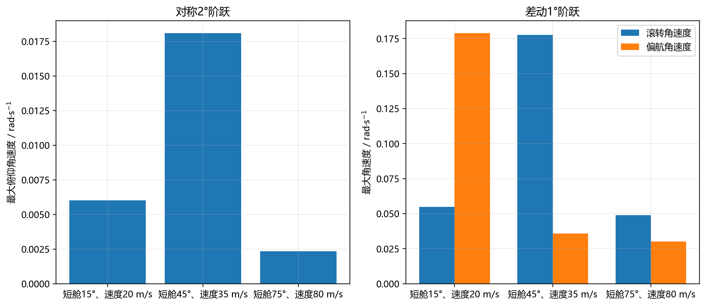

*F06　图06_三点短舱阶跃刚体角速度。来源：已提交十三状态短舱研究可重复计算；工况：图内注明；核心代表点为15°/20 m/s、45°/35 m/s、75°/80 m/s；证据等级：L1-L2。*

该图服务于十三状态短舱研究，展示角度或角速度状态如何经左右旋翼、半翼尾流和反作用力矩进入刚体响应。阅读时应同时区分对称与差动输入、可信初始配平点和有效时间段。曲线幅值属于规定运动型执行机构和当前概念参数，不能外推为真实铰链或机械卡滞载荷。 本图来源为“已提交十三状态短舱研究可重复计算”，证据等级为L1-L2。原始数据与生成入口已进入图表索引，便于在模型或参数变更后重新计算并比较版本差异。

*F07　图07_差动短舱阶跃力矩。来源：已提交十三状态短舱研究可重复计算；工况：图内注明；核心代表点为15°/20 m/s、45°/35 m/s、75°/80 m/s；证据等级：L1-L2。*

该图服务于十三状态短舱研究，展示角度或角速度状态如何经左右旋翼、半翼尾流和反作用力矩进入刚体响应。阅读时应同时区分对称与差动输入、可信初始配平点和有效时间段。曲线幅值属于规定运动型执行机构和当前概念参数，不能外推为真实铰链或机械卡滞载荷。 本图来源为“已提交十三状态短舱研究可重复计算”，证据等级为L1-L2。原始数据与生成入口已进入图表索引，便于在模型或参数变更后重新计算并比较版本差异。

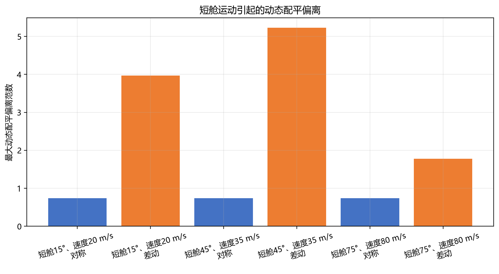

*F08　图08_动态配平偏离。来源：已提交十三状态短舱研究可重复计算；工况：图内注明；核心代表点为15°/20 m/s、45°/35 m/s、75°/80 m/s；证据等级：L1-L2。*

该图服务于十三状态短舱研究，展示角度或角速度状态如何经左右旋翼、半翼尾流和反作用力矩进入刚体响应。阅读时应同时区分对称与差动输入、可信初始配平点和有效时间段。曲线幅值属于规定运动型执行机构和当前概念参数，不能外推为真实铰链或机械卡滞载荷。 本图来源为“已提交十三状态短舱研究可重复计算”，证据等级为L1-L2。原始数据与生成入口已进入图表索引，便于在模型或参数变更后重新计算并比较版本差异。

*F09　图09_新增计算时间步收敛。来源：已提交十三状态短舱研究可重复计算；工况：图内注明；核心代表点为15°/20 m/s、45°/35 m/s、75°/80 m/s；证据等级：L1-L2。*

该图比较不同离散或时间步下的关键输出，用于确认定量峰值不是单一数值设置的偶然结果。收敛判据针对给定方程和覆盖工况，不证明气动闭合或执行机构参数真实。若出现分支失败，失败状态被单独保存而不参与平滑。 本图来源为“已提交十三状态短舱研究可重复计算”，证据等级为L1-L2。原始数据与生成入口已进入图表索引，便于在模型或参数变更后重新计算并比较版本差异。

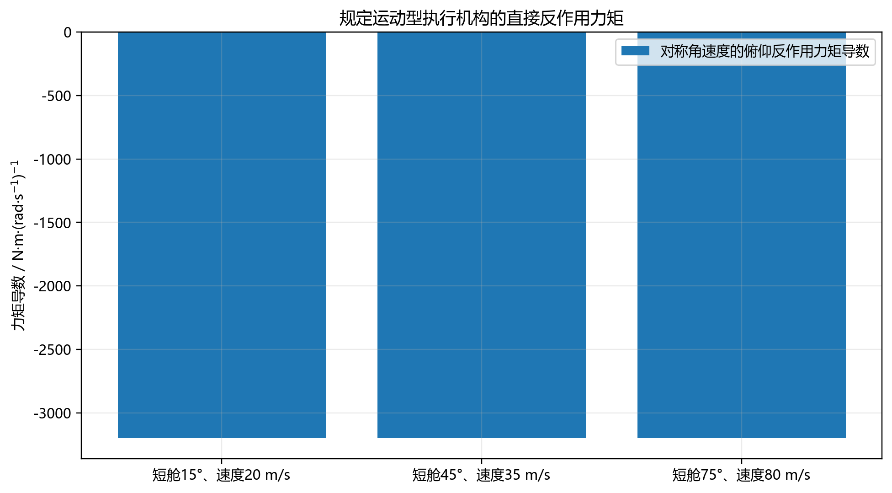

*F10　图10_短舱角速度直接反作用力矩。来源：已提交十三状态短舱研究可重复计算；工况：图内注明；核心代表点为15°/20 m/s、45°/35 m/s、75°/80 m/s；证据等级：L1-L2。*

该图服务于十三状态短舱研究，展示角度或角速度状态如何经左右旋翼、半翼尾流和反作用力矩进入刚体响应。阅读时应同时区分对称与差动输入、可信初始配平点和有效时间段。曲线幅值属于规定运动型执行机构和当前概念参数，不能外推为真实铰链或机械卡滞载荷。 本图来源为“已提交十三状态短舱研究可重复计算”，证据等级为L1-L2。原始数据与生成入口已进入图表索引，便于在模型或参数变更后重新计算并比较版本差异。

*F11　图11_四类参数方案配平状态。来源：已提交十三状态短舱研究可重复计算；工况：图内注明；核心代表点为15°/20 m/s、45°/35 m/s、75°/80 m/s；证据等级：L1-L2。*

该图用于说明配平残差、控制需求、边界余度或俯仰力矩能力之间的关系。可信点、病态点和失败点必须分开读取，失败点不与相邻成功点连线。优化方案只提供研究工作点和敏感性背景，不是型号参数辨识，也不构成连续转换安全走廊。 本图来源为“已提交十三状态短舱研究可重复计算”，证据等级为L1-L2。原始数据与生成入口已进入图表索引，便于在模型或参数变更后重新计算并比较版本差异。

*F12　图12_联合优化方案配平可行区域。来源：已提交十三状态短舱研究可重复计算；工况：图内注明；核心代表点为15°/20 m/s、45°/35 m/s、75°/80 m/s；证据等级：L1-L2。*

该图用于说明配平残差、控制需求、边界余度或俯仰力矩能力之间的关系。可信点、病态点和失败点必须分开读取，失败点不与相邻成功点连线。优化方案只提供研究工作点和敏感性背景，不是型号参数辨识，也不构成连续转换安全走廊。 本图来源为“已提交十三状态短舱研究可重复计算”，证据等级为L1-L2。原始数据与生成入口已进入图表索引，便于在模型或参数变更后重新计算并比较版本差异。

*F13　图13_联合优化方案控制需求。来源：已提交十三状态短舱研究可重复计算；工况：图内注明；核心代表点为15°/20 m/s、45°/35 m/s、75°/80 m/s；证据等级：L1-L2。*

该图用于说明配平残差、控制需求、边界余度或俯仰力矩能力之间的关系。可信点、病态点和失败点必须分开读取，失败点不与相邻成功点连线。优化方案只提供研究工作点和敏感性背景，不是型号参数辨识，也不构成连续转换安全走廊。 本图来源为“已提交十三状态短舱研究可重复计算”，证据等级为L1-L2。原始数据与生成入口已进入图表索引，便于在模型或参数变更后重新计算并比较版本差异。

*F14　图14_联合优化方案控制余度。来源：已提交十三状态短舱研究可重复计算；工况：图内注明；核心代表点为15°/20 m/s、45°/35 m/s、75°/80 m/s；证据等级：L1-L2。*

该图用于说明配平残差、控制需求、边界余度或俯仰力矩能力之间的关系。可信点、病态点和失败点必须分开读取，失败点不与相邻成功点连线。优化方案只提供研究工作点和敏感性背景，不是型号参数辨识，也不构成连续转换安全走廊。 本图来源为“已提交十三状态短舱研究可重复计算”，证据等级为L1-L2。原始数据与生成入口已进入图表索引，便于在模型或参数变更后重新计算并比较版本差异。

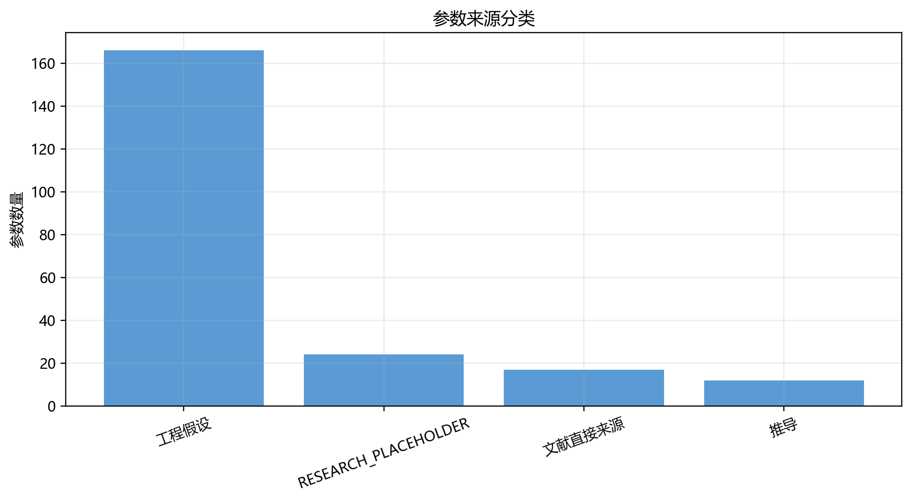

*F15　图15_参数来源分类。来源：已提交十三状态短舱研究可重复计算；工况：图内注明；核心代表点为15°/20 m/s、45°/35 m/s、75°/80 m/s；证据等级：L1-L2。*

该图把文献值、推导值、工程假设和标定等效量区分显示，或比较不同参数方案的内部结果。来源类别回答可追溯性，不等于精度；参数方案之间的差异用于敏感性和边界诊断，不能倒推某一方案就是XV-15真实参数。 本图来源为“已提交十三状态短舱研究可重复计算”，证据等级为L1-L2。原始数据与生成入口已进入图表索引，便于在模型或参数变更后重新计算并比较版本差异。

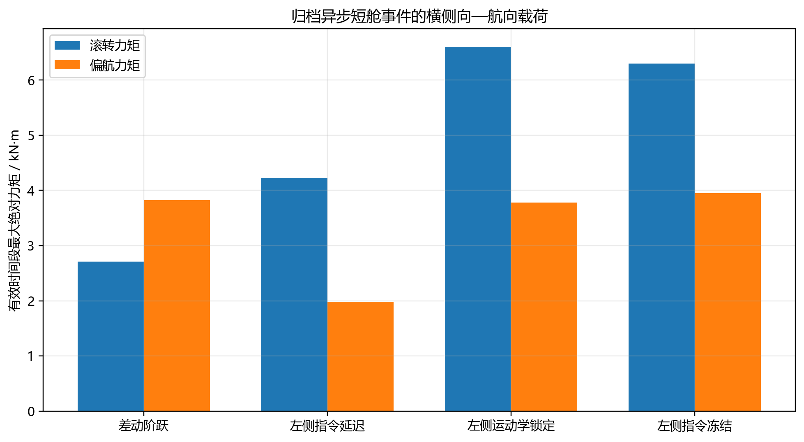

*F16　图16_归档异步短舱事件载荷。来源：已提交十三状态短舱研究可重复计算；工况：图内注明；核心代表点为15°/20 m/s、45°/35 m/s、75°/80 m/s；证据等级：L1-L2。*

该图服务于十三状态短舱研究，展示角度或角速度状态如何经左右旋翼、半翼尾流和反作用力矩进入刚体响应。阅读时应同时区分对称与差动输入、可信初始配平点和有效时间段。曲线幅值属于规定运动型执行机构和当前概念参数，不能外推为真实铰链或机械卡滞载荷。 本图来源为“已提交十三状态短舱研究可重复计算”，证据等级为L1-L2。原始数据与生成入口已进入图表索引，便于在模型或参数变更后重新计算并比较版本差异。

*F17　图17_归档时间步收敛。来源：已提交十三状态短舱研究可重复计算；工况：图内注明；核心代表点为15°/20 m/s、45°/35 m/s、75°/80 m/s；证据等级：L1-L2。*

该图比较不同离散或时间步下的关键输出，用于确认定量峰值不是单一数值设置的偶然结果。收敛判据针对给定方程和覆盖工况，不证明气动闭合或执行机构参数真实。若出现分支失败，失败状态被单独保存而不参与平滑。 本图来源为“已提交十三状态短舱研究可重复计算”，证据等级为L1-L2。原始数据与生成入口已进入图表索引，便于在模型或参数变更后重新计算并比较版本差异。

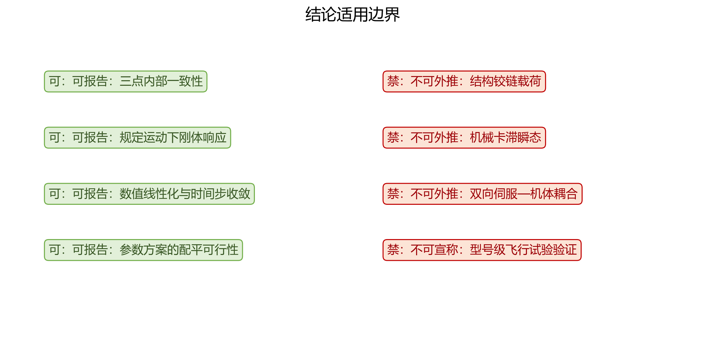

*F18　图18_结论适用边界。来源：已提交十三状态短舱研究可重复计算；工况：图内注明；核心代表点为15°/20 m/s、45°/35 m/s、75°/80 m/s；证据等级：L1-L2。*

该图是对正文相应定量结果或声明边界的可视化。应结合图中工况、数据来源和证据等级读取，不能脱离原始数据矩阵单独引用。图表只支持其明确列出的变量和工作区间，不支持型号级或全包线外推。 本图来源为“已提交十三状态短舱研究可重复计算”，证据等级为L1-L2。原始数据与生成入口已进入图表索引，便于在模型或参数变更后重新计算并比较版本差异。

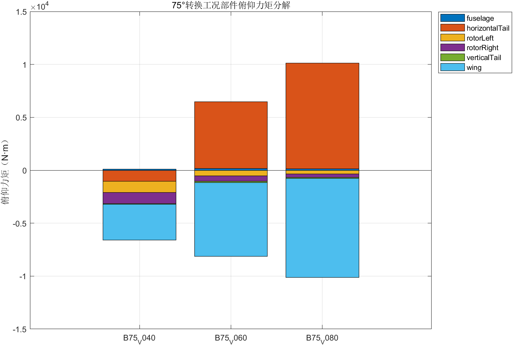

*F19　03_75度俯仰力矩分解。来源：已归档通用模型配平与参数敏感性计算；工况：通用概念模型；不是XV-15型号校准；证据等级：L1-L2。*

该图用于说明配平残差、控制需求、边界余度或俯仰力矩能力之间的关系。可信点、病态点和失败点必须分开读取，失败点不与相邻成功点连线。优化方案只提供研究工作点和敏感性背景，不是型号参数辨识，也不构成连续转换安全走廊。 本图来源为“已归档通用模型配平与参数敏感性计算”，证据等级为L1-L2。原始数据与生成入口已进入图表索引，便于在模型或参数变更后重新计算并比较版本差异。

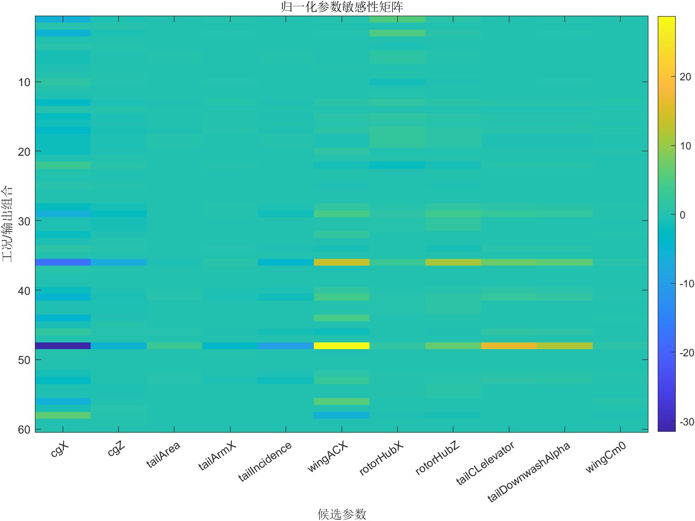

*F20　05_归一化参数敏感性。来源：已归档通用模型配平与参数敏感性计算；工况：通用概念模型；不是XV-15型号校准；证据等级：L1-L2。*

该图展示局部线性化、奇异值或参数敏感性结果。所有导数均以可信配平点、中心差分和明确单位为前提，特征根需结合状态参与度解释。它能够支持数值条件与局部耦合判断，但缺少同构飞行辨识数据时不能提升为外部模态验证。 本图来源为“已归档通用模型配平与参数敏感性计算”，证据等级为L1-L2。原始数据与生成入口已进入图表索引，便于在模型或参数变更后重新计算并比较版本差异。

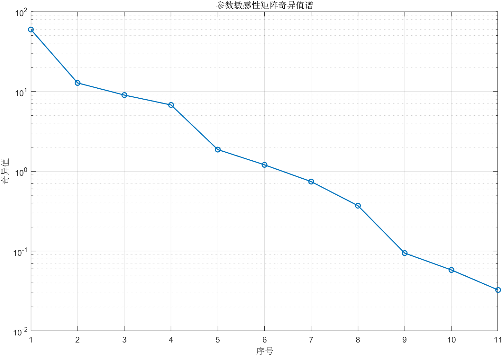

*F21　07_参数SVD。来源：已归档通用模型配平与参数敏感性计算；工况：通用概念模型；不是XV-15型号校准；证据等级：L1-L2。*

该图展示局部线性化、奇异值或参数敏感性结果。所有导数均以可信配平点、中心差分和明确单位为前提，特征根需结合状态参与度解释。它能够支持数值条件与局部耦合判断，但缺少同构飞行辨识数据时不能提升为外部模态验证。 本图来源为“已归档通用模型配平与参数敏感性计算”，证据等级为L1-L2。原始数据与生成入口已进入图表索引，便于在模型或参数变更后重新计算并比较版本差异。

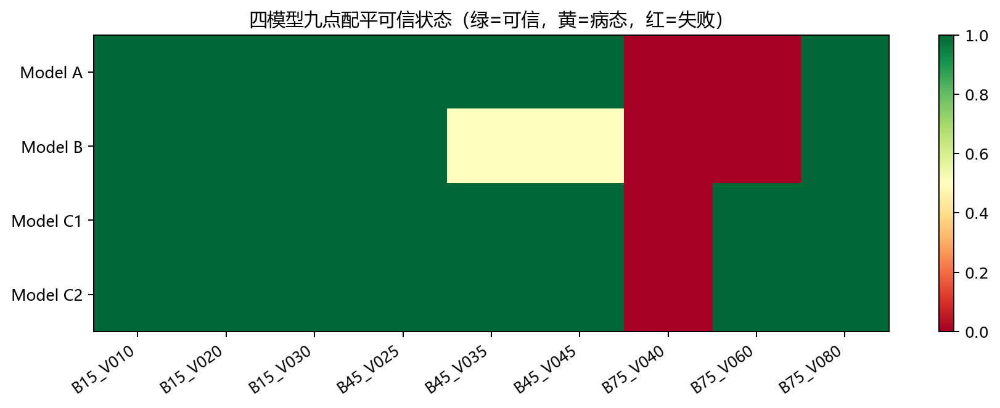

*F22　10_四模型九点配平状态。来源：已归档通用模型配平与参数敏感性计算；工况：通用概念模型；不是XV-15型号校准；证据等级：L1-L2。*

该图用于说明配平残差、控制需求、边界余度或俯仰力矩能力之间的关系。可信点、病态点和失败点必须分开读取，失败点不与相邻成功点连线。优化方案只提供研究工作点和敏感性背景，不是型号参数辨识，也不构成连续转换安全走廊。 本图来源为“已归档通用模型配平与参数敏感性计算”，证据等级为L1-L2。原始数据与生成入口已进入图表索引，便于在模型或参数变更后重新计算并比较版本差异。

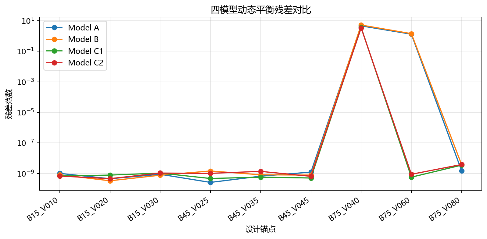

*F23　11_配平残差对比。来源：已归档通用模型配平与参数敏感性计算；工况：通用概念模型；不是XV-15型号校准；证据等级：L1-L2。*

该图用于说明配平残差、控制需求、边界余度或俯仰力矩能力之间的关系。可信点、病态点和失败点必须分开读取，失败点不与相邻成功点连线。优化方案只提供研究工作点和敏感性背景，不是型号参数辨识，也不构成连续转换安全走廊。 本图来源为“已归档通用模型配平与参数敏感性计算”，证据等级为L1-L2。原始数据与生成入口已进入图表索引，便于在模型或参数变更后重新计算并比较版本差异。

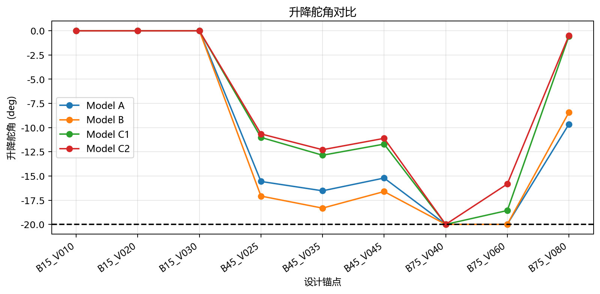

*F24　12_升降舵角对比。来源：已归档通用模型配平与参数敏感性计算；工况：通用概念模型；不是XV-15型号校准；证据等级：L1-L2。*

该图用于说明配平残差、控制需求、边界余度或俯仰力矩能力之间的关系。可信点、病态点和失败点必须分开读取，失败点不与相邻成功点连线。优化方案只提供研究工作点和敏感性背景，不是型号参数辨识，也不构成连续转换安全走廊。 本图来源为“已归档通用模型配平与参数敏感性计算”，证据等级为L1-L2。原始数据与生成入口已进入图表索引，便于在模型或参数变更后重新计算并比较版本差异。

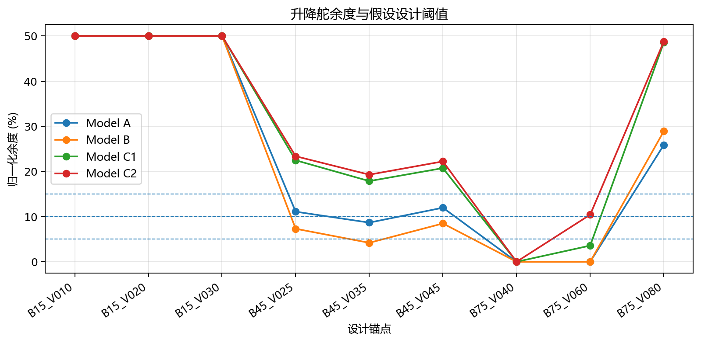

*F25　13_升降舵余度对比。来源：已归档通用模型配平与参数敏感性计算；工况：通用概念模型；不是XV-15型号校准；证据等级：L1-L2。*

该图用于说明配平残差、控制需求、边界余度或俯仰力矩能力之间的关系。可信点、病态点和失败点必须分开读取，失败点不与相邻成功点连线。优化方案只提供研究工作点和敏感性背景，不是型号参数辨识，也不构成连续转换安全走廊。 本图来源为“已归档通用模型配平与参数敏感性计算”，证据等级为L1-L2。原始数据与生成入口已进入图表索引，便于在模型或参数变更后重新计算并比较版本差异。

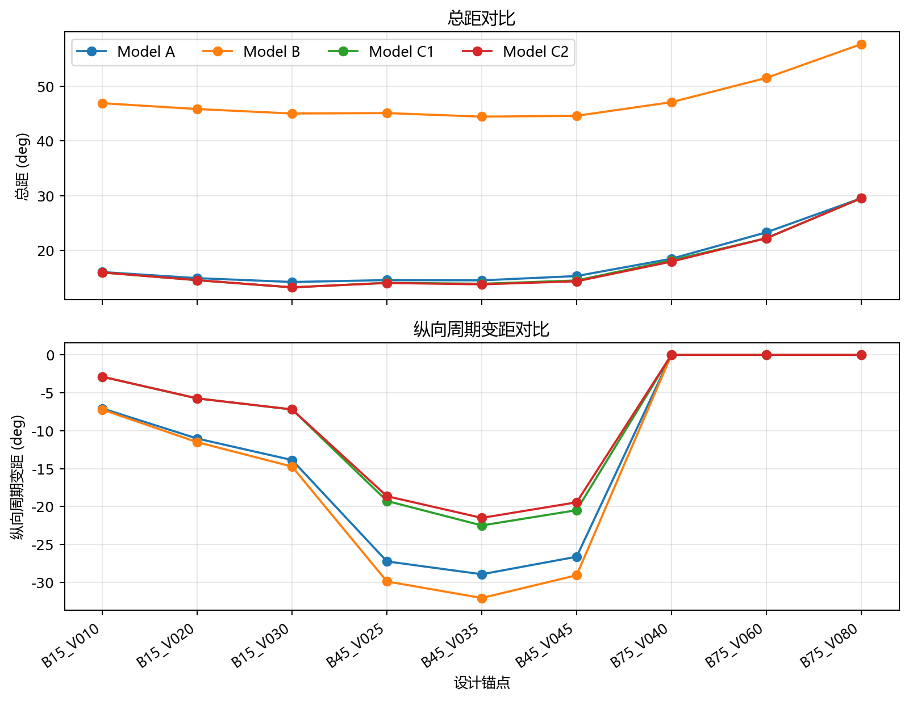

*F26　14_总距与纵向周期变距。来源：已归档通用模型配平与参数敏感性计算；工况：通用概念模型；不是XV-15型号校准；证据等级：L1-L2。*

该图是对正文相应定量结果或声明边界的可视化。应结合图中工况、数据来源和证据等级读取，不能脱离原始数据矩阵单独引用。图表只支持其明确列出的变量和工作区间，不支持型号级或全包线外推。 本图来源为“已归档通用模型配平与参数敏感性计算”，证据等级为L1-L2。原始数据与生成入口已进入图表索引，便于在模型或参数变更后重新计算并比较版本差异。

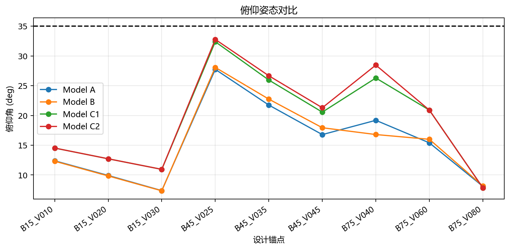

*F27　15_俯仰姿态对比。来源：已归档通用模型配平与参数敏感性计算；工况：通用概念模型；不是XV-15型号校准；证据等级：L1-L2。*

该图是对正文相应定量结果或声明边界的可视化。应结合图中工况、数据来源和证据等级读取，不能脱离原始数据矩阵单独引用。图表只支持其明确列出的变量和工作区间，不支持型号级或全包线外推。 本图来源为“已归档通用模型配平与参数敏感性计算”，证据等级为L1-L2。原始数据与生成入口已进入图表索引，便于在模型或参数变更后重新计算并比较版本差异。

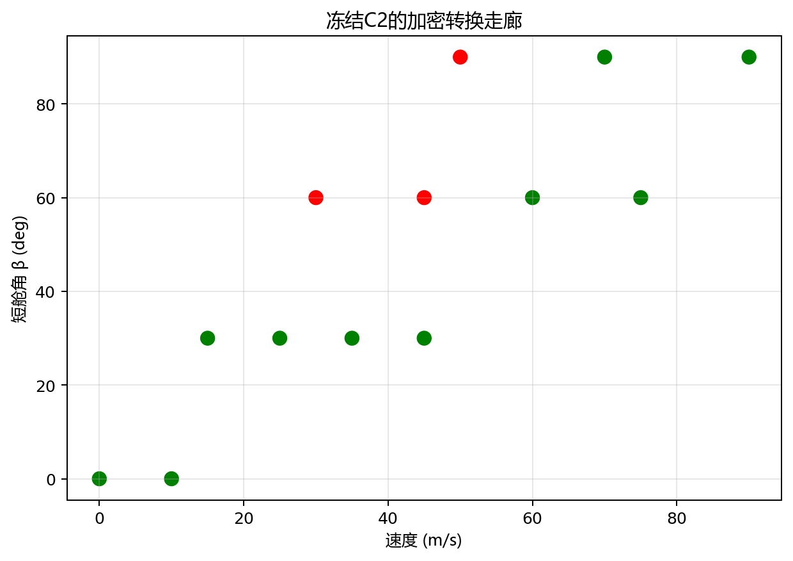

*F28　16_加密转换走廊。来源：已归档通用模型配平与参数敏感性计算；工况：通用概念模型；不是XV-15型号校准；证据等级：L1-L2。*

该图用于说明配平残差、控制需求、边界余度或俯仰力矩能力之间的关系。可信点、病态点和失败点必须分开读取，失败点不与相邻成功点连线。优化方案只提供研究工作点和敏感性背景，不是型号参数辨识，也不构成连续转换安全走廊。 本图来源为“已归档通用模型配平与参数敏感性计算”，证据等级为L1-L2。原始数据与生成入口已进入图表索引，便于在模型或参数变更后重新计算并比较版本差异。

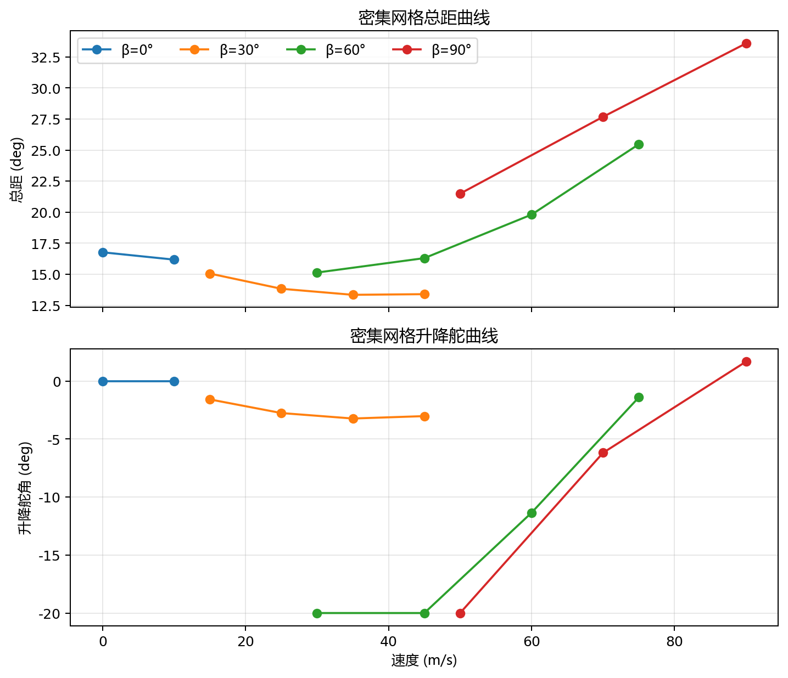

*F29　17_控制曲线连续性。来源：已归档通用模型配平与参数敏感性计算；工况：通用概念模型；不是XV-15型号校准；证据等级：L1-L2。*

该图用于说明配平残差、控制需求、边界余度或俯仰力矩能力之间的关系。可信点、病态点和失败点必须分开读取，失败点不与相邻成功点连线。优化方案只提供研究工作点和敏感性背景，不是型号参数辨识，也不构成连续转换安全走廊。 本图来源为“已归档通用模型配平与参数敏感性计算”，证据等级为L1-L2。原始数据与生成入口已进入图表索引，便于在模型或参数变更后重新计算并比较版本差异。

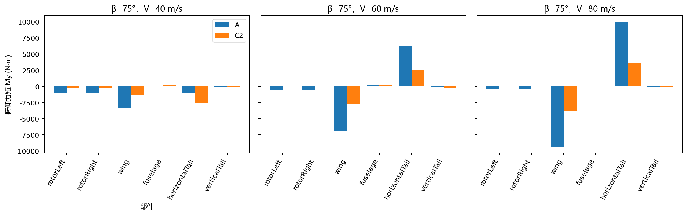

*F30　18_优化前后俯仰力矩分解。来源：已归档通用模型配平与参数敏感性计算；工况：通用概念模型；不是XV-15型号校准；证据等级：L1-L2。*

该图用于说明配平残差、控制需求、边界余度或俯仰力矩能力之间的关系。可信点、病态点和失败点必须分开读取，失败点不与相邻成功点连线。优化方案只提供研究工作点和敏感性背景，不是型号参数辨识，也不构成连续转换安全走廊。 本图来源为“已归档通用模型配平与参数敏感性计算”，证据等级为L1-L2。原始数据与生成入口已进入图表索引，便于在模型或参数变更后重新计算并比较版本差异。

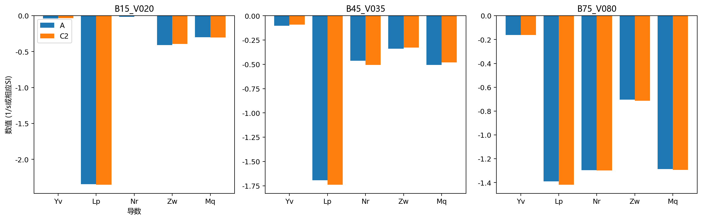

*F31　21_未参与优化的稳定导数。来源：已归档通用模型配平与参数敏感性计算；工况：通用概念模型；不是XV-15型号校准；证据等级：L1-L2。*

该图展示局部线性化、奇异值或参数敏感性结果。所有导数均以可信配平点、中心差分和明确单位为前提，特征根需结合状态参与度解释。它能够支持数值条件与局部耦合判断，但缺少同构飞行辨识数据时不能提升为外部模态验证。 本图来源为“已归档通用模型配平与参数敏感性计算”，证据等级为L1-L2。原始数据与生成入口已进入图表索引，便于在模型或参数变更后重新计算并比较版本差异。

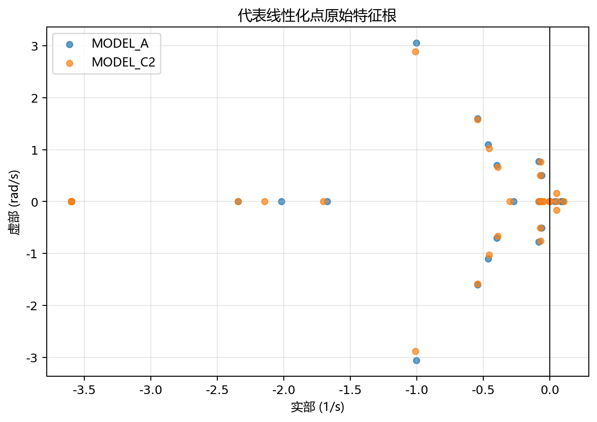

*F32　22_代表特征根。来源：已归档通用模型配平与参数敏感性计算；工况：通用概念模型；不是XV-15型号校准；证据等级：L1-L2。*

该图展示局部线性化、奇异值或参数敏感性结果。所有导数均以可信配平点、中心差分和明确单位为前提，特征根需结合状态参与度解释。它能够支持数值条件与局部耦合判断，但缺少同构飞行辨识数据时不能提升为外部模态验证。 本图来源为“已归档通用模型配平与参数敏感性计算”，证据等级为L1-L2。原始数据与生成入口已进入图表索引，便于在模型或参数变更后重新计算并比较版本差异。

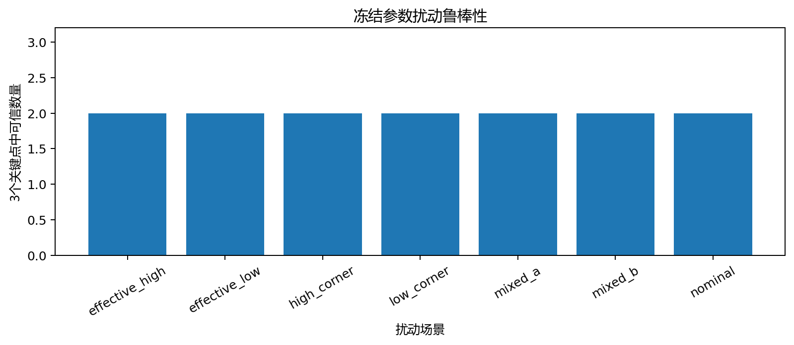

*F33　23_参数扰动鲁棒性。来源：已归档通用模型配平与参数敏感性计算；工况：通用概念模型；不是XV-15型号校准；证据等级：L1-L2。*

该图把文献值、推导值、工程假设和标定等效量区分显示，或比较不同参数方案的内部结果。来源类别回答可追溯性，不等于精度；参数方案之间的差异用于敏感性和边界诊断，不能倒推某一方案就是XV-15真实参数。 本图来源为“已归档通用模型配平与参数敏感性计算”，证据等级为L1-L2。原始数据与生成入口已进入图表索引，便于在模型或参数变更后重新计算并比较版本差异。

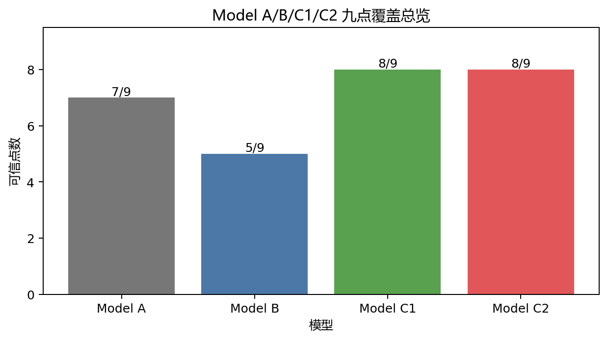

*F34　24_四模型总览。来源：已归档通用模型配平与参数敏感性计算；工况：通用概念模型；不是XV-15型号校准；证据等级：L1-L2。*

该图把文献值、推导值、工程假设和标定等效量区分显示，或比较不同参数方案的内部结果。来源类别回答可追溯性，不等于精度；参数方案之间的差异用于敏感性和边界诊断，不能倒推某一方案就是XV-15真实参数。 本图来源为“已归档通用模型配平与参数敏感性计算”，证据等级为L1-L2。原始数据与生成入口已进入图表索引，便于在模型或参数变更后重新计算并比较版本差异。

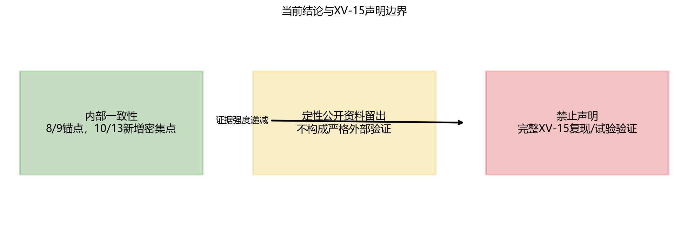

*F35　25_声明边界。来源：已归档通用模型配平与参数敏感性计算；工况：通用概念模型；不是XV-15型号校准；证据等级：L1-L2。*

该图是对正文相应定量结果或声明边界的可视化。应结合图中工况、数据来源和证据等级读取，不能脱离原始数据矩阵单独引用。图表只支持其明确列出的变量和工作区间，不支持型号级或全包线外推。 本图来源为“已归档通用模型配平与参数敏感性计算”，证据等级为L1-L2。原始数据与生成入口已进入图表索引，便于在模型或参数变更后重新计算并比较版本差异。

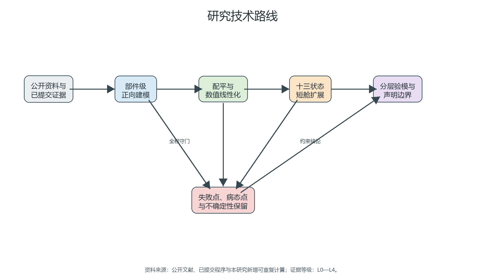

*F36　研究技术路线。来源：本研究方法结构图；工况：不适用；证据等级：L0。*

该图给出研究方法、模型层级或证据流向。箭头表示计算或论证依赖，不表示证据等级自动传递。程序校核、数值收敛、独立模型比较与外部数据关联在图中保持分层，从而防止把测试通过写成外部验证。 本图来源为“本研究方法结构图”，证据等级为L0。原始数据与生成入口已进入图表索引，便于在模型或参数变更后重新计算并比较版本差异。

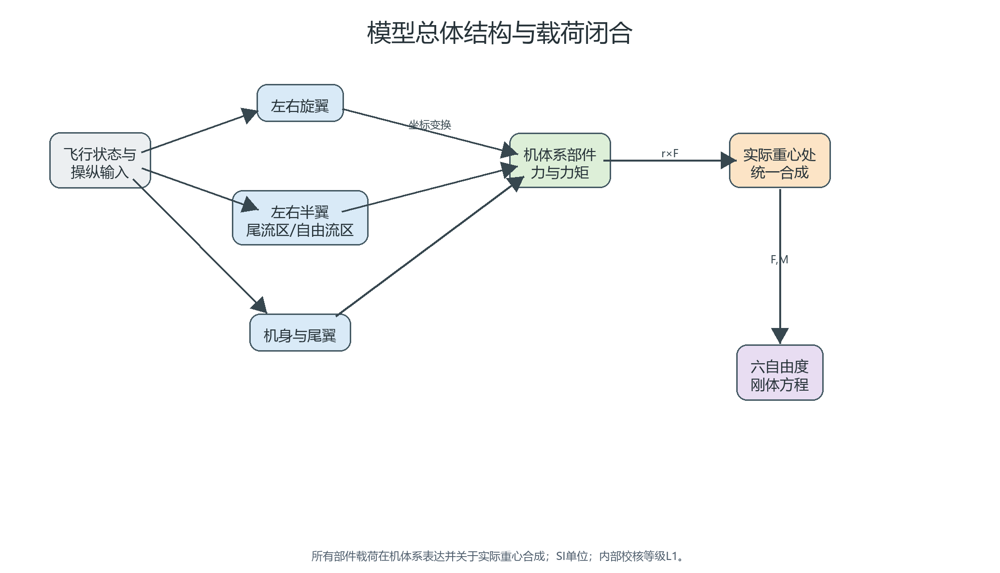

*F37　模型总体结构与载荷闭合。来源：本研究方法结构图；工况：不适用；证据等级：L0。*

该图给出研究方法、模型层级或证据流向。箭头表示计算或论证依赖，不表示证据等级自动传递。程序校核、数值收敛、独立模型比较与外部数据关联在图中保持分层，从而防止把测试通过写成外部验证。 本图来源为“本研究方法结构图”，证据等级为L0。原始数据与生成入口已进入图表索引，便于在模型或参数变更后重新计算并比较版本差异。

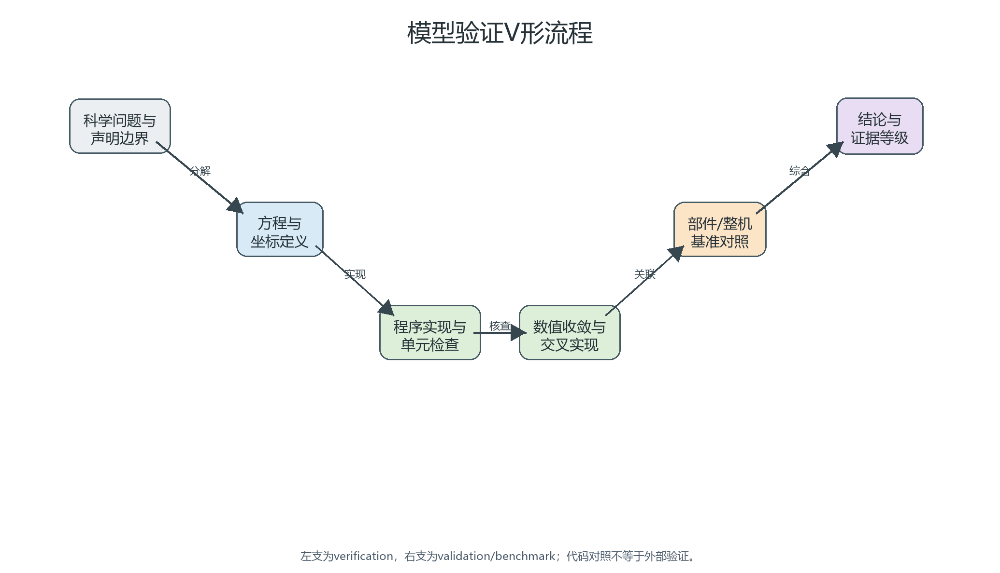

*F38　模型验证V形流程。来源：本研究方法结构图；工况：不适用；证据等级：L0。*

该图给出研究方法、模型层级或证据流向。箭头表示计算或论证依赖，不表示证据等级自动传递。程序校核、数值收敛、独立模型比较与外部数据关联在图中保持分层，从而防止把测试通过写成外部验证。 本图来源为“本研究方法结构图”，证据等级为L0。原始数据与生成入口已进入图表索引，便于在模型或参数变更后重新计算并比较版本差异。

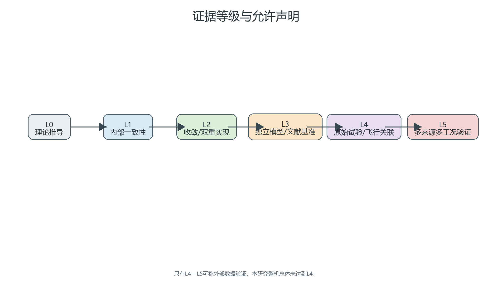

*F39　证据等级与允许声明。来源：本研究方法结构图；工况：不适用；证据等级：L0。*

该图给出研究方法、模型层级或证据流向。箭头表示计算或论证依赖，不表示证据等级自动传递。程序校核、数值收敛、独立模型比较与外部数据关联在图中保持分层，从而防止把测试通过写成外部验证。 本图来源为“本研究方法结构图”，证据等级为L0。原始数据与生成入口已进入图表索引，便于在模型或参数变更后重新计算并比较版本差异。

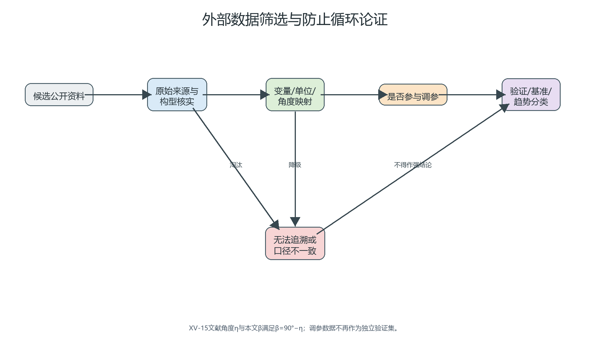

*F40　外部数据筛选与防止循环论证。来源：本研究方法结构图；工况：不适用；证据等级：L0。*

该图是对正文相应定量结果或声明边界的可视化。应结合图中工况、数据来源和证据等级读取，不能脱离原始数据矩阵单独引用。图表只支持其明确列出的变量和工作区间，不支持型号级或全包线外推。 本图来源为“本研究方法结构图”，证据等级为L0。原始数据与生成入口已进入图表索引，便于在模型或参数变更后重新计算并比较版本差异。

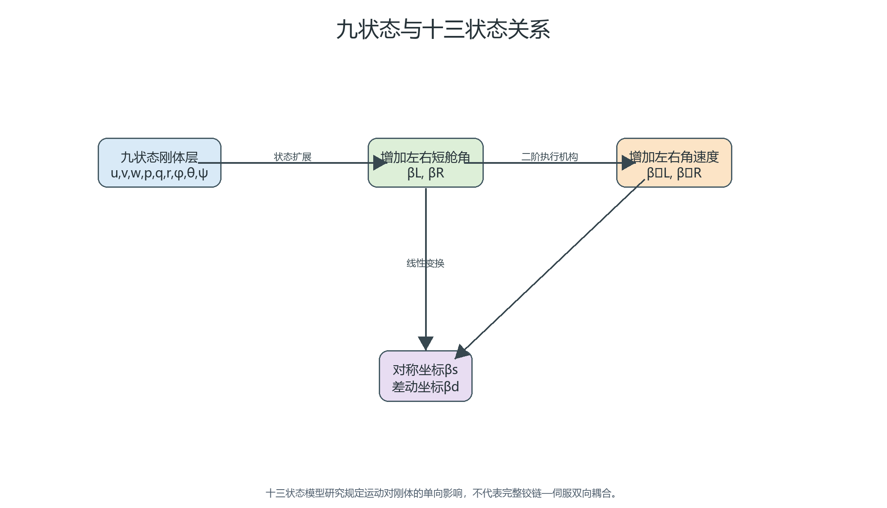

*F41　九状态与十三状态关系。来源：本研究方法结构图；工况：不适用；证据等级：L0。*

该图给出研究方法、模型层级或证据流向。箭头表示计算或论证依赖，不表示证据等级自动传递。程序校核、数值收敛、独立模型比较与外部数据关联在图中保持分层，从而防止把测试通过写成外部验证。 本图来源为“本研究方法结构图”，证据等级为L0。原始数据与生成入口已进入图表索引，便于在模型或参数变更后重新计算并比较版本差异。

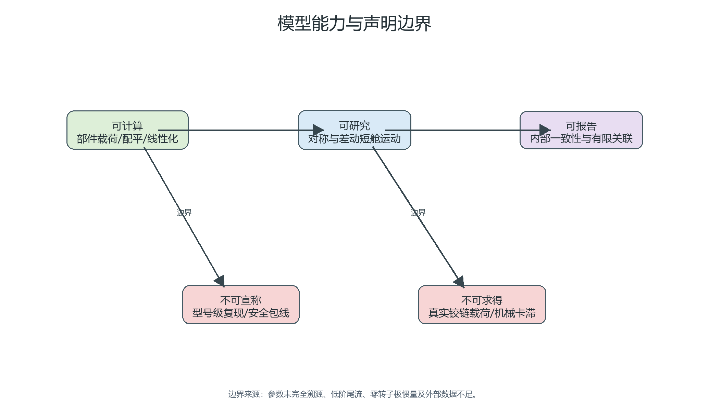

*F42　模型能力与声明边界。来源：本研究方法结构图；工况：不适用；证据等级：L0。*

该图是对正文相应定量结果或声明边界的可视化。应结合图中工况、数据来源和证据等级读取，不能脱离原始数据矩阵单独引用。图表只支持其明确列出的变量和工作区间，不支持型号级或全包线外推。 本图来源为“本研究方法结构图”，证据等级为L0。原始数据与生成入口已进入图表索引，便于在模型或参数变更后重新计算并比较版本差异。

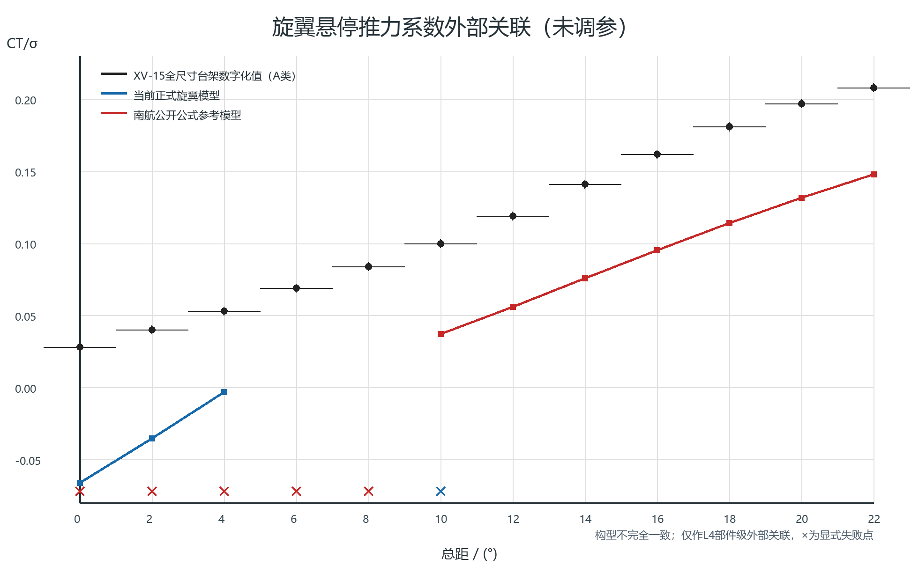

*F43　旋翼悬停推力系数外部关联。来源：NASA TM-86854图25数字化值与本研究MATLAB R2021a计算；工况：零空速；总距0°—22°；模型未调参；构型不完全一致；证据等级：L4_CORRELATION。*

该图把A类原始台架数字化点与两条未调参旋翼路径并列。误差棒表示数字化与控制几何不确定度，曲线中断和叉号保留不收敛或负推力未闭合点。斜率方向一致只支持趋势关联，系统幅值偏差说明不能称型号验证通过。 本图来源为“NASA TM-86854图25数字化值与本研究MATLAB R2021a计算”，证据等级为L4_CORRELATION。原始数据与生成入口已进入图表索引，便于在模型或参数变更后重新计算并比较版本差异。

# 参考文献

[1] SHENG H, ZHANG C, XIANG Y. Mathematical modeling and stability analysis of tiltrotor aircraft[J]. Drones, 2022, 6(4): 92.

[2] DREIER M E. 直升机和倾转旋翼飞行器飞行仿真引论[M]. 孙传伟, 等译. 北京: 航空工业出版社, 2012.

[3] BERGER T. Handling qualities requirements and control design for high-speed rotorcraft[D]. Pennsylvania State University, 2019.

[4] TILT ROTOR PROJECT OFFICE STAFF. NASA/Army XV-15 tilt rotor research aircraft familiarization document[R]. NASA-TM-X-62407, 1975.

[5] DUGAN D C, ERHART R G, SCHROERS L G. The XV-15 tilt rotor research aircraft[R]. NASA-TM-81244, 1980.

[6] NASA AMES RESEARCH CENTER. Full-scale hover testing of the XV-15 advanced technology blade rotor[R]. NASA-TM-86854, 1987.

[7] TISCHLER M B, et al. Frequency-domain identification of XV-15 tilt-rotor aircraft dynamics[R]. NASA-TM-86009, 1984.

[8] NASA AMES RESEARCH CENTER. XV-15 tilt rotor research aircraft pilot's guide[R]. NASA-TM-100025, 1987.

[9] NASA. Wind-tunnel investigation of the XV-15 tilt rotor aircraft[R]. NASA-TM-81177, 1980.

[10] NASA. XV-15 tilt rotor aircraft flight validation report[R]. NASA-CR-166537, 1982.

[11] JOHNSON W, et al. NDARC calculations of XV-15 performance and trim compared with flight data[R]. NASA-CR-2017-219456, 2017.

[12] NASA. Hover performance of the XV-15 metal-blade rotor[R]. NASA Technical Report, 1985.

[13] LEISHMAN J G. Principles of Helicopter Aerodynamics[M]. Cambridge: Cambridge University Press, 2006.

[14] STEVENS B L, LEWIS F L, JOHNSON E N. Aircraft Control and Simulation[M]. Hoboken: Wiley, 2016.

[15] ETKIN B, REID L D. Dynamics of Flight: Stability and Control[M]. New York: Wiley, 1996.

[16] ANDERSON J D. Aircraft Performance and Design[M]. New York: McGraw-Hill, 1999.

[17] COOK M V. Flight Dynamics Principles[M]. Oxford: Butterworth-Heinemann, 2012.

[18] GOLUB G H, VAN LOAN C F. Matrix Computations[M]. Baltimore: Johns Hopkins University Press, 2013.

[19] OBERKAMPF W L, ROY C J. Verification and Validation in Scientific Computing[M]. Cambridge: Cambridge University Press, 2010.

[20] ASME. Standard for Verification and Validation in Computational Fluid Dynamics and Heat Transfer[S]. ASME V&V 20, 2009.

# 附录A　公式—代码—参数—测试追溯说明

完整映射见交付包FORMULA_CODE_PARAMETER_TEST_MAPPING.md。该映射逐项记录文献页码、公式/图表、数学形式、实现变量、参数分类、单位换算、坐标变换和测试。正文不以程序文件名替代科学论证。

# 附录B　验证与外部数据矩阵

完整数据见MODEL_VALIDATION_MATRIX.csv、EXTERNAL_VALIDATION_DATA_INVENTORY.csv、EXTERNAL_DATA_TRACEABILITY_MATRIX.csv和CLAIM_VALIDATION_LEVEL_MATRIX.csv。矩阵保留失败、不可比和待人工核对状态。

# 附录C　可重复性与数据完整性

新增旋翼外部关联由MATLAB R2021a脚本计算，图表由交付包Python脚本生成。每幅图在FIGURE_DATA_INDEX.csv记录标题、来源、工况、证据等级和原始数据。最终清单以SHA-256覆盖所有交付文件，但不包含清单自身和最终ZIP，避免自引用。
