# 倾转旋翼机部件级飞行动力学建模与短舱动态状态影响研究

## 摘要

本文围绕倾转旋翼机转换过程中的部件级飞行动力学建模与短舱动态状态影响，建立一条由物理模型、配平与数值线性化、左右短舱动态扩展、时域响应、参数来源和结论边界组成的可追溯研究主线。基础层采用九个刚体状态，动态层在保持既有部件模型和默认参数冻结的条件下，引入左右短舱角度与角速度，形成十三状态模型。短舱执行机构采用规定运动形式：指令经二阶环节生成短舱运动，反作用力矩进入刚体动力学；机体运动不反向改变执行机构内部状态。因此，本文讨论的是规定运动引起的单向动力学影响，而不是完整的铰链—伺服—结构双向耦合。

新增计算选取短舱角15°、速度20 m/s，短舱角45°、速度35 m/s，以及短舱角75°、速度80 m/s三个可信配平点，对准静态短舱九状态层、对称流形十三状态层和左右独立十三状态层进行比较。三个配平点的刚体残差范数均小于 $4\times10^{-9}$。对称短舱2°阶跃主要激发纵向响应；差动短舱1°阶跃在三个点均产生非零侧向速度、滚转和偏航响应。默认旋翼极惯量为零，因此短舱角速度陀螺通道虽在方程结构中保留，却在本组默认参数下不产生数值贡献；对称角速度仍通过执行机构反作用力矩形成 $-3200$ N·m/(rad/s) 的俯仰力矩导数。自适应时间步检查保证所采用相邻两级结果的峰值变化不超过2%。

纵向布局与等效控制参数优化在本文中只承担提供可信配平工作点和评估控制余度的辅助作用。它不被解释为型号参数辨识，也不作为短舱动态状态必要性的替代证据。研究结论限于公开资料约束下的概念模型、所列工况和规定运动型执行机构，不能外推为机械卡滞载荷、结构铰链载荷或型号级飞行试验验证。

**关键词：** 倾转旋翼机；部件级建模；短舱动态状态；配平；数值线性化；左右不对称；转换走廊

## 符号与缩写

|符号|含义|单位|
|---|---|---|
|$\mathbf{v}_b=[u,v,w]^T$|机体系线速度|m/s|
|$\boldsymbol{\omega}_b=[p,q,r]^T$|机体系角速度|rad/s|
|$\boldsymbol{\eta}=[\phi,\theta,\psi]^T$|滚转、俯仰、偏航欧拉角|rad|
|$\beta_L,\beta_R$|左、右短舱倾转角|rad|
|$\beta_s,\beta_d$|短舱对称、差动坐标|rad|
|$\delta$|操纵输入向量|rad|
|$\mathbf{F}_b,\mathbf{M}_b$|机体系合力与关于重心的合力矩|N，N·m|
|$\mathbf{I}$|关于实际重心的惯量矩阵|kg·m²|
|$\mathbf{A},\mathbf{B}$|状态矩阵和输入矩阵|按状态与输入定义|
|$\mathbf{r}_t$|配平残差向量|经尺度化后无量纲|

# 第一章　引言

## 1.1 研究背景

倾转旋翼机通过短舱和旋翼系统的转动在悬停、转换和飞机模式之间改变主要升力与推进方向。与固定翼或常规直升机相比，其难点不仅是气动力来源多，而且部件参考系、旋翼尾流覆盖、重心和惯量、短舱运动及操纵分配会随构型共同变化。若只把短舱角当作静态查表参数，就无法描述执行机构动态、左右不同步以及短舱角速度反作用力矩对刚体的影响。

公开文献提供了部件划分、六自由度方程、配平算法和部分型号资料，但公开数据不构成对本模型的完整辨识。本文采用“公式—代码—参数—测试—结论”五层追溯策略：文献明确给出的内容作为结构或数据依据；由公式推导的量标为推导量；缺少直接来源的概念参数明确列为工程假设；经优化得到的控制效能只称为标定等效参数。

## 1.2 国内外研究现状

Sheng、Zhang和Xiang在2022年的公开论文中采用旋翼、机翼、机身、平尾和垂尾的部件划分，并在PDF第3页给出随短舱倾转变化的重心与惯量关系，在第5—9页给出旋翼和机翼建模链，在第12页给出配平与稳定性分析结果。该文献支持本文的部件建模路线，但其公开内容没有给出本文所需的左右独立规定运动型短舱执行机构。

Berger于2019年完成的学位论文在PDF第90—96页（原文第55—61页，第2.1.3节）描述了包含9个机体状态、左右短舱角与角速度的高维旋翼飞行器模型，并在PDF第95页说明短舱角指令经控制环映射为广义转矩。该模型总计51个状态，研究对象和细节层级均不同于本文；本文只对照其状态组织和输入接口，不称为Berger模型复现。

Dreier教材中文译本在PDF第348、355和360页（原书第323、330和335页，第17章）分别讨论配平定义、控制匹配和雅可比迭代修正。NASA-TM-81244的PDF第4—6页给出XV-15的基本几何、操纵与转换系统，其中第6页明确0°为飞机模式、90°为直升机模式；NASA-TM-X-62407的PDF第11—20页给出重量、惯量、重心、尺寸和旋翼规格章节。两份NASA资料只作为公开参数候选，不把资料中的型号性能直接赋予当前通用模型。

## 1.3 公开数据不足与研究边界

公开资料缺少与当前所有部件公式、控制映射和工况一一对应的气动数据库，也缺少左右短舱执行机构时域数据、铰链载荷、非定常旋翼尾流和完整飞行试验记录。本文因此把研究定位为通用、低阶、部件级飞行动力学研究：可以检验公式闭合、数值一致性和有限工况趋势，不能形成型号级外部验证、飞行安全边界或完整双向多体动力学结论。

## 1.4 科学问题

本文回答三个相互衔接的问题。第一，如何在统一坐标、单位和力矩参考点下形成可运行、可配平、可线性化的部件级模型；第二，从九状态准静态短舱模型扩展为十三状态左右独立短舱模型后，短舱角度与角速度通过哪些物理通道影响刚体；第三，在公开资料有限且没有型号级试验数据的条件下，哪些结果可以形成定量结论，哪些只能作为内部一致性或趋势证据。

## 1.5 研究路线与贡献

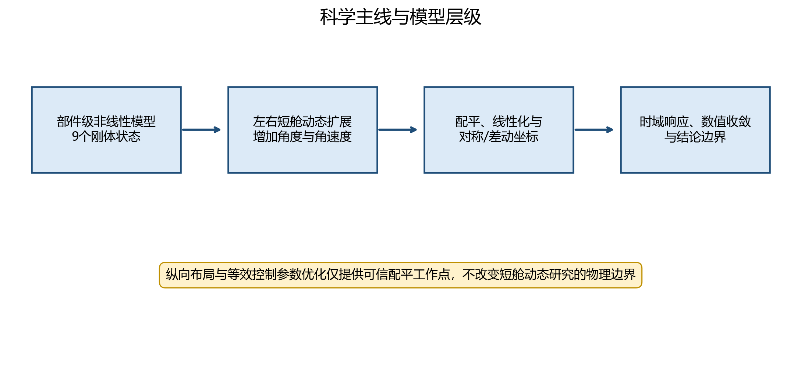

*图 1　科学主线与模型层级*

本文的增量贡献是：在冻结既有物理代码和默认参数的前提下，选择三个可信配平点完成三层模型比较；把对称与差动短舱运动分开讨论；显式核查执行机构反作用力矩、短舱角速度陀螺项、动态配平偏离和时间步收敛；将先前的配平参数优化收敛为辅助章节，而不继续扩大优化范围。

# 第二章　倾转旋翼机部件级飞行动力学模型

## 2.1 坐标系与短舱角定义

机体系采用右手系，$x_b$ 轴向前、$y_b$ 轴向右、$z_b$ 轴向下；力和力矩最终均转换到机体系并关于整机实际重心合成。短舱角 $\beta=0$ 表示旋翼轴接近垂直、处于直升机侧，$\beta=\pi/2$ 表示旋翼轴接近机体纵轴、处于飞机侧。Berger文献采用相反端点的角度记号，二者映射为 $\beta=\pi/2-\delta_{nac}$，引用其结果时必须先执行该转换。

地面系到机体系的姿态由3-2-1欧拉角描述。本文不在接近 $\theta=\pm\pi/2$ 的奇异区域形成结论。短舱局部坐标、左右旋翼轴向与旋转方向由模型中的显式旋转矩阵和旋向参数共同给出，不能仅由示意图推断符号。

## 2.2 六自由度刚体方程

机体系平动方程写为

$$m(\dot{\mathbf{v}}_b+\boldsymbol{\omega}_b\times\mathbf{v}_b)
=\mathbf{F}_b+m\mathbf{g}_b,$$

转动方程写为

$$\mathbf{I}\dot{\boldsymbol{\omega}}_b
+\boldsymbol{\omega}_b\times(\mathbf{I}\boldsymbol{\omega}_b)
=\mathbf{M}_b.$$

这里 $\mathbf{I}$ 为关于实际整机重心、在机体系表达的完整对称惯量矩阵。欧拉角运动学为

$$\dot{\boldsymbol{\eta}}=\mathbf{T}(\phi,\theta)\boldsymbol{\omega}_b.$$

九状态向量取

$$\mathbf{x}_9=[u,v,w,p,q,r,\phi,\theta,\psi]^T.$$

位置状态不参与本研究的局部动力学比较。重力只在刚体方程中计入一次，各气动部件函数不重复加入重力。

## 2.3 旋翼模型

左右旋翼分别计算。叶素动量模型由局部轴向和切向速度、桨距分布、翼型升阻力关系以及诱导速度迭代获得推力和扭矩。单个叶素的相对速度和入流角可写为

$$W^2=U_T^2+U_P^2,\qquad \varphi_i=\operatorname{atan2}(U_P,U_T),$$

$$\alpha_i=\theta_i-\varphi_i,$$

并通过径向积分形成旋翼轴系载荷。旋翼轴系载荷使用短舱姿态旋转到机体系。左右旋翼反扭矩符号由旋向参数控制，不能以简单镜像代替。

当前模型为简化叶素动量和稳态一阶谐波挥舞模型，不是自由尾迹或计算流体力学模型。旋翼间干扰、详细非定常失速和弹性桨叶动力学未被完整表示。默认旋翼极惯量为零属于工程假设，使随短舱倾转产生的转子陀螺力矩数值为零；方程接口仍保留该通道。

## 2.4 机翼与旋翼尾流区域

机翼左右半翼独立计算局部来流与旋翼尾流覆盖。常规升力线近似与近法向来流概念模型在同一局部来流状态下分别计算，再用五次平滑阶跃函数连续混合：

$$w(s)=6s^5-15s^4+10s^3,\qquad
\mathbf{F}_w=(1-w)\mathbf{F}_{LL}+w\mathbf{F}_{N}.$$

过渡中心和半宽均为模型参数，其中半宽是为低速连续性采用的工程假设，并非试验标定。左右半翼分别接收短舱状态，因此差动短舱角能够破坏左右对称尾流条件并产生横侧向载荷。

## 2.5 机身、平尾与垂尾

机身、平尾和垂尾均以局部动压、迎角或侧滑角和参考面积计算载荷。平尾升降舵效能在联合优化方案中包含一个标定等效参数；它只表达当前简化模型下的等效控制能力，不能解释为真实舵面导数测量。气动系数超出线性或经验模型适用范围时，结果只用于内部诊断。

## 2.6 合力、合力矩、重心与惯量

所有部件力先转换到机体系，再按

$$\mathbf{M}_{arm,i}=(\mathbf{r}_i-\mathbf{r}_{cg})\times\mathbf{F}_i$$

形成力臂矩，并与部件自身气动力矩相加。总载荷为

$$\mathbf{F}_b=\sum_i\mathbf{F}_i,\qquad
\mathbf{M}_b=\sum_i(\mathbf{M}_i+\mathbf{M}_{arm,i}).$$

实际重心和惯量根据各部件质量、位置和自身惯量重构，使用平行轴定理并检查对称性与正定性。三个新增工况的最小惯量特征值均大于 $1.75\times10^4$ kg·m²，九状态与十三状态层在同一短舱角下使用相同的静态质量属性。

## 2.7 控制量与参数来源

基础控制架构包括总距、差动总距、对称纵向周期变距和差动纵向周期变距；文中“差动纵向周期变距”对应代码历史接口中的差动周期名称。纵向配平使用总距、对称纵向周期变距、升降舵和俯仰姿态等与工况一致的未知量。所有角度进入三角函数前均转换为弧度。

参数来源分为文献直接来源、图表数字化、推导、工程假设、标定等效参数、临时占位和未知。来源分类不等于精度等级；即使是文献数值，也必须确认构型、页码、单位和坐标定义。

*图 15　参数来源分类*

# 第三章　配平、数值线性化与可信度判据

## 3.1 配平问题

配平被写为有界非线性最小二乘问题

$$\min_{\mathbf{z}}\left\|\mathbf{W}_r\mathbf{r}(\mathbf{z})\right\|_2^2,
\qquad \mathbf{z}_l\leq\mathbf{z}\leq\mathbf{z}_u,$$

其中 $\mathbf{z}$ 包括规定工况下的姿态和控制未知量，$\mathbf{W}_r$ 用于平衡平动加速度、角加速度和运动学约束的量级。求解器退出成功只说明某次数值迭代满足内部停止条件，不能自动说明物理可信。

## 3.2 尺度、边界与连续延拓

未知量和残差按物理尺度归一化。控制上下界保持可追溯，触界点单独标记。转换走廊计算采用相邻工况连续延拓和多初值策略，但多初值不能替代残差、边界与条件数检查。工况量较大时先做代表点和局部检查，再扩大扫描范围。

## 3.3 可信配平判据

可信配平点必须同时满足：残差有限且小于规定门槛；未知量不出现非实数；控制量未违反边界；数值雅可比未达到病态判据；回代完整非线性模型后状态导数保持一致。配平失败点与数值病态点不进入定量动态结论。本文使用“可信配平点”“配平失败点”和“数值病态点”三个中文类别。

## 3.4 雅可比与奇异值

配平雅可比为

$$\mathbf{J}_t=\frac{\partial(\mathbf{W}_r\mathbf{r})}{\partial\mathbf{z}},$$

通过奇异值分解评估局部可辨识性和病态程度。小奇异值意味着某些控制组合对残差的作用接近线性相关，可能导致对初值、边界或数值误差敏感。本文不把单一条件数阈值解释成普适物理标准，而把它作为内部可信度守门量。

## 3.5 数值线性化

在真实配平点附近采用中心差分：

$$\mathbf{A}_{:,i}\approx
\frac{\mathbf{f}(\mathbf{x}+h_i\mathbf{e}_i,\mathbf{u})
-\mathbf{f}(\mathbf{x}-h_i\mathbf{e}_i,\mathbf{u})}{2h_i},$$

$$\mathbf{B}_{:,j}\approx
\frac{\mathbf{f}(\mathbf{x},\mathbf{u}+k_j\mathbf{e}_j)
-\mathbf{f}(\mathbf{x},\mathbf{u}-k_j\mathbf{e}_j)}{2k_j}.$$

步长按变量量级缩放，并对0.1、1和10倍步长作敏感性检查。新增三点的最大矩阵变化约为 $4.1\times10^{-6}$，未出现非有限值或复数。

## 3.6 对称与差动坐标

左右短舱量转换为

$$\beta_s=\frac{\beta_L+\beta_R}2,\quad
\beta_d=\frac{\beta_L-\beta_R}2,$$

$$\dot\beta_s=\frac{\dot\beta_L+\dot\beta_R}2,\quad
\dot\beta_d=\frac{\dot\beta_L-\dot\beta_R}2.$$

完全对称构型下，线性模型的对称与差动子空间应解耦。新增三点的跨子块范数均低于 $3.1\times10^{-11}$，可作为左右符号、旋向和坐标变换的内部一致性证据。

# 第四章　左右短舱动态状态扩展

## 4.1 从九状态到十三状态

十三状态向量为

$$\mathbf{x}_{13}=
[\mathbf{x}_9^T,\beta_L,\beta_R,\dot\beta_L,\dot\beta_R]^T.$$

三层比较定义如下：第一层为九状态准静态短舱模型，短舱角作为固定参数；第二层为十三状态模型的对称流形，左右短舱状态相同；第三层允许左右短舱独立运动，并通过差动指令激发非对称响应。三个层级使用同一冻结参数方案和同一配平状态，不重新优化参数。

## 4.2 规定运动型执行机构

每侧短舱执行机构用二阶系统描述：

$$\ddot\beta_i=\omega_{n,i}^2(\beta_{c,i}-\beta_i)
-2\zeta_i\omega_{n,i}\dot\beta_i,$$

并可含显式速度限制。该执行机构给出规定运动，机体气动力矩不会反向改变执行机构内部状态。这一边界使模型适合研究已知短舱运动对刚体的影响，但不能求取真实铰链载荷、伺服电流或机械卡滞冲击。

## 4.3 反作用力矩与角速度陀螺项

短舱角加速度相关的执行机构反作用力矩和短舱角速度相关的阻尼反作用力矩进入刚体力矩合成。新增计算中，对称短舱角速度对应的俯仰反作用力矩导数为
$-3200$ N·m/(rad/s)，差动角速度的直接反作用力矩为零。

旋翼角动量与短舱转轴相对运动可形成陀螺力矩，概念式为

$$\mathbf{M}_g=-\boldsymbol{\Omega}_{tilt}\times\mathbf{H}_r.$$

然而当前默认旋翼极惯量为零，故三个工况的该项范数均为零。本文将其称为“结构上实现、默认参数下不激活”，不能据此断言真实飞行器的陀螺效应可以忽略。

*图 10　规定运动型执行机构的直接反作用力矩*

## 4.4 模型层级的共同子块

三个点的九状态与十三状态配平残差在数值精度内相同，共同输入矩阵差异约为 $10^{-14}$ 至 $10^{-12}$。共同刚体状态矩阵仍有0.0079至0.2006的范数差异。逐项检查表明，静态合力、合力矩、重心和惯量在配平点相同；差异集中于角速度扰动下的部件动态载荷重算。因而动态层并非仅在九状态矩阵末尾附加四个执行机构状态，也改变了部分角速度阻尼通道。本文如实保留该差异，不用“完全等价”描述两层。

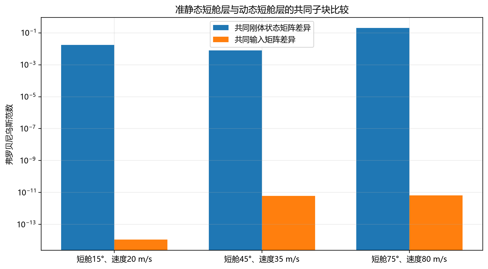

*图 2　准静态短舱层与动态短舱层共同子块比较*

## 4.5 短舱状态必要性

若研究对象仅是固定短舱角下的稳态配平，九状态层足以表达刚体平衡；若研究对称短舱过渡速率、左右不同步、单侧延迟或冻结，短舱角和角速度必须成为状态。必要性的核心不是状态数本身，而是状态提供了历史依赖、执行机构带宽和左右差动通道。

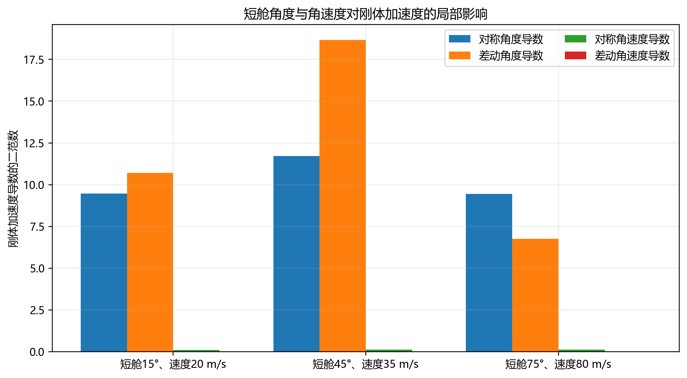

*图 3　短舱角度与角速度对刚体加速度的局部影响*

# 第五章　配平与模型一致性验证

## 5.1 新增三点

新增工况覆盖直升机侧、转换中段和飞机侧：

|工况|俯仰角/(°)|九状态残差范数|十三状态残差范数|最小惯量特征值/(kg·m²)|
|---|---|---|---|---|
|短舱15°、速度20 m/s|12.7200|4.539e-10|4.539e-10|17897.75|
|短舱45°、速度35 m/s|26.6719|1.361e-09|1.361e-09|17740.63|
|短舱75°、速度80 m/s|7.8512|3.829e-09|3.829e-09|17583.50|

这些点来自冻结的联合优化参数方案。短舱75°、60 m/s点虽有控制解，但不满足可信度边界；短舱75°、40 m/s点仍为配平失败点，二者均未被选作新增动态定量工况。

## 5.2 静态一致性

在每个点把十三状态模型的左右短舱角设为相同、角速度设为零，并与九状态模型使用同一控制输入。回代残差保持一致，说明动态扩展没有暗中改变配平控制或静态质量属性。共同输入矩阵的数值一致性进一步支持控制映射未被改写。

## 5.3 对称性与有限值

三个点的对称/差动跨子块范数在 $10^{-11}$ 量级。所有新增矩阵、特征根、时域状态、力和力矩均为有限实数。检查没有用零替换非有限值，也没有删除失败工况。

## 5.4 特征根比较

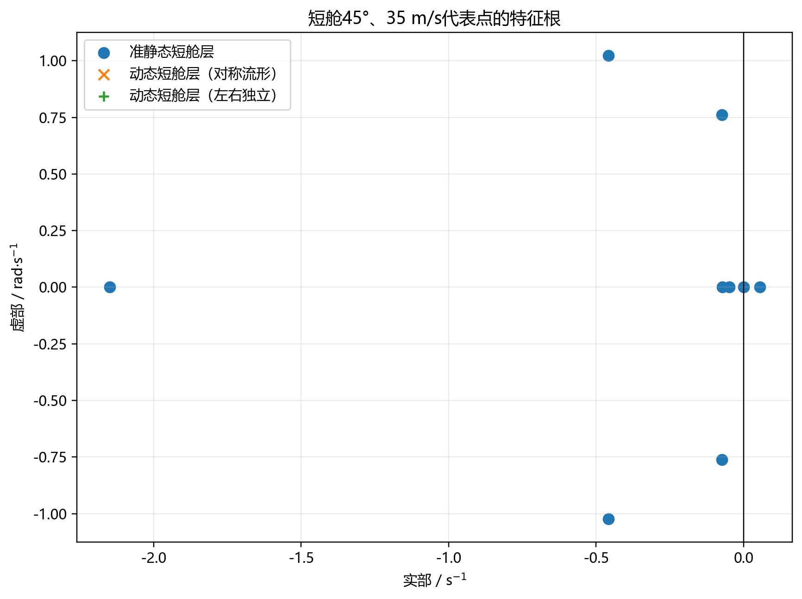

*图 5　短舱45°、35 m/s代表点的模型层级特征根*

十三状态层增加四个执行机构相关根，并可能通过共同刚体子块差异轻微移动原有根。本文只报告原始特征根和数值变化，不对条件不良的特征向量作确定性模态命名。既有代表点中六组特征向量矩阵均被判为数值病态，因此“模态物理身份”只作为待进一步验证的问题。

## 5.5 退化、镜像与参考点一致性

十三状态模型在左右短舱角相等、角速度为零且使用广义转矩接口时，前九个刚体导数对既有九状态基线的最大差异为零。交换左右短舱角和旋向后，侧向力、滚转力矩和偏航力矩满足预期镜像关系。部件力矩统一关于随短舱角重构的实际重心计算，质量矩守恒、惯量矩阵对称且正定；改变实际重心会同步改变固定部件的力臂矩，不使用名义重心替代。

## 5.6 文献结构与趋势对照

南航论文的部件划分、重心/惯量随短舱角变化以及有界配平流程与本文结构相似，但具体参数、尾流和控制模型不同。Berger论文支持左右短舱角、角速度和两类短舱输入的状态接口，但其51状态高阶模型不等同于本文十三状态模型。XV-15公开资料中的几何、操纵和转换角定义只用于参数候选及符号核查。上述比较属于结构或有限趋势对照，不构成型号验证。

## 5.7 时间步收敛

新增时域计算从0.05 s开始逐级减半，选择第一对最大峰值变化不超过2%的相邻时间步。收敛判据覆盖短舱状态、刚体角速度、姿态以及力矩峰值；最终归档使用较细一级。该过程与既有14个时域工况的0.1、0.05和0.025 s检查互补。

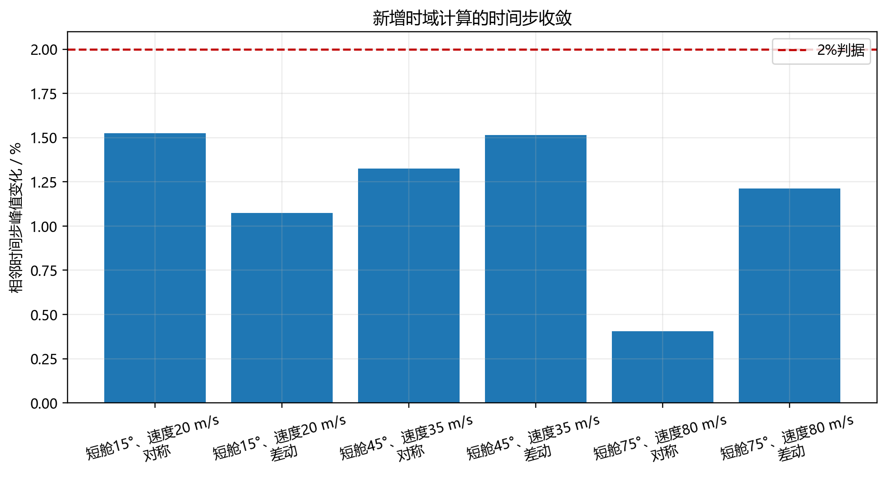

*图 9　新增时域计算的自适应时间步收敛*

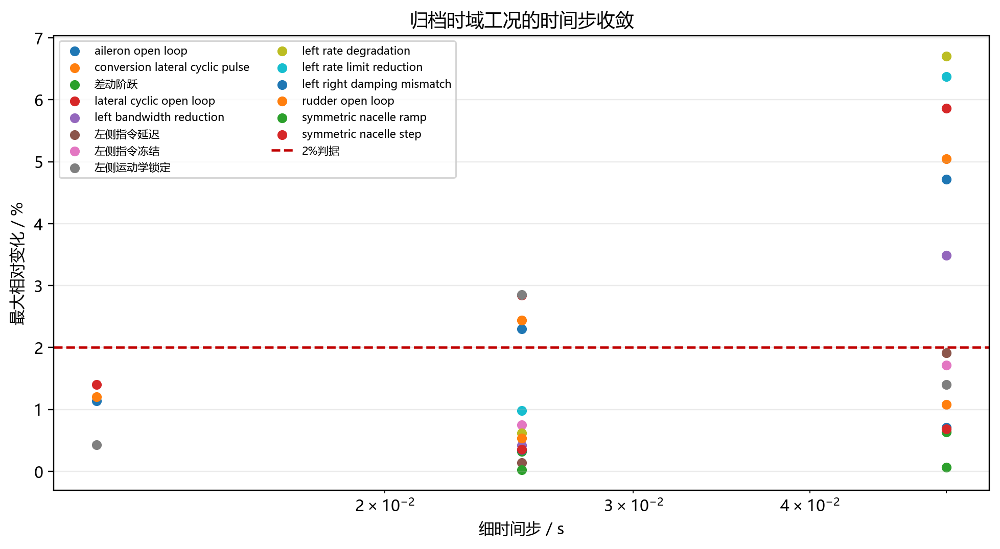

*图 17　既有时域工况的时间步收敛*

# 第六章　短舱动态状态影响的核心结果

## 6.1 对称短舱阶跃

对称2°指令使左右短舱角同步变化，三个点的最大短舱对称角偏差约0.03543 rad。最大俯仰角速度分别为
0.00601, 0.01809, 0.00234 rad/s，最大俯仰姿态偏差分别为
0.00547, 0.02213, 0.00370 rad。横侧向速度、滚转和偏航响应仅处于数值舍入量级，符合对称子空间不激发差动自由度的预期。

*图 6　三个工况的短舱阶跃刚体角速度*

## 6.2 对称短舱斜坡

既有归档中的8°对称斜坡用来表达连续转换运动。相较2°阶跃，斜坡降低了高频输入成分，但在较大总角度下形成更明显的俯仰姿态变化。斜坡结果只适用于给定二阶执行机构、速率限制和有效时间段，不代表任意转换律。

## 6.3 速度与构型影响

三个代表点的对称角度导数范数分别为
9.469, 11.721, 9.446。中间转换点的对称阶跃俯仰响应最大，说明响应并非随速度或短舱角单调变化，而由旋翼推力方向、机翼动压、尾翼效能、重心和部件力臂共同决定。

## 6.4 执行机构带宽与阻尼

既有敏感性计算表明，改变规定运动型执行机构的固有频率和阻尼会改变短舱跟踪相位、峰值角速度及刚体瞬态。带宽和阻尼在当前模型中是执行机构动态参数，而不是气动参数。它们影响瞬态，却不能用来补偿稳态配平失衡。

## 6.5 左右速率不一致

当左右执行机构带宽、阻尼或速度限制不一致时，即使指令在对称坐标中给出，也会产生非零差动短舱角。差动角通过左右旋翼推力方向和半翼尾流不对称进入侧向力、滚转力矩和偏航力矩。该现象说明只记录平均短舱角会丢失重要信息。

## 6.6 差动短舱阶跃

差动1°指令在三个点产生最大侧向速度偏差
4.793, 7.466, 2.045 m/s，最大滚转角速度
0.0549, 0.1777, 0.0488 rad/s，以及最大偏航角速度
0.1788, 0.0359, 0.0302 rad/s。结果显示差动角是横侧向—航向响应的直接状态变量。

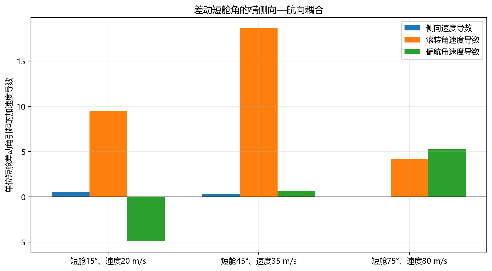

*图 4　差动短舱角的横侧向—航向局部导数*

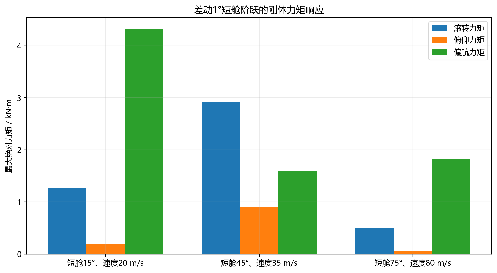

*图 7　差动1°短舱阶跃的刚体力矩响应*

## 6.7 单侧指令延迟

既有经修正归档在转换代表点计算了0.30 s左侧指令延迟。有效时间段最大滚转、偏航力矩分别为4.229和1.984 kN·m。该结果描述规定指令的时间错位，不等同于机械故障；其定量值依赖延迟长度、指令幅值和当时工作点。

## 6.8 指令冻结

指令冻结表示某一侧的指令值保持不变，执行机构仍按自身二阶动力学响应。有效时间段最大滚转、偏航力矩为6.300和3.950 kN·m，首次有效域违反发生在3.8 s。冻结后的全时段响应超出既定分析有效域时，只作数值显示，不形成定量结论。

## 6.9 运动学锁定

运动学锁定表示某一侧短舱角和角速度在事件时刻被固定。其与指令冻结的内部状态和动力学边界不同。有效时间段最大滚转、偏航力矩为6.603和3.780 kN·m，首次有效域违反发生在3.2625 s。全时段偏航峰值6.990 kN·m不进入正式定量结论。

## 6.10 机械卡滞的边界

机械卡滞需要接触、间隙、结构柔度、驱动器饱和和铰链载荷反馈等模型。当前规定运动模型不具备这些状态，故本文不计算机械卡滞冲击，不把指令冻结或运动学锁定重新命名为机械卡滞。

*图 16　归档异步短舱事件的横侧向—航向载荷*

## 6.11 纵向变量

对称短舱运动主要通过推力方向变化、尾流覆盖变化和执行机构俯仰反作用力矩影响纵向速度、俯仰角速度和俯仰姿态。三个点的最大俯仰力矩绝对值为
261.3, 347.0, 260.7 N·m。该结果是扰动量，不应与维持稳态的总俯仰力矩混淆。

## 6.12 横侧向—航向变量

差动短舱运动破坏左右推力方向和尾流覆盖的对称性。其最大滚转力矩为
1.268, 2.921, 0.495 kN·m，最大偏航力矩为
4.324, 1.593, 1.835 kN·m。中间转换点滚转响应最大，而低速点偏航响应最大，表明两个方向的主导机制不同。

## 6.13 动态配平偏离

定义动态配平偏离为瞬时刚体加速度相对于初始配平残差的尺度化范数。对称阶跃的最大值约0.731；差动阶跃在三个点分别为
3.969, 5.231, 1.779。差动事件明显离开纵向配平流形，说明“初始时刻已配平”不能替代全过程的刚体动态计算。

*图 8　短舱运动引起的动态配平偏离*

## 6.14 线性与非线性一致性

小扰动线性模型用于解释局部导数和特征根，非线性模型用于计算有限幅值阶跃。既有归档对短舱和常规控制输入进行了线性—非线性增量比较。只有在扰动足够小、未跨越限幅和分段边界时，两者才应接近；有限幅值结果不能由单一导数无条件外推。

## 6.15 有效域与数值守门

有效域同时约束姿态偏差、角速度、差动短舱角及必要的状态范围。所有定量峰值只从有效前缀提取。发生有效域违反并不自动说明模型发散，也不说明真实飞行器失稳；它只表示该时刻以后超出本文预先声明的分析范围。

# 第七章　参数来源、配平优化及其辅助角色

## 7.1 四类参数方案

参数来源主表共审计219项参数。原始概念基线模型使用项目既有概念参数；XV-15公开参数覆盖模型只替换有明确公开来源且完成单位与坐标核查的参数；其余参数继续标为与XV-15量级相近但未验证、通用工程假设、推导量、临时占位或未知。几何布局优化模型在边界内调整机翼气动中心纵向位置、旋翼倾转轴垂向位置和平尾安装角；几何与等效控制参数联合优化模型再加入升降舵有效升力导数。四者不是由低到高的“真实性等级”，而是不同研究问题的对照方案。

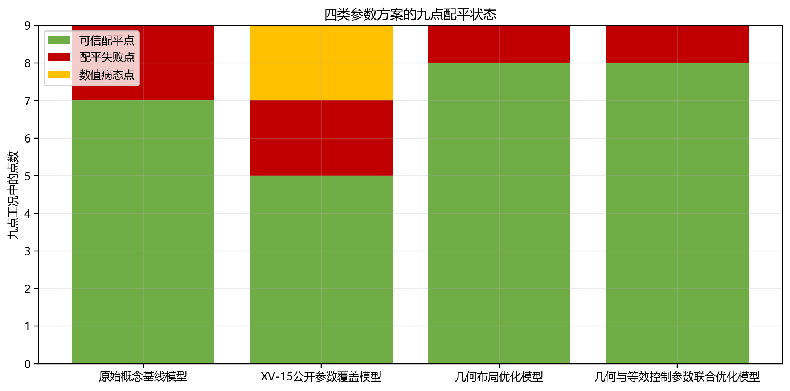

*图 11　四类参数方案的九点配平状态*

## 7.2 优化目标与边界

优化目标由配平可信点数量、残差、控制余度和连续性构成。几何变量边界基于概念设计可行范围，等效控制参数明确标记为标定量。优化没有改变质量、惯量、旋翼气动或短舱执行机构默认设置，也没有以稳定特征根为直接目标。

## 7.3 结果

九点集中，原始概念基线模型有7个可信配平点，公开参数覆盖模型有5个可信点、2个数值病态点和2个失败点，几何布局优化模型和联合优化模型均有8个可信点。联合优化方案在短舱75°、60 m/s点的升降舵需求为-15.8305°，全量程最小余度为10.4237%；短舱75°、40 m/s仍失败。加密工况为10/13可信，参数扰动鲁棒性工况为14/21可信。

短舱75°、40、60和80 m/s三点的俯仰力矩分解用于区分旋翼、机翼、机身和平尾贡献；无约束升降舵诊断用于判断失败来自控制边界还是求解器局部性。40 m/s点在正式边界内仍失败，60 m/s点虽有可信解但未作为动态定量代表点，80 m/s点具有可接受余度并进入三点层级比较。失败点和走廊断裂被保留，未用新增自由参数强行填补。

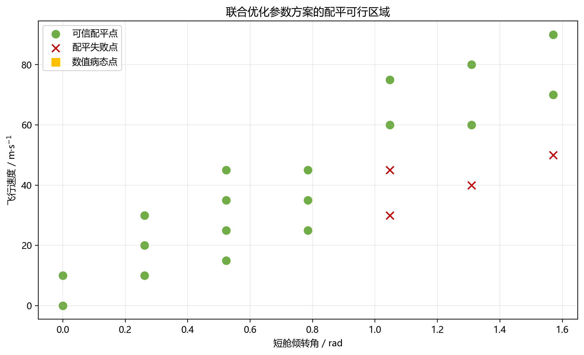

*图 12　联合优化参数方案的配平可行区域*

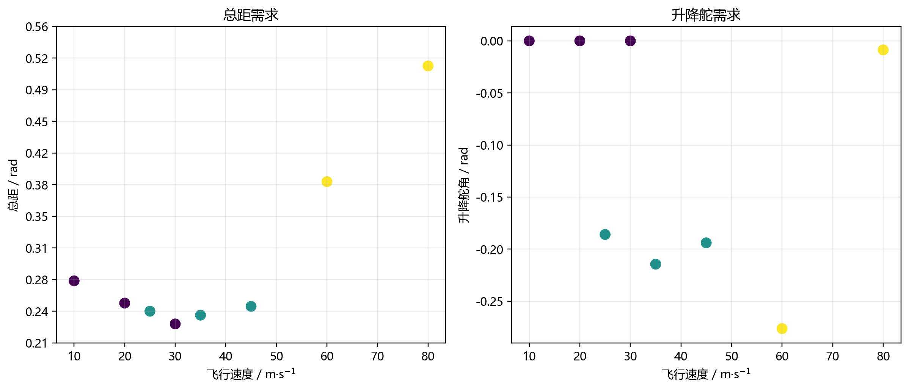

*图 13　联合优化参数方案的控制需求*

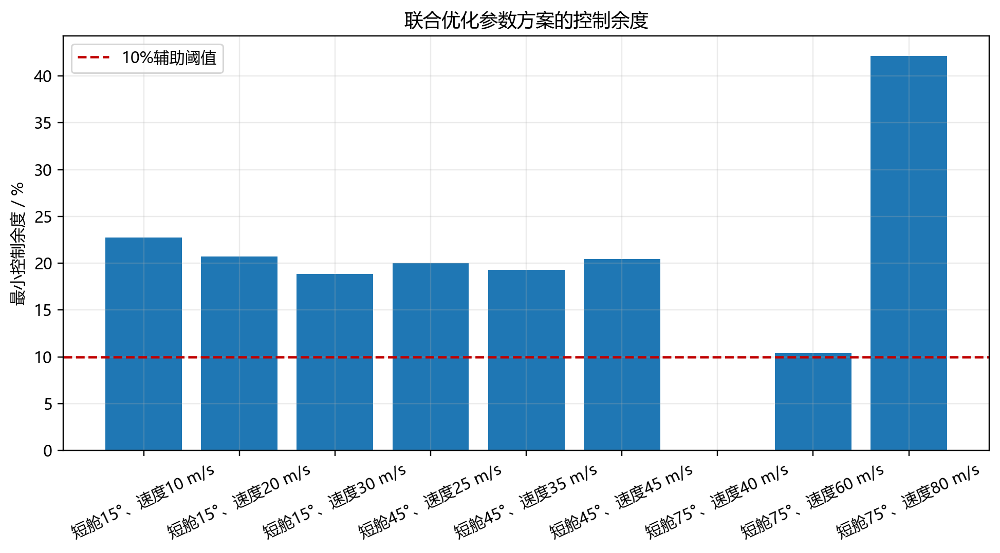

*图 14　联合优化参数方案的控制余度*

## 7.4 在论文中的角色

参数优化的唯一主线角色是提供三个可回代、有限、未触界的动态研究起点，并说明结果对布局和等效控制能力的依赖。它不是参数辨识，不提供外部试验验证，也不能证明十三状态扩展的真实性。短舱状态必要性由动态方程、左右不同步通道和响应结果共同支持。

# 第八章　讨论与局限

## 8.1 可形成的科学判断

计算结果表明：固定短舱角的稳态纵向研究可以使用九状态层；一旦研究短舱运动速率、左右不同步或异步事件，必须保留左右短舱角与角速度。对称运动主要进入纵向通道，差动运动在三个构型点均产生横侧向—航向响应。执行机构反作用力矩是默认参数下对称短舱角速度的直接动力学通道。

## 8.2 不能外推的内容

当前模型没有完整铰链动力学、伺服电机、电液作动器、结构柔度、传动链间隙和接触冲击，故不能给出机械卡滞或结构极限载荷结论。旋翼极惯量为零使陀螺通道不激活，这一工程假设限制了短舱角速度结论。气动模型仍包含线性和经验近似，也没有完成型号级风洞或飞行试验标定。

## 8.3 文献对照边界

南航论文支持部件划分、坐标变换、配平和线性化的建模路线；Berger学位论文支持把左右短舱角和角速度作为状态、用指令经控制环映射到短舱运动的结构；教材支持用雅可比迭代求解配平；NASA文献提供XV-15公开几何与质量资料的候选来源。上述对照是结构、公式或有限参数级，不构成对当前模型的完整复现。

## 8.4 数值与实验局限

新增计算只覆盖三个代表点、两种小幅阶跃和3 s时间窗。时间步收敛和线性化步长稳定只说明离散误差受到控制，不等于物理模型已验证。代表特征向量条件不佳，限制了模态命名。未来需要引入非零且可追溯的旋翼极惯量、双向铰链/伺服模型、更多转换轨迹以及独立试验数据。

*图 18　本文结论的适用边界*

# 第九章　结论

1. 在统一坐标、单位、实际重心和力矩参考点下，部件级模型形成了可配平、可线性化和可回代的研究链。三个新增可信点的配平残差范数均小于 $4\times10^{-9}$，输出为有限实数。
2. 九状态层适合固定短舱角的稳态刚体研究；十三状态层通过左右短舱角和角速度表达执行机构历史、速率和不同步，因而是研究短舱动态影响的必要层级。
3. 对称2°短舱阶跃在三个点主要产生纵向响应，横侧向—航向量保持在数值舍入水平。差动1°阶跃则在全部三个点产生非零侧向速度、滚转和偏航响应。
4. 默认旋翼极惯量为零，使短舱角速度陀螺项在本组计算中为零；对称角速度仍通过执行机构反作用力矩形成直接俯仰通道。该结果不能外推为真实旋翼陀螺效应可忽略。
5. 动态配平偏离表明初始配平不能代替短舱运动全过程计算。差动阶跃离开纵向配平流形的程度显著大于对称阶跃。
6. 纵向布局与等效控制参数优化为动态研究提供可信工作点，但只属于辅助证据。它既不改变短舱动态方程，也不构成型号参数辨识或外部验证。
7. 所有定量结论均受三个工况、规定运动型执行机构、有效时间段和数值收敛门槛约束。机械卡滞、铰链载荷、双向伺服耦合与型号级飞行试验结论不在本文能力范围内。

# 参考文献

[1] SHENG H, ZHANG C, XIANG Y. Mathematical modeling and stability analysis of tiltrotor aircraft[J]. Drones, 2022, 6(4): 92. DOI: 10.3390/drones6040092.

[2] BERGER T. Handling qualities requirements and control design for high-speed rotorcraft[D]. University Park: Pennsylvania State University, 2019.

[3] DREIER M E. 直升机和倾转旋翼飞行器飞行仿真引论[M]. 孙传伟, 孙文胜, 刘勇, 傅思平, 译. 北京: 航空工业出版社, 2012.

[4] DUGAN D C, ERHART R G, SCHROERS L G. The XV-15 tilt rotor research aircraft[R]. NASA-TM-81244, 1980.

[5] TILT ROTOR PROJECT OFFICE STAFF. NASA/Army XV-15 tilt rotor research aircraft familiarization document[R]. NASA-TM-X-62407, 1975.

# 附录A　十七项科学问题的证据回答

1. 本文建立左右旋翼、左右半翼与尾流区、机身、平尾、垂尾、质量—重心—惯量和刚体六自由度模型，并在实际重心处合成载荷。
2. 十三个状态依次为机体系纵向、侧向和垂向速度，滚转、俯仰和偏航角速度，滚转、俯仰和偏航姿态角，左短舱角、右短舱角、左短舱角速度、右短舱角速度。
3. 短舱角和角速度必须成为状态，才能表达运动历史、执行机构带宽和阻尼、角速度反作用力矩以及左右不同步。
4. 九状态模型遗漏短舱执行机构瞬态、短舱角速度通道、左右差动角历史、单侧延迟、指令冻结和运动学锁定。
5. 左右独立短舱状态使差动指令、左右参数失配、单侧延迟、冻结和锁定的横侧向—航向影响可以被区分。
6. 对称短舱运动主要影响纵向速度、垂向速度、俯仰角速度和俯仰姿态角。
7. 差动短舱运动主要影响侧向速度、滚转与偏航角速度以及滚转与偏航姿态角。
8. 在同一角度幅值下，提高短舱转动速率会增大规定执行机构的角速度反作用力矩，并可能增大动态配平偏离；具体峰值还受带宽、阻尼、构型和气动载荷共同影响，不能由单一速率无条件排序。
9. 左右执行机构不同步生成非零差动短舱角，进而破坏左右推力方向和半翼尾流对称性，产生滚转和偏航力矩。
10. 当前执行机构状态由指令单向决定，机体和铰链载荷不反向进入执行机构内部方程，因此只能研究规定运动对刚体的单向动力学影响。
11. 参数优化只提供可信配平工作点、控制余度和参数敏感性背景，不是论文主要创新，也不构成参数辨识。
12. 配平失败保留了控制边界、力矩能力和走廊断裂信息；只要动态定量工况来自可信点，失败点不否定短舱状态研究本身。
13. 状态/输入接口、对称退化、左右镜像、质量矩、惯量正定、配平回代、差分步长和时间步检查属于内部一致性证据。
14. 与南航部件划分、Berger状态结构以及XV-15公开几何和操纵定义的比较属于结构或有限趋势对照。
15. 当前没有独立飞行试验或风洞数据库闭环，不能称为外部验证。
16. 主要局限包括规定运动型执行机构、无双向铰链反馈、默认零旋翼极惯量、缺少动态入流和桨叶模态、近法向机翼概念模型、平尾局部来流简化、参数可辨识性不足和外部数据缺失。
17. 下一步最需要非零旋翼极惯量与转子角动量数据、左右短舱执行机构与铰链载荷试验、非定常尾流/动态入流、桨叶模态、平尾局部流场以及独立转换飞行试验数据。

# 附录B　三个新增工况的响应指标

|工况|输入|最大俯仰角速度/(rad/s)|最大滚转角速度/(rad/s)|最大偏航角速度/(rad/s)|最大动态配平偏离|时间步峰值变化|
|---|---|---|---|---|---|---|
|短舱15°、速度20 m/s|对称2°阶跃|0.00601|0.00000|0.00000|0.7405|1.5248%|
|短舱15°、速度20 m/s|差动1°阶跃|0.00402|0.05490|0.17885|3.9688|1.0728%|
|短舱45°、速度35 m/s|对称2°阶跃|0.01809|0.00000|0.00000|0.7405|1.3264%|
|短舱45°、速度35 m/s|差动1°阶跃|0.01034|0.17773|0.03587|5.2308|1.5145%|
|短舱75°、速度80 m/s|对称2°阶跃|0.00234|0.00000|0.00000|0.7406|0.4058%|
|短舱75°、速度80 m/s|差动1°阶跃|0.00101|0.04884|0.03017|1.7792|1.2111%|

# 附录C　可重复性说明

新增计算脚本只读取冻结的参数方案和配平归档，在三个点分别执行九状态、十三状态对称流形和十三状态左右独立计算。线性化采用中心差分并进行0.1、1和10倍步长检查；时域积分逐级减半时间步，直到相邻峰值变化不超过2%。全部原始图数据、矩阵数据库、语言审计和文件哈希随本报告一并归档。
