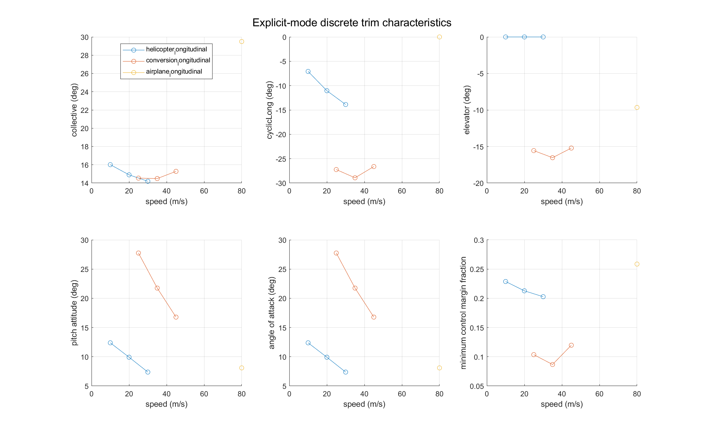
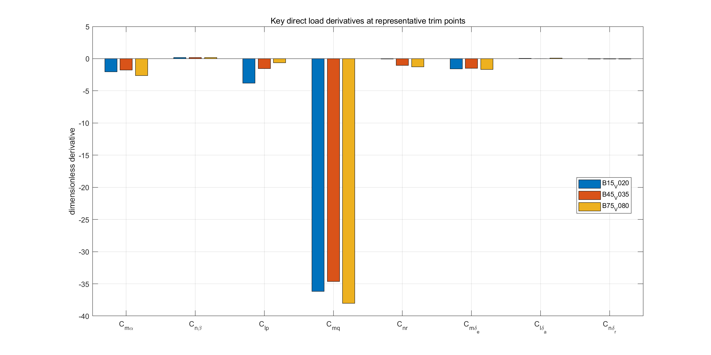
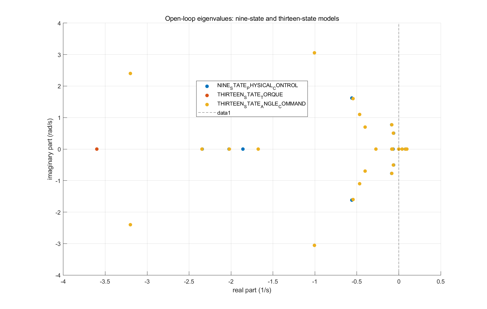
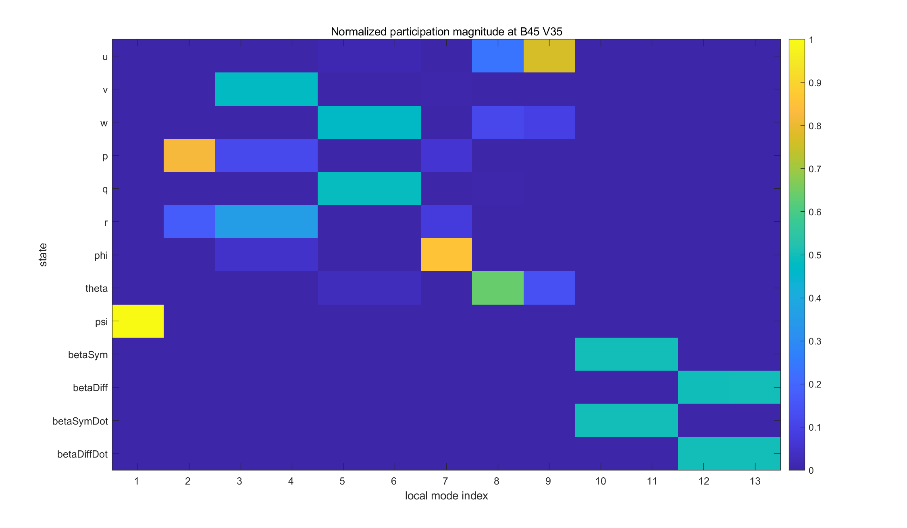
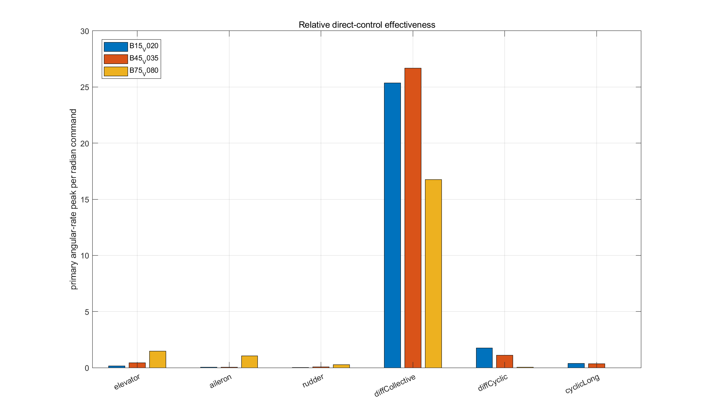

# 第一章　摘要与符号说明

本报告在统一机体系和部件级载荷合成框架下，对通用低阶倾转旋翼机模型开展开环操纵稳定特性后处理。研究对象包括九状态刚体模型与包含左右短舱角、角速度的十三状态规定运动模型。三个代表点分别为短舱角 15°/20 m/s、45°/35 m/s 和 75°/80 m/s；复算结果显示三点可信度与旋翼物理闭合状态均为“满足”。分析采用保持空速模长的迎角和侧滑角重构、三档中心差分、完整质量与惯量换算、左右特征向量双正交归一化以及线性—非线性同时间步小扰动对照。

结果文件给出静稳定导数、阻尼导数、七个物理控制通道的直接力/矩导数、九状态和十三状态全部特征根、参与因子、控制阶跃与分模式配平特性。A 矩阵链式反推中 90 项满足完整交叉核查，0 项因刚体、重力或运动学耦合保留为部分核查；B 矩阵换算中 0 项满足完整交叉核查，0 项保留为部分核查。全部模态表中记录 9 个局部不稳定根；78 个根因状态参与不集中或数值条件限制标为 `MIXED_OR_UNCERTAIN_MODE`，没有强行套用经典模态名称。参与因子最大双正交误差为 1.414e+00。控制阶跃最细时间步相对差异最大值为 6.041e-02，线性与非线性响应方向一致比例为 70.4%。

NASA TM-86854 图 25 仅用于总距增加时推力增加的趋势方向对照。该文献横轴为 \(0.75R\) 桨距，而当前模型命令总距是叠加于既定扭转分布的控制量，尚未形成同构横坐标。因此既有 MAE/RMSE 只能称为“未经同构映射的原始曲线差异诊断”，不作为模型预测误差、型号验证或结论核心指标。

本报告的适用范围是通用低阶模型的飞行动力学机理、开环稳定性、操纵效能和短舱动态状态影响研究；不支持 XV-15 定量复现、具体型号性能预测、飞行安全包线认证、正式操纵品质评级或完整伺服—铰链—结构双向耦合结论。

**关键词：** 倾转旋翼机；部件级建模；开环稳定性；操纵导数；参与因子；短舱动态状态

## 主要符号

|符号|含义|单位|
|---|---|---|
|\(u,v,w\)|机体系速度分量|m/s|
|\(p,q,r\)|机体系角速度|rad/s|
|\(\phi,\theta,\psi\)|滚转、俯仰、偏航欧拉角|rad|
|\(\beta_M\)|短舱构型角|rad|
|\(\beta_{\rm slip}\)|侧滑角|rad|
|\(\mathbf F_b,\mathbf M_b\)|机体系合力、关于重心的合力矩|N，N·m|
|\(\mathbf A,\mathbf B\)|状态矩阵、输入矩阵|按状态与输入定义|
|\(V,W\)|右、左特征向量矩阵|1|
|\(P_{ki}\)|状态 \(k\) 对模态 \(i\) 的参与因子|1|

# 第二章　研究背景与技术目标

## 2.1 研究对象

倾转旋翼机在短舱转换过程中同时改变旋翼推力方向、机翼局部来流、尾翼动压、质量属性和操纵权限。公开数据不足以唯一辨识具体型号的完整气动和执行机构参数，因此本研究采用通用、低阶、部件级正向机理模型，强调坐标、单位、力矩参考点、物理分支与数值闭合的一致性。

## 2.2 技术目标与问题分解

报告依次回答四类问题：部件载荷如何在统一坐标系中闭合；可信配平点附近的静稳定、阻尼与操纵导数如何由直接力/矩扰动得到；九状态和十三状态模型的局部根、参与因子及短舱执行机构模态如何解释；小幅操纵阶跃在有限时间内的线性—非线性一致性和相对效能如何变化。

## 2.3 研究边界

本研究不通过调参追求“更稳定”或“更像文献”的结果，不删除不收敛点，不跨不同显式配平模式连接曲线，也不将数值可积、配平可信或局部特征根稳定混为模型正确性证明。分析结果只对应列出的离散工况和概念参数。

# 第三章　坐标系、动力学理论与模型架构

本章建立全文共同使用的坐标、符号和刚体动力学基础。统一定义是后续部件载荷合成、配平以及短舱状态扩展能够相互比较的前提。

## 3.1 理论与模型实现概览

机体系采用右手系，$x_b$ 轴向前、$y_b$ 轴向右、$z_b$ 轴向下；力和力矩最终均转换到机体系并关于整机实际重心合成。短舱角 $\beta=0$ 表示旋翼轴接近垂直、处于直升机侧，$\beta=\pi/2$ 表示旋翼轴接近机体纵轴、处于飞机侧。Berger文献采用相反端点的角度记号，二者映射为 $\beta=\pi/2-\delta_{nac}$，引用其结果时必须先执行该转换。

地面系到机体系的姿态由3-2-1欧拉角描述。本文不在接近 $\theta=\pm\pi/2$ 的奇异区域形成结论。短舱局部坐标、左右旋翼轴向与旋转方向由模型中的显式旋转矩阵和旋向参数共同给出，不能仅由示意图推断符号。

机体系平动方程写为

$$m(\dot{\mathbf{v}}_b+\boldsymbol{\omega}_b\times\mathbf{v}_b)
=\mathbf{F}_b+m\mathbf{g}_b,$$

转动方程写为

$$\mathbf{I}\dot{\boldsymbol{\omega}}_b
+\boldsymbol{\omega}_b\times(\mathbf{I}\boldsymbol{\omega}_b)
=\mathbf{M}_b.$$

这里 $\mathbf{I}$ 为关于实际整机重心、在机体系表达的完整对称惯量矩阵。欧拉角运动学为

$$\dot{\boldsymbol{\eta}}=\mathbf{T}(\phi,\theta)\boldsymbol{\omega}_b.$$

九状态向量取

$$\mathbf{x}_9=[u,v,w,p,q,r,\phi,\theta,\psi]^T.$$

位置状态不参与本研究的局部动力学比较。重力只在刚体方程中计入一次，各气动部件函数不重复加入重力。

左右旋翼分别计算。叶素动量模型由局部轴向和切向速度、桨距分布、翼型升阻力关系以及诱导速度迭代获得推力和扭矩。单个叶素的相对速度和入流角可写为

$$W^2=U_T^2+U_P^2,\qquad \varphi_i=\operatorname{atan2}(U_P,U_T),$$

$$\alpha_i=\theta_i-\varphi_i,$$

并通过径向积分形成旋翼轴系载荷。旋翼轴系载荷使用短舱姿态旋转到机体系。左右旋翼反扭矩符号由旋向参数控制，不能以简单镜像代替。

当前模型为简化叶素动量和稳态一阶谐波挥舞模型，不是自由尾迹或计算流体力学模型。旋翼间干扰、详细非定常失速和弹性桨叶动力学未被完整表示。默认旋翼极惯量为零属于工程假设，使随短舱倾转产生的转子陀螺力矩数值为零；方程接口仍保留该通道。

机翼左右半翼独立计算局部来流与旋翼尾流覆盖。常规升力线近似与近法向来流概念模型在同一局部来流状态下分别计算，再用五次平滑阶跃函数连续混合：

$$w(s)=6s^5-15s^4+10s^3,\qquad
\mathbf{F}_w=(1-w)\mathbf{F}_{LL}+w\mathbf{F}_{N}.$$

过渡中心和半宽均为模型参数，其中半宽是为低速连续性采用的工程假设，并非试验标定。左右半翼分别接收短舱状态，因此差动短舱角能够破坏左右对称尾流条件并产生横侧向载荷。

所有部件力先转换到机体系，再按

$$\mathbf{M}_{arm,i}=(\mathbf{r}_i-\mathbf{r}_{cg})\times\mathbf{F}_i$$

形成力臂矩，并与部件自身气动力矩相加。总载荷为

$$\mathbf{F}_b=\sum_i\mathbf{F}_i,\qquad
\mathbf{M}_b=\sum_i(\mathbf{M}_i+\mathbf{M}_{arm,i}).$$

基础控制架构包括总距、差动总距、对称纵向周期变距和差动纵向周期变距；文中“差动纵向周期变距”对应代码历史接口中的差动周期名称。纵向配平使用总距、对称纵向周期变距、升降舵和俯仰姿态等与工况一致的未知量。所有角度进入三角函数前均转换为弧度。

参数来源分为文献直接来源、图表数字化、推导、工程假设、标定等效参数、临时占位和未知。来源分类不等于精度等级；即使是文献数值，也必须确认构型、页码、单位和坐标定义。

模型层级由部件公式、整机载荷、九状态刚体、十三状态短舱扩展、配平与线性化组成。每向上一层，均保留下一层的输入输出和适用性状态。该结构使失败可以定位到具体部件或数值环节，避免以整机残差掩盖局部不收敛。

本文采用V形验模思想：左侧把科学问题分解为坐标、力学、气动、质量和执行机构要求；底部由单元、守恒和数值收敛检查支撑；右侧依次执行独立代码交叉比较、文献基准和外部试验数据关联。外部数据无法形成同构输入时，证据不向上越级。

## 3.2 姿态运动学

地面坐标系记为 \(O_gx_gy_gz_g\)，机体系记为 \(O_bx_by_bz_b\)。机体系采用
\(x_b\) 向前、\(y_b\) 向右、\(z_b\) 向下的右手约定。按照 3-2-1 被动坐标变换，
地面系向量在机体系中的分量由

$$
\mathbf C_b^g=
\begin{bmatrix}
c_\theta c_\psi&c_\theta s_\psi&-s_\theta\\
s_\phi s_\theta c_\psi-c_\phi s_\psi&s_\phi s_\theta s_\psi+c_\phi c_\psi&s_\phi c_\theta\\
c_\phi s_\theta c_\psi+s_\phi s_\psi&c_\phi s_\theta s_\psi-s_\phi c_\psi&c_\phi c_\theta
\end{bmatrix} \\tag{1}
$$

给出，其中 \(c_\bullet=\cos(\bullet)\)、\(s_\bullet=\sin(\bullet)\)，角度单位为 rad。
角速度与欧拉角速率的关系为

$$
\begin{bmatrix}\dot\phi\\\dot\theta\\\dot\psi\end{bmatrix}
=
\begin{bmatrix}
1&s_\phi\tan\theta&c_\phi\tan\theta\\
0&c_\phi&-s_\phi\\
0&s_\phi/\cos\theta&c_\phi/\cos\theta
\end{bmatrix}
\begin{bmatrix}p\\q\\r\end{bmatrix}. \\tag{2}
$$

该表示在 \(\cos\theta=0\) 处奇异，本文工况远离该区域。重力在机体系中的投影为

$$
\mathbf g_b=\mathbf C_b^g[0,0,g]^T
=g[-\sin\theta,\ \sin\phi\cos\theta,\ \cos\phi\cos\theta]^T. \\tag{3}
$$

完整惯量矩阵写作

$$
\mathbf I_b=\begin{bmatrix}I_{xx}&-I_{xy}&-I_{xz}\\-I_{xy}&I_{yy}&-I_{yz}\\-I_{xz}&-I_{yz}&I_{zz}\end{bmatrix},
\qquad \lambda_{\min}(\mathbf I_b)>0. \\tag{4}
$$

代码保留 \(I_{xz}\) 而没有套用仅适于对角惯量的标量转动方程。符号、重力方向和
交叉惯量均通过端点与正定性检查约束。

## 3.3 部件载荷合成的数学形式

第 \(k\) 个部件在自身局部系的力与固有矩分别为
\(\mathbf F_k^{(k)}\) 和 \(\mathbf M_k^{(k)}\)。用被动旋转矩阵
\(\mathbf C_b^k\) 转入机体系：

$$
\mathbf F_k^b=\mathbf C_b^k\mathbf F_k^{(k)},\qquad
\mathbf M_{k,0}^b=\mathbf C_b^k\mathbf M_k^{(k)}. \\tag{5}
$$

若 \(\mathbf r_k^b\) 是从整机实际重心指向作用点的位置，整机载荷为

$$
\mathbf F_b=\sum_k\mathbf F_k^b,\qquad
\mathbf M_b=\sum_k\left(\mathbf M_{k,0}^b+\mathbf r_k^b\times\mathbf F_k^b\right). \\tag{6}
$$

叉乘次序不可交换。该统一接口使旋翼反扭矩、尾翼固有矩与作用点力矩只计入一次。

## 3.4 模型层级与信息流

全文使用三个互有包含关系的动力学层级。准静态九状态模型把共同短舱角作为工况参数，
适合配平、局部导数和既有结果回归。十三状态规定运动模型增加左右短舱角与角速度，
适合研究带宽、速率和不同步历史。外部参考旋翼不是第四个整机层级，而是可以替换单一
旋翼部件的对照实现。层级之间共享状态顺序、控制定义、部件接口和载荷合成点，差异项
必须在模型入口处显式选择。

每次模型调用的信息流可概括为：由状态和短舱角计算质量属性；在实际重心上建立各部件
局部速度；左右旋翼求解诱导速度和稳态挥舞；旋翼结果决定机翼尾流覆盖；机身与尾翼
使用各自作用点速度；全部载荷转换到机体系并关于实际重心合成；最后进入完整惯量的
六自由度方程。十三状态路径还计算短舱二阶运动、移动质量和规定运动反作用项。先算
质量属性再算力臂，是避免参考点滞后一个时间步的必要顺序。

## 3.5 单位、正方向与极限工况

模型内部统一使用SI制：长度m、质量kg、速度m/s、力N、力矩N·m、惯量kg·m²、角度rad、
角速度rad/s。文献中以degree、rpm、英尺或磅力给出的量必须在进入参数表前换算，例如

$$
\Omega=\mathrm{rpm}\,\frac{2\pi}{60}. \\tag{7}
$$

短舱角端点通过推力方向检查：\(\beta=0\) 时正推力主要沿 \(-z_b\)，
\(\beta=\pi/2\) 时主要沿 \(+x_b\)。重力端点通过水平姿态
\(\mathbf g_b=[0,0,g]^T\) 检查。左右旋翼在完全对称输入下推力大小应接近，而气动
反扭矩符号相反；差动控制的镜像关系则根据力矩奇偶性判断，不能机械要求所有输出相等。

零空速时固定翼动压应趋近零，旋翼仍可在转速非零时产生诱导载荷；旋翼停转若允许，
叶素相对速度和无量纲系数的定义必须避免除零。本文不在欧拉角奇异区、超出线性气动
系数有效迎角或未闭合风车分支上给出稳定性结论。这些极限工况既是数值保护，也是坐标
与符号的可证伪测试。

## 3.6 本章小结

本章给出3-2-1坐标变换、欧拉角运动学、重力投影、完整惯量刚体方程和关于实际重心的
载荷合成。短舱角端点、左右旋向和SI单位构成后续程序的共同约束。质量属性须在部件
局部速度和力臂之前更新，固有矩与力臂矩只计入一次。这些定义不提供气动精度，却决定
不同部件和模型层级能否无歧义比较。

## 3.7 部件级非线性飞行动力学模型

本节把本章的统一定义落实为旋翼、左右机翼、机身和尾翼的部件级载荷链，最终输出关于实际重心的整机合力与合矩。本章方程链属于理论与实现定义；有限值、镜像、端点、力矩臂和多步长检查分别在第五、七章集中评价，因此不在各小节重复证据等级说明。

### 3.7.1 部件模型实现概览

总质量采用部件质量和，实际重心由一阶质量矩确定。每个部件自身惯量先旋转到机体系，再用平行轴定理迁移到实际重心。移动短舱部件的质心位置和惯量随倾转角变化，因此质量属性与气动载荷必须使用同一时刻的短舱状态。审计同时检查惯量对称性、特征值正定性和交叉惯量符号。当前数值只构成概念模型参数，不能以与公开XV-15数值数量级接近来替代来源证明。

轮毂局部速度由机体平动速度与角速度叉乘力臂叠加得到，再投影到旋翼轴向和盘面基。叶素切向速度包含旋转速度和盘内来流的一阶方位项，垂向速度包含轴向来流、诱导速度、挥舞角和挥舞角速度贡献。采用atan2计算入流角以保留象限，零转速、零空速和极小分母均由显式适用性检查处理，不能把非有限结果替换为零。

正式旋翼路径采用稳态一阶谐波挥舞与诱导速度耦合迭代。南航公开公式参考路径则严格保留公开式的主链，并把翼型关系、坐标相位、结构质量分布和数值求解器标记为标准闭合或同参数输入。两条路径共享几何和气动参数时的比较可以揭示数学实现差异，却不能恢复作者未公开的原程序。两条路径均只支持正推力动量闭合；负推力载荷保留作诊断，但 `physicalConverged=false`，不能进入可信配平。

叶素升阻力先分解为轴向和切向分力，经径向和方位积分得到推力、面内力及轴矩。旋翼轴系载荷经短舱姿态矩阵转到机体系；轮毂力臂矩按从实际重心指向轮毂的位置向量与机体系力的叉乘计算。左右反扭矩由旋向参数决定，不能简单令左右所有分量同号或异号。

左右半翼分为自由流区和旋翼尾流覆盖区，并分别计算局部速度、动压、迎角和载荷。近法向来流模型与升力线概念模型在同一局部来流上分别求值，再用五次平滑函数混合，避免布尔硬切换导致配平残差不连续。过渡中心和半宽属于工程模型参数，连续性改善不等于气动真实性已经验证。

机身气动力由局部速度、迎角和侧滑角构成的低阶系数关系计算。零动压时载荷自然趋零；超出系数适用范围的状态只作诊断。机身作用点和自身力矩必须与机体系坐标一致，不能将风轴阻力直接叠加到机体系而省略变换。

垂尾以局部侧滑和动压生成侧向力及偏航力矩。左右差动短舱运动会通过旋翼推力方向、尾流覆盖和机体姿态破坏对称条件，因而垂尾响应是横侧向耦合链的一部分。当前模型未包含旋翼尾迹瞬态扫过垂尾的非定常效应。

每个部件输出均包含作用点、机体系力和部件自身力矩。总力矩由自身力矩与力臂矩逐项求和，重力只在刚体方程计入一次。审计以人工改变作用点的方式验证力矩增量，能够发现叉乘顺序、参考点或坐标系错误。

平动方程保留角速度与机体系速度的叉乘项，转动方程使用完整惯量矩阵及角动量叉乘项。欧拉角采用三二一顺序，接近俯仰九十度时存在运动学奇异，本文工况避开该区域。状态导数顺序与线性化、配平和时域积分接口保持一致。

控制架构包括对称总距、差动总距、对称纵向周期变距和差动纵向周期变距。正对称纵向周期变距定义为左右盘面法向量共同向规定盘内方向倾斜；差动纵向周期变距使两侧盘面产生相反纵向倾斜。外部控制先分配到左右旋翼，旋翼内部再按旋向映射一阶谐波相位。

模型不允许用数值截断掩盖物理分支缺失。任何NaN、Inf、复数、迭代不收敛、越界插值或负推力未闭合都必须作为显式状态进入证据矩阵。旋翼输出区分数值序列收敛 `coupledConverged` 与物理闭合 `physicalConverged`，后者还要求正推力分支受支持且原始推力—动量残差达标。保护项只防止未定义运算，不把保护后的点自动判为可信。

### 3.7.2 左右旋翼模型的局部速度与几何

左右桨毂 \(h\in\{L,R\}\) 的机体系局部来流同时包含质心速度和机体转动贡献：

$$
\mathbf V_h^b=\mathbf V_{\rm CG}^b+\boldsymbol\omega_b\times\mathbf r_h^b. \\tag{8}
$$

旋翼轴单位向量由短舱角决定。以本文端点定义，\(\beta_h=0\) 为直升机侧，
\(\beta_h=\pi/2\) 为飞机侧，可写

$$
\mathbf e_{A,h}^b=[\sin\beta_h,\ 0,\ -\cos\beta_h]^T,\qquad
\|\mathbf e_{A,h}^b\|_2=1. \\tag{9}
$$

与轴向正交的盘面基向量记为 \(\mathbf e_{D,h}^b,\mathbf e_{Y,h}^b\)，满足

$$
\mathbf e_{D,h}^b\times\mathbf e_{Y,h}^b=\mathbf e_{A,h}^b. \\tag{10}
$$

桨叶径向坐标和方位角分别为

$$
r=r_{\rm hub}+\xi(R-r_{\rm hub}),\quad 0\le\xi\le1,\qquad
\psi_j=\psi+\frac{2\pi(j-1)}{N_b}. \\tag{11}
$$

桨距包含总距、线性扭转和一阶纵向周期量：

$$
\theta_h(r,\psi)=\theta_{0,h}+\theta_{\rm tw}\frac{r-r_{\rm hub}}{R-r_{\rm hub}}
+\theta_{1s,h}\sin\psi . \\tag{12}
$$

控制接口把正纵向周期定义为盘面法向共同向 \(+\mathbf e_D\) 倾斜。左右旋向
\(s_h\in\{-1,+1\}\) 不同，内部映射为

$$
\theta_{1s,h}=-s_h\,\theta_{{\rm cyc},h}. \\tag{13}
$$

因此对称外部指令在物理盘面上同向，而不是简单给左右旋翼相同的内部谐波符号。

### 3.7.3 叶素气动力、诱导速度与挥舞闭合

叶素切向和轴向速度分别记为 \(U_T\) 与 \(U_P\)：

$$
U_T=s_h\Omega r+\mathbf V_h^b\cdot\mathbf e_t,\qquad
U_P=\mathbf V_h^b\cdot\mathbf e_{A,h}+v_i+v_{1c}\cos\psi+v_{1s}\sin\psi. \\tag{14}
$$

相对速度、入流角和攻角为

$$
W=\sqrt{U_T^2+U_P^2},\qquad
\varphi=\operatorname{atan2}(U_P,U_T),\qquad
\alpha=\theta_h-\varphi . \\tag{15}
$$

二维翼型关系在概念模型有效攻角内写成 \(C_l=C_{l\alpha}\alpha\) 和
\(C_d=C_{d0}+k_dC_l^2\)。叶素升阻力为

$$
\mathrm dL=\tfrac12\rho W^2c\,C_l\,\mathrm dr,\qquad
\mathrm dD=\tfrac12\rho W^2c\,C_d\,\mathrm dr. \\tag{16}
$$

轴向推力与气动扭矩微元分别为

$$
\mathrm dT=(\mathrm dL\cos\varphi-\mathrm dD\sin\varphi),\qquad
\mathrm dQ=r(\mathrm dL\sin\varphi+\mathrm dD\cos\varphi). \\tag{17}
$$

经径向积分、方位平均和桨叶求和得到

$$
T=\frac{N_b}{2\pi}\int_0^{2\pi}\int_{r_{\rm hub}}^R\mathrm dT\,\mathrm d\psi,
\qquad
Q=\frac{N_b}{2\pi}\int_0^{2\pi}\int_{r_{\rm hub}}^R\mathrm dQ\,\mathrm d\psi . \\tag{18}
$$

诱导速度由叶素推力与动量关系闭合。概念性写法为

$$
T=2\rho A v_i\sqrt{V_\parallel^2+v_i^2+V_\perp^2},
\qquad A=\pi R^2, \\tag{19}
$$

实际程序采用带松弛的迭代：

$$
v_i^{(n+1)}=(1-\gamma)v_i^{(n)}+\gamma\mathcal G(T^{(n)},\mathbf V_h), \\tag{20}
$$

并显式报告迭代失败。`max(T,0)` 仅定义当前正推力 Eq.13 的诱导速度目标；最终仍以未截断叶素推力复算原始动量闭合残差。负推力载荷不改写为零，但由于尚无负推力/风车闭合，必须返回“不支持的物理分支”，不得作为成功点。一阶谐波挥舞写成

$$
\beta_f(\psi)=\beta_0+a_{1c}\cos\psi+b_{1s}\sin\psi, \\tag{21}
$$

其中谐波系数通过稳态线性代数闭合，不是自由尾迹或瞬态弹性桨叶模型。旋翼合力和
反扭矩在局部轴系内为

$$
\mathbf F_h^{(h)}=[F_D,F_Y,-T]^T,\qquad
\mathbf M_{Q,h}^{(h)}=[0,0,-s_hQ]^T. \\tag{22}
$$

随后使用短舱旋转矩阵转换到机体系。悬停附近两套旋翼路径的推力斜率方向一致，
前飞时局部速度、诱导闭合和面内力的差异会通过配平放大。

### 3.7.4 左右机翼与旋翼尾流

第 \(h\) 侧半翼气动中心的速度为

$$
\mathbf V_{w,h}^b=\mathbf V_{\rm CG}^b+\boldsymbol\omega_b\times\mathbf r_{w,h}^b . \\tag{23}
$$

自由流区和尾流区分别采用 \(\mathbf V_{\infty,h}\) 与
\(\mathbf V_{{\rm slip},h}\)，其动压为

$$
q_{\infty,h}=\tfrac12\rho\|\mathbf V_{\infty,h}\|^2,\qquad
q_{{\rm slip},h}=\tfrac12\rho\|\mathbf V_{{\rm slip},h}\|^2. \\tag{24}
$$

局部迎角与侧滑角采用

$$
\alpha_h=\operatorname{atan2}(w_h,u_h),\qquad
\beta_{a,h}=\operatorname{atan2}(v_h,\sqrt{u_h^2+w_h^2}). \\tag{25}
$$

升力线分支写成

$$
C_{L,h}=C_{L0}+C_{L\alpha}\alpha_h,\quad
C_{D,h}=C_{D0}+k_wC_{L,h}^2,\quad
C_{m,h}=C_{m0}+C_{m\alpha}\alpha_h . \\tag{26}
$$

相应载荷为

$$
L_h=q_hS_hC_{L,h},\quad D_h=q_hS_hC_{D,h},\quad
M_h=q_hS_h\bar c\,C_{m,h}. \\tag{27}
$$

近法向来流分支与升力线分支在同一局部速度上分别计算。令法向流比
\(\chi=|V_n|/\max(\|\mathbf V\|,V_{\rm ref})\)，过渡坐标为

$$
\zeta=\operatorname{clip}\left(\frac{\chi-(\chi_0-\Delta\chi)}
{2\Delta\chi},0,1\right), \\tag{28}
$$

五次平滑权重为

$$
s(\zeta)=6\zeta^5-15\zeta^4+10\zeta^3. \\tag{29}
$$

正式载荷连续混合为

$$
\mathbf F_w=(1-s)\mathbf F_{\rm liftline}+s\mathbf F_{\rm normal}. \\tag{30}
$$

这里的 \(\chi\) 只表示机翼局部法向流比，对应代码中的 `normalFlowRatioActual`；转换配平的虚拟俯仰命令使用 `pitchCommand`，二者没有共享变量、传参或覆盖关系。本文 \(\chi_0=0.35\)、\(\Delta\chi=0.15\) 均属概念模型设定，连续化只消除人工硬
切换，不代表该区间已经试验辨识。尾流覆盖面积记为

$$
S_{{\rm slip},h}=\operatorname{clip}\!\left(\mathcal A(\mu_h,\beta_h),0,S_h\right),
\qquad \mu_h=\frac{V_{\perp,h}}{\Omega R}. \\tag{31}
$$

十三状态路径逐侧计算该非线性面积，九状态路径使用左右推进比平均值；当 \(p\) 或
\(r\) 扰动使左右速度不同，两种求值顺序会产生滚转/偏航阻尼导数差异。

### 3.7.5 机身、平尾和垂尾

机身以局部动压和经验导数形成轴向、侧向与法向力：

$$
\mathbf F_f^b=q_fS_f[C_X,\ C_Y,\ C_Z]^T,\qquad
q_f=\tfrac12\rho\|\mathbf V_f^b\|^2 . \\tag{32}
$$

平尾局部迎角把安装角、下洗和升降舵效能分开：

$$
\alpha_t=\operatorname{atan2}(w_t,u_t)+i_t-\epsilon,\qquad
\epsilon=\epsilon_0+\frac{\partial\epsilon}{\partial\alpha}\alpha_w, \\tag{33}
$$

$$
C_{L,t}=C_{L0,t}+C_{L\alpha,t}\alpha_t+C_{L\delta_e,t}\delta_e,
\quad L_t=q_tS_tC_{L,t}. \\tag{34}
$$

垂尾以局部侧滑和方向舵形成侧力：

$$
C_{Y,v}=C_{Y\beta,v}\beta_v+C_{Y\delta_r,v}\delta_r,\qquad
Y_v=q_vS_vC_{Y,v}. \\tag{35}
$$

### 3.7.6 坐标转换与整机闭合

任一部件的局部来流、载荷和作用点必须在同一转换链中处理。旋翼 \(h\) 的机体系载荷为

$$
\mathbf F_h^b=\mathbf C_b^h(\beta_h)\mathbf F_h^{(h)},\qquad
\mathbf M_h^b=\mathbf C_b^h\mathbf M_h^{(h)}
+(\mathbf r_h^b-\mathbf r_{\rm CG}^b)\times\mathbf F_h^b. \\tag{36}
$$

总力与总矩进入六自由度方程：

$$
\dot{\mathbf V}_b=\frac{\mathbf F_b}{m}+\mathbf g_b
-\boldsymbol\omega_b\times\mathbf V_b, \\tag{37}
$$

$$
\dot{\boldsymbol\omega}_b=\mathbf I_b^{-1}
\left[\mathbf M_b-\boldsymbol\omega_b\times(\mathbf I_b\boldsymbol\omega_b)\right]. \\tag{38}
$$

低空速、零转速、极端迎角和诱导迭代失败均由显式状态或失败信息保留。本文没有以
绝对值、静默饱和或零替换来掩盖非物理结果。

### 3.7.7 模型假设、耦合遗漏与适用范围

旋翼采用刚性桨叶、准稳态二维翼型和稳态一阶谐波挥舞；诱导速度是低阶闭合，不含自由
尾迹、涡环状态专用模型、动态失速和弹性模态。机翼分成左右半翼并区分尾流区与自由流区，
但覆盖关系是几何—推进比函数，没有解析尾迹收缩、偏斜和下游时间延迟。机身及尾翼使用
低阶系数关系，超出有效迎角和侧滑角后的定量结果只可视为模型外推。部件间主要通过
局部速度、尾流覆盖、实际重心和总载荷耦合，没有全机CFD级干扰数据库。

这些简化对不同结论的影响不相同。对称性、力臂矩和坐标端点主要受实现定义约束，对
气动参数相对不敏感；配平控制量和特征根同时受气动系数、旋翼形式和质量属性影响；
短舱阶跃的响应符号通常由推力方向和左右几何主导，峰值幅度却依赖执行机构和非定常
气动。报告因此分别使用“定义校核”“趋势”“限定工况定量结果”和“外部关联”表述。

### 3.7.8 数值实现与失败保留

叶素径向和方位离散必须在计算成本与积分误差间折中。离散加密时推力、扭矩和面内力
应趋于稳定；如果仅推力收敛而扭矩发散，仍不能认为旋翼模型整体收敛。诱导迭代同时
检查最大迭代次数、残差和有限实数。局部 \(W\) 很小时，气动载荷随 \(W^2\) 自然衰减，
不通过人为设定最小动压产生载荷。

近法向混合的五次函数在两端具有一阶和二阶连续性：

$$
s(0)=0,\quad s(1)=1,\quad s'(0)=s'(1)=s''(0)=s''(1)=0. \\tag{39}
$$

这减小了数值线性化跨越模型分支时的人为跳变。连续并不等于物理已验证；混合中心和
半宽仍是模型参数。对配平和线性化而言，函数连续性让残差雅可比更可解释，但不能修复
系数本身缺乏数据的问题。

负推力、诱导迭代失败、NaN、Inf和非预期复数均必须沿调用链返回。对正推力分支，配平可信度判据同时要求数值序列收敛与原始诱导闭合残差达标；对负推力分支，原载荷可以用于诊断，但在尚无风车/自转闭合时必须拒绝。配平求解器不能把
这些点当作高惩罚但可接受的平衡，更不能以零载荷替代。保留失败点使可行区边界能够
区分“控制触界”“数值失败”和“模型适用性不足”三类原因。

### 3.7.9 控制输入、左右分配与可辨识通道

整机控制向量采用总距、差动总距、对称纵向周期、差动纵向周期、短舱角、升降舵和方向舵
等物理量。左右旋翼侧控制由和差变换得到：

$$
\theta_{0,L}=\theta_0+\Delta\theta_0,\qquad
\theta_{0,R}=\theta_0-\Delta\theta_0, \\tag{40}
$$

$$
\theta_{{\rm cyc},L}=\theta_{\rm cyc}+\Delta\theta_{\rm cyc},\qquad
\theta_{{\rm cyc},R}=\theta_{\rm cyc}-\Delta\theta_{\rm cyc}. \\tag{41}
$$

历史接口名 `diffCyclic` 在物理含义上指差动纵向周期变距。模型没有独立横向周期输入。
这不是遗漏一个显然控制，而是当前左右旋翼稳态一阶挥舞映射的控制架构选择：对称纵向
周期使两个盘面法向共同沿 \(+\mathbf e_D\) 倾斜，差动纵向周期使盘面反向倾斜并在
当前符号下产生负偏航力矩增量。若未来引入每侧完整横纵周期控制，状态与输入矩阵必须
重新定义，不能在现有B矩阵末尾静默增加一列。

控制分配的可辨识性取决于载荷通道是否线性独立。总距主要改变两旋翼推力和总轴向/
法向力；差动总距主要形成左右推力差和滚转矩；对称纵向周期改变共同盘面方向；差动
纵向周期通过相反盘面倾斜形成偏航/滚转耦合。短舱角改变推力轴与机翼尾流，作用比
周期变距更广。配平雅可比的奇异值能够发现两个控制在特定工况下趋于共线，但不能仅凭
控制名称预先假定解耦。

### 3.7.10 载荷量纲、功率与能量一致性

旋翼推力和扭矩系数分别定义为

$$
C_T=\frac{T}{\rho A(\Omega R)^2},\qquad
C_Q=\frac{Q}{\rho A(\Omega R)^2R}. \\tag{42}
$$

轴功率为

$$
P=Q\Omega, \\tag{43}
$$

单位为W。若扭矩符号随旋向而改变，功率比较使用阻力矩对驱动轴所需功率的正值，而机体
反扭矩仍保留有向符号。把两者混用会导致左右旋翼功率相消这一非物理结果。本文的左右
旋向只影响有向面内力、反扭矩和谐波映射，不改变完全对称工况下单侧耗功的正值。

固定翼部件载荷按 \(qS\) 尺度，气动力矩按 \(qS\bar c\) 或 \(qSb\) 尺度；作用点
力矩按 \(rF\) 尺度。质量属性进入加速度时分别形成 \(F/m\) 和 \(I^{-1}M\)。这些
量纲关系用于发现度/弧度、rpm/rad·s⁻¹、整翼/半翼面积以及力/力矩参考量重复计入。
数值有限并不保证量纲正确，故单元测试还需要端点、速度平方律和人为力臂扰动。

### 3.7.11 左右半翼尾流求值顺序的物理含义

九状态路径的共同短舱角适合完全对称准静态工况。它用左右旋翼推进比平均值
\(\bar\mu=(\mu_L+\mu_R)/2\) 计算覆盖面积，再对两侧应用相同覆盖。十三状态路径允许
\(\beta_L\ne\beta_R\)，因此使用 \(\mathcal A(\mu_L,\beta_L)\) 和
\(\mathcal A(\mu_R,\beta_R)\) 分别计算。即使在平衡点
\(\beta_L=\beta_R\)，对 \(p\) 或 \(r\) 的中心差分扰动仍产生
\(\delta\mu_L=-\delta\mu_R\) 型分量。

若 \(\mathcal A\) 为严格线性函数且不触及上下限，两种路径的一阶总和可能相同；实际
模型包含几何限制和连续混合，局部曲率及饱和使

$$
\mathcal A\!\left(\frac{\mu_L+\mu_R}{2},\beta\right)
\ne\frac{\mathcal A(\mu_L,\beta)+\mathcal A(\mu_R,\beta)}{2}. \\tag{44}
$$

因此差异集中在产生左右速度梯度的角速度扰动，而不是所有九个共享状态。该解释既说明
数值现象，又暴露模型选择：独立求值具有更细的左右信息，但没有试验数据证明其覆盖
函数更准确。报告保留两条路径，不把其中一条强制改成另一条。

### 3.7.12 本章小结

本章从桨毂速度出发闭合叶素载荷、诱导速度和稳态挥舞，并把旋翼结果传递给左右机翼
尾流；机身和尾翼按各自局部来流求解。整机载荷统一转入机体系并关于实际重心合成。
公式链支持重复计算，但仍含刚性桨叶、准稳态翼型、低阶尾流覆盖和线性固定翼系数。
下一章判断哪些工况能够形成可信平衡与局部线性模型。

# 第四章　配平、数值线性化与可信度判据

本章回答模型在哪些工况具备可解释的平衡解，以及局部导数在何种数值条件下可用。输出的可信配平点构成短舱动态比较的初始状态。

## 4.1 配平与线性化流程概览

配平被写为有界非线性最小二乘问题

$$\min_{\mathbf{z}}\left\|\mathbf{W}_r\mathbf{r}(\mathbf{z})\right\|_2^2,
\qquad \mathbf{z}_l\leq\mathbf{z}\leq\mathbf{z}_u,$$

其中 $\mathbf{z}$ 包括规定工况下的姿态和控制未知量，$\mathbf{W}_r$ 用于平衡平动加速度、角加速度和运动学约束的量级。求解器退出成功只说明某次数值迭代满足内部停止条件，不能自动说明物理可信。

未知量和残差按物理尺度归一化。控制上下界保持可追溯，触界点单独标记。相邻工况初值延拓只在同一个显式配平定义内使用；直升机、转换和固定翼三种纵向配平定义不得仅按短舱角隐式切换。当前正式网格是显式指定模式的离散可行性证据，不构成跨模式边界的连续控制路径。多初值不能替代残差、边界与条件数检查。工况量较大时先做代表点和局部检查，再扩大扫描范围。

可信配平点必须同时满足：残差有限且小于规定门槛；未知量不出现非实数；控制量未违反边界；数值雅可比未达到病态判据；回代完整非线性模型后状态导数保持一致。配平失败点与数值病态点不进入定量动态结论。本文使用“可信配平点”“配平失败点”和“数值病态点”三个中文类别。

配平雅可比为

$$\mathbf{J}_t=\frac{\partial(\mathbf{W}_r\mathbf{r})}{\partial\mathbf{z}},$$

通过奇异值分解评估局部可辨识性和病态程度。小奇异值意味着某些控制组合对残差的作用接近线性相关，可能导致对初值、边界或数值误差敏感。本文不把单一条件数阈值解释成普适物理标准，而把它作为内部可信度守门量。

在真实配平点附近采用中心差分：

$$\mathbf{A}_{:,i}\approx
\frac{\mathbf{f}(\mathbf{x}+h_i\mathbf{e}_i,\mathbf{u})
-\mathbf{f}(\mathbf{x}-h_i\mathbf{e}_i,\mathbf{u})}{2h_i},$$

$$\mathbf{B}_{:,j}\approx
\frac{\mathbf{f}(\mathbf{x},\mathbf{u}+k_j\mathbf{e}_j)
-\mathbf{f}(\mathbf{x},\mathbf{u}-k_j\mathbf{e}_j)}{2k_j}.$$

步长按变量量级缩放，并对0.1、1和10倍步长作敏感性检查。新增三点的最大矩阵变化约为 $4.1\times10^{-6}$，未出现非有限值或复数。

左右短舱量转换为

$$\beta_s=\frac{\beta_L+\beta_R}2,\quad
\beta_d=\frac{\beta_L-\beta_R}2,$$

$$\dot\beta_s=\frac{\dot\beta_L+\dot\beta_R}2,\quad
\dot\beta_d=\frac{\dot\beta_L-\dot\beta_R}2.$$

完全对称构型下，线性模型的对称与差动子空间应解耦。新增三点的跨子块范数均低于 $3.1\times10^{-11}$，可作为左右符号、旋向和坐标变换的内部一致性证据。

|工况|短舱角/(°)|速度/(m/s)|俯仰姿态/(°)|动态残差范数|条件数|最小控制余度|
|---|---:|---:|---:|---:|---:|---:|
|B15/V20|15|20|12.7200|4.54×10^-10|59.96|0.2075|
|B45/V35|45|35|26.6719|1.36×10^-9|74.09|0.1190|
|B75/V80|75|80|7.8512|3.83×10^-9|23.83|0.3878|

表中数值来自预先规定参数方案的完整非线性回代。它们只用于选择局部动态研究起点，不构成XV-15飞行配平数据。

## 4.2 未知量、约束与尺度化残差

对给定短舱角和空速，配平未知量写成

$$
\mathbf z=[\theta,\theta_0,\theta_{1s},\delta_e]^T, \\tag{45}
$$

其中具体分量随配平模式定义。完整非线性模型回代形成原始残差

$$
\mathbf r(\mathbf z)=[\dot u,\dot w,\dot q,\ldots]^T . \\tag{46}
$$

为避免平动加速度、角加速度与工况约束因量纲不同而支配求解，使用

$$
\widetilde{\mathbf r}=\mathbf W_r\mathbf r,\qquad
J(\mathbf z)=\tfrac12\widetilde{\mathbf r}^{\,T}\widetilde{\mathbf r}. \\tag{47}
$$

控制边界写为 \(\mathbf z_{\min}\le\mathbf z\le\mathbf z_{\max}\)。
第 \(i\) 个控制的双侧余度定义为

$$
m_i=\min\left(\frac{z_i-z_{i,\min}}{z_{i,\max}-z_{i,\min}},
\frac{z_{i,\max}-z_i}{z_{i,\max}-z_{i,\min}}\right). \\tag{48}
$$

可信度判断同时考察残差、有限实数、求解器退出状态、边界余度和局部可控性，不把
“优化器停止”单独视为平衡成立。

## 4.3 雅可比、奇异值和可解性

尺度化配平雅可比为

$$
\mathbf J_z=\frac{\partial\widetilde{\mathbf r}}{\partial\mathbf z}. \\tag{49}
$$

其奇异值分解

$$
\mathbf J_z=\mathbf U\boldsymbol\Sigma\mathbf V^T,\qquad
\boldsymbol\Sigma=\operatorname{diag}(\sigma_1,\ldots,\sigma_n) \\tag{50}
$$

给出局部控制方向。采用相对阈值 \(\tau\) 时

$$
\operatorname{rank}_\tau(\mathbf J_z)=
\#\{i:\sigma_i>\tau\sigma_1\},\qquad
\kappa_2=\frac{\sigma_1}{\sigma_n}. \\tag{51}
$$

条件数大并不自动等于无解，但表示残差对参数或数值噪声敏感，必须与控制触界和回代
残差共同解释。

## 4.4 数值线性化与步长

在可信配平点 \((\mathbf x_\star,\mathbf u_\star)\) 附近，

$$
\delta\dot{\mathbf x}=\mathbf A\delta\mathbf x+\mathbf B\delta\mathbf u,
\qquad
\mathbf A=\left.\frac{\partial\mathbf f}{\partial\mathbf x}\right|_\star,\quad
\mathbf B=\left.\frac{\partial\mathbf f}{\partial\mathbf u}\right|_\star . \\tag{52}
$$

第 \(j\) 列使用中心差分：

$$
\mathbf A_{:j}\approx
\frac{\mathbf f(\mathbf x_\star+h_j\mathbf e_j,\mathbf u_\star)
-\mathbf f(\mathbf x_\star-h_j\mathbf e_j,\mathbf u_\star)}{2h_j}. \\tag{53}
$$

步长按变量量级缩放 \(h_j=h_{\rm rel}\max(|x_{\star,j}|,s_j)\)。
以 \(h_{\rm rel}/2\) 复算可定义导数步长差

$$
\varepsilon_A=
\frac{\|\mathbf A(h)-\mathbf A(h/2)\|_F}
{\max(\|\mathbf A(h/2)\|_F,\varepsilon_{\rm ref})}. \\tag{54}
$$

## 4.5 线性—非线性一致性

给定足够小的扰动，非线性增量与线性预测的相对误差定义为

$$
\varepsilon_{\rm LN}(t)=
\frac{\|\mathbf x_{\rm NL}(t)-\mathbf x_\star-\delta\mathbf x_{\rm L}(t)\|_2}
{\max(\|\delta\mathbf x_{\rm L}(t)\|_2,x_{\rm ref})}. \\tag{55}
$$

该比较只能评价局部线性化的一致性，不能验证非线性气动模型。扰动若跨越控制限幅、
尾流面积限制或近法向混合边界，误差包含分段模型变化，不宜解释成差分精度问题。

## 4.6 配平可信度分类与代表点选择

本文把配平结果分为可信、边界敏感、不可行和数值失败四类。可信点要求完整非线性回代
残差低于可信度判据、所有变量有限实数、控制不触及不允许的边界，并具备可解释的雅可比秩。
边界敏感点虽可能残差较小，但控制余度过低或条件数过大；它可用于描述权限逼近，不能
作为时域比较的稳健初值。不可行点在物理限位内无法同时闭合目标方程；数值失败则包括
部件迭代不收敛或函数非有限。

代表点选取遵循“构型覆盖、初始状态可信、计算量可控”三项原则。15°/20 m/s、
45°/35 m/s和75°/80 m/s分别代表接近直升机侧、中间转换和接近飞机侧的三个局部状态。
它们不是等概率样本，也没有覆盖侧滑、爬升、转弯和大幅操纵。选择三点的目的，是在
保持完整部件模型调用的条件下比较短舱动态通道，而非估计全包线统计量。

## 4.7 特征根、模态与证据限制

特征根应结合右特征向量和状态参与度解释。倾转旋翼模型在不同短舱角下的气动力导数
差异显著，固定翼的短周期、荷兰滚或直升机模态名称不一定可直接沿用。若一对复根主要
由 \(q,\theta,w\) 参与，可称为纵向振荡型局部模态；若 \(p,r,\phi\) 共同参与，则可
描述为横航向耦合，而不强行赋予经典名称。

## 4.8 本章小结

配平可信度由尺度化残差、完整回代、控制边界、余度、雅可比秩和条件数共同决定；数值
线性化采用尺度化中心差分，并以步长复算和小扰动一致性约束。三个代表点覆盖低、中、
高短舱角，但仅服务于局部机理比较。可信配平不等于开环稳定，正实部根和航向积分根
须分别解释。本章输出作为十三状态扩展的基线。

## 4.9 左右短舱动态状态扩展

本章针对准静态短舱角不能保存运动历史的问题，引入左右短舱角和角速度，说明新增状态进入质量属性、旋翼轴、尾流与反作用力矩的路径。

### 4.9.1 扩展动机与实现概览

十三状态向量为

$$\mathbf{x}_{13}=
[\mathbf{x}_9^T,\beta_L,\beta_R,\dot\beta_L,\dot\beta_R]^T.$$

三层比较定义如下：第一层为九状态准静态短舱模型，短舱角作为固定参数；第二层为十三状态模型的对称流形，左右短舱状态相同；第三层允许左右短舱独立运动，并通过差动指令激发非对称响应。三个层级使用同一预先规定参数方案和同一配平状态，不重新优化参数。

每侧短舱执行机构用二阶系统描述：

$$\ddot\beta_i=\omega_{n,i}^2(\beta_{c,i}-\beta_i)
-2\zeta_i\omega_{n,i}\dot\beta_i,$$

并可含显式速度限制。该执行机构给出规定运动，机体气动力矩不会反向改变执行机构内部状态。这一边界使模型适合研究已知短舱运动对刚体的影响，但不能求取真实铰链载荷、伺服电流或机械卡滞冲击。

短舱角加速度相关的执行机构反作用力矩和短舱角速度相关的阻尼反作用力矩进入刚体力矩合成。新增计算中，对称短舱角速度对应的俯仰反作用力矩导数为
$-3200$ N·m/(rad/s)，差动角速度的直接反作用力矩为零。

旋翼角动量与短舱转轴相对运动可形成陀螺力矩，概念式为

$$\mathbf{M}_g=-\boldsymbol{\Omega}_{tilt}\times\mathbf{H}_r.$$

若研究对象仅是固定短舱角下的稳态配平，九状态层足以表达刚体平衡；若研究对称短舱过渡速率、左右不同步、单侧延迟或预先规定，短舱角和角速度必须成为状态。必要性的核心不是状态数本身，而是状态提供了历史依赖、执行机构带宽和左右差动通道。

### 4.9.2 十三状态、对称与差动坐标

十三状态向量为

$$
\mathbf x_{13}=[u,v,w,p,q,r,\phi,\theta,\psi,\beta_L,\beta_R,
\dot\beta_L,\dot\beta_R]^T. \\tag{56}
$$

对称与差动短舱变量定义为

$$
\beta_s=\frac{\beta_L+\beta_R}{2},\qquad
\beta_d=\frac{\beta_L-\beta_R}{2}, \\tag{57}
$$

$$
\dot\beta_s=\frac{\dot\beta_L+\dot\beta_R}{2},\qquad
\dot\beta_d=\frac{\dot\beta_L-\dot\beta_R}{2}. \\tag{58}
$$

逆变换为 \(\beta_L=\beta_s+\beta_d\)、\(\beta_R=\beta_s-\beta_d\)。
它把对称纵向通道和反对称横航向通道显式分开，但几何或气动不对称会使两个子空间重新
耦合。

### 4.9.3 规定运动型执行机构

每侧短舱采用二阶命令跟踪模型：

$$
\ddot\beta_h^\circ=
\omega_n^2(\beta_{c,h}-\beta_h)-2\zeta\omega_n\dot\beta_h. \\tag{59}
$$

角度、速率和加速度限制依次作用：

$$
\beta_h\in[\beta_{\min},\beta_{\max}],\qquad
|\dot\beta_h|\le\dot\beta_{\max},\qquad
|\ddot\beta_h|\le\ddot\beta_{\max}. \\tag{60}
$$

若以等效转矩限制表达，还需满足

$$
|I_{\rm nac}\ddot\beta_h|\le\tau_{\max}. \\tag{61}
$$

当前 \(I_{\rm nac}\)、\(\omega_n\)、\(\zeta\)、速率、加速度和转矩上限均为研究占位或
工程假设；外部资料只为转换速率提供量级约束。因此时域幅值用于机理比较，不能解释为
真实执行机构性能。

### 4.9.4 反作用力矩、移动质量与陀螺项

规定短舱角加速度对机体的等效反作用力矩写作

$$
\mathbf M_{{\rm react},h}^b=-I_{{\rm nac},h}\ddot\beta_h\,\mathbf e_{{\rm hinge},h}^b. \\tag{62}
$$

转子角动量为

$$
\mathbf H_{R,h}^b=s_h I_{R,h}\Omega_h\mathbf e_{A,h}^b, \\tag{63}
$$

其机体系力矩包含

$$
\mathbf M_{{\rm gyro},h}^b=
-\boldsymbol\omega_b\times\mathbf H_{R,h}^b
-s_hI_{R,h}\Omega_h\dot\beta_h
(\mathbf e_{{\rm hinge},h}^b\times\mathbf e_{A,h}^b). \\tag{64}
$$

默认旋翼极惯量为研究占位值，陀螺通道在当前定量结果中不可作为型号结论。
若移动短舱质点位置为

$$
\mathbf r_{{\rm nac},h}^b(\beta_h)=
\mathbf r_{{\rm hinge},h}^b+\mathbf C_b^h(\beta_h)\mathbf r_{c,h}^{(h)}, \\tag{65}
$$

实际重心和总惯量分别为

$$
\mathbf r_{\rm CG}^b=\frac{1}{m}\sum_km_k\mathbf r_k^b, \\tag{66}
$$

$$
\mathbf I_{\rm CG}=\sum_k\left[
\mathbf C_b^k\mathbf I_{k,c}\mathbf C_k^b
+m_k\big((\mathbf d_k^T\mathbf d_k)\mathbf 1-\mathbf d_k\mathbf d_k^T\big)
\right],
\quad \mathbf d_k=\mathbf r_k^b-\mathbf r_{\rm CG}^b. \\tag{67}
$$

这一路径使短舱角通过重心、惯量、桨毂力臂和旋翼轴共同影响刚体；模型是单向规定运动，
不计算铰链载荷反过来改变伺服运动。

### 4.9.5 移动质量与载荷参考点的时间一致性

短舱质量位置随角度变化时，总重心和惯量必须与本次载荷调用使用的左右短舱角保持一致。
若先用旧重心计算部件力臂、再更新质量属性，会人为引入一步延迟；
在线性化中，这种顺序错误会表现为关于短舱角的伪导数。本文在每次状态函数入口先计算
质量属性，再向所有部件传递统一重心。

平行轴项对称且半正定，但部件坐标旋转后的自身惯量和交叉惯量符号仍需核对。总惯量的
数值检查包括

$$
\|\mathbf I-\mathbf I^T\|_F\le\varepsilon_I,\qquad
\min_i\lambda_i(\mathbf I)>0. \\tag{68}
$$

这两个条件能够排除非对称或非正定矩阵，却不能确认部件质量和质心半径来自真实型号。
当前移动短舱质量900 kg和质心半径0.75 m属于通用概念参数；它们决定重心移动量和
惯量变化幅值，需要在获得构型数据后优先替换。

### 4.9.6 短舱角速度的直接与间接作用

\(\dot\beta_h\) 有三类作用。第一类是转子角动量方向变化形成的直接陀螺矩；第二类是
执行机构加速度通过等效惯量形成的反作用矩；第三类是短舱角历史改变旋翼轴、局部来流和
移动质量，随后间接改变气动力与刚体状态。当前默认转子极惯量为零时，第一类直接项为
零，但接口和符号仍受测试约束；不能据此宣称真实飞行器没有陀螺效应。

区分直接与间接贡献的方法，是在同一状态下分别评估完整载荷与把
\(\dot\beta_h,\ddot\beta_h\) 直接项置零后的载荷差。该差只表示方程分解，不是可独立
施加的物理实验。随着刚体状态演化，两条轨迹的气动载荷也会分离，因此长时间响应不能
简单相减后全部归因于陀螺矩。

### 4.9.7 对称性破缺与左右事件

完全对称构型、零侧滑和相同左右参数下，对称短舱命令的一阶横航向响应应接近零。差动
命令则允许非零侧向力、滚转矩和偏航矩。现实中的质量、气动、安装和伺服差异会破坏
这一分解。本文通过带宽失配、速率失配和单侧延迟构造可控的不对称，但没有为真实左右
差异赋值。

若左右事件的符号同时反转，横航向奇变量应镜像，对称纵向偶变量应近似保持。镜像误差
是检查控制分配、旋向、坐标变换和力臂符号的有效手段。它只在对称参数和小扰动附近成立；
执行机构限幅、非线性尾流覆盖或状态偏离会产生高阶非镜像项。

### 4.9.8 本章小结

十三状态模型以左右短舱角及角速度保存运动历史，并以对称/差动坐标区分主要纵向和
横航向通道。新增状态进入旋翼轴、尾流、移动质量、反作用力矩和角动量接口。当前执行
机构是规定运动二阶模型，参数多为研究占位；它能回答速率、延迟和左右失配如何进入
刚体，却不能预测真实伺服、铰链或机械卡滞载荷。

### 4.9.9 状态扩展的研究增量与单向边界

若短舱角只作为静态参数，相同瞬时角度无法区分不同速率、带宽、延迟和左右失配历史。
十三状态模型的增量不在于增加方程数量，而在于使这些历史变量成为可重复的初值和状态，
从而可分解规定运动反作用、移动质量和尾流不同步通道。二阶执行机构没有型号辨识数据，
所以本文不比较真实伺服品质，也不预测机械卡滞载荷。该限制在时域图和结论中保持一致。

# 第五章　模型校核、外部趋势参考与适用边界

## 5.1 可信度证据层级

可信度证据由接口核查、极限工况、对称性、质量与惯量、旋翼物理闭合、配平回代、差分步长、线性—非线性局部对照和外部趋势参考组成。程序测试通过仅说明覆盖工况下的内部一致性，不表示具体型号试验验证。

## 5.2 控制接口核查

九状态输入依次为对称总距、差动总距、对称纵向周期变距、差动纵向周期变距、副翼、升降舵和方向舵。短舱角是外部构型参数。十三状态力矩输入在八个常规操纵之后使用左右短舱力矩；命令输入则使用左右短舱角命令。详细证据见 `CONTROL_INPUT_INTERFACE_AUDIT.md`。

## 5.3 NASA 旋翼曲线声明边界

NASA TM-86854 的 `COLL` 是 \(0.75R\) 桨距；当前命令总距的零点与该局部桨距零点不同。两条曲线仅在各自坐标中保留“总距增加、推力增加”的方向对照。原始 MAE/RMSE 是未经同构映射的原始曲线差异诊断，不得称为模型预测误差。低总距失败点全部保留。详细核查见 `EXTERNAL_ROTOR_COMPARISON_CLAIM_AUDIT.md`。

# 第六章　分模式配平特性
## 6.1 三个代表点

| 工况 | 显式模式 | 短舱角/(°) | 速度/(m/s) | 俯仰角/(°) | 迎角/(°) | 总距/(°) | 纵向周期/(°) | 升降舵/(°) | 动态残差 | 条件数 | 最小余度 |
|---|---|---|---|---|---|---|---|---|---|---|---|
| B15_V020 | helicopter_longitudinal | 15 | 20 | 9.91677 | 9.91677 | 14.89637 | -11.04386 | 0 | 4.49261e-10 | 50.87977 | 0.21281 |
| B45_V035 | conversion_longitudinal | 45 | 35 | 21.75102 | 21.75102 | 14.48739 | -28.92987 | -16.53135 | 6.59748e-10 | 69.16031 | 0.08672 |
| B75_V080 | airplane_longitudinal | 75 | 80 | 8.09144 | 8.09144 | 29.49851 | 0 | -9.656 | 1.48780e-09 | 30.23395 | 0.2586 |

三点均采用显式配平模式并检查完整残差、控制边界、Jacobian/SVD 条件与左右旋翼物理闭合。75°/40 m/s 等失败点只保留在分模式离散表中，不进入导数、模态和阶跃分析。

## 6.2 分模式离散特性

| 工况 | 模式 | 速度 | 短舱角 | 俯仰角 | 迎角 | 总距 | 纵向周期 | 升降舵 | 控制余度 | 残差 | 状态 |
|---|---|---|---|---|---|---|---|---|---|---|---|
| B15_V010 | helicopter_longitudinal | 10 | 15 | 12.38202 | 12.38202 | 16.01053 | -7.08012 | 0 | 0.22872 | 1.00452e-09 | 可信 |
| B15_V020 | helicopter_longitudinal | 20 | 15 | 9.91677 | 9.91677 | 14.89637 | -11.04386 | 0 | 0.21281 | 4.49261e-10 | 可信 |
| B15_V030 | helicopter_longitudinal | 30 | 15 | 7.37403 | 7.37403 | 14.19263 | -13.87584 | 0 | 0.20275 | 8.76804e-10 | 可信 |
| B45_V025 | conversion_longitudinal | 25 | 45 | 27.75081 | 27.75081 | 14.537 | -27.23714 | -15.56408 | 0.10356 | 2.57539e-10 | 可信 |
| B45_V035 | conversion_longitudinal | 35 | 45 | 21.75102 | 21.75102 | 14.48739 | -28.92987 | -16.53135 | 0.08672 | 6.59748e-10 | 可信 |
| B45_V045 | conversion_longitudinal | 45 | 45 | 16.78514 | 16.78514 | 15.27768 | -26.62091 | -15.21195 | 0.1197 | 1.21938e-09 | 可信 |
| B75_V040 | airplane_longitudinal | 40 | 75 | 19.18636 | 19.18636 | 18.44171 | 0 | -20 | -9.57255e-10 | 4.60328 | 未满足可信度判据 |
| B75_V060 | airplane_longitudinal | 60 | 75 | 15.40115 | 15.40115 | 23.2725 | 0 | -20 | -4.55575e-10 | 1.31476 | 未满足可信度判据 |
| B75_V080 | airplane_longitudinal | 80 | 75 | 8.09144 | 8.09144 | 29.49851 | 0 | -9.656 | 0.2586 | 1.48780e-09 | 可信 |

B75/V040 与 B75/V060 的最小控制余度分别为 `-9.57255e-10` 与 `-4.55575e-10`。两者相对于零的偏差属于浮点舍入量，表中仍按 `atLimit` 和完整可信度判据标记为未满足可信度判据，未将其解释为可用的负控制余度。

图中各模式分别连线，仅用于同一显式配平定义内的离散变化展示。跨模式边界不计算连续梯度，也不将九点集合解释为连续转换走廊。

# 第七章　静稳定性、阻尼导数、操纵导数与特征根/模态分析
## 7.1 定义与归一化

机体系采用 \(x\) 向前、\(y\) 向右、\(z\) 向下。迎角和侧滑角分别为

$$
\alpha=\operatorname{atan2}(w,u),\qquad
\beta_{\rm slip}=\arcsin(v/V). \\tag{69}
$$

扰动迎角或侧滑角时保持 \(V=\sqrt{u^2+v^2+w^2}\) 不变。力系数以 \(q_\infty S\) 归一化，滚转和偏航矩系数以 \(q_\infty Sb\) 归一化，俯仰矩系数以 \(q_\infty S\bar c\) 归一化。角速度导数采用 \(pb/(2V)\)、\(q\bar c/(2V)\)、\(rb/(2V)\) 的无量纲角速度。

中心差分为

$$
f_\xi\approx\frac{f(\xi+h)-f(\xi-h)}{2h}. \\tag{70}
$$

角度和物理控制采用 \(10^{-3},10^{-4},10^{-5}\) rad；角速度采用 \(10^{-2},10^{-3},10^{-4}\) rad/s。CSV 保存正负扰动力/矩、三档步长、有量纲与无量纲导数、离散差异和有效性状态。

## 7.2 关键静稳定导数

| 工况 | 导数 | 中档步长 | 有量纲导数 | 无量纲导数 | 三步长相对差异 | 有效性 |
|---|---|---|---|---|---|---|
| B15_V020 | CX_alpha | 1.00000e-04 | 1.06470e+04 | 2.41428 | 2.02800e-06 | 有效中心差分 |
| B15_V020 | CZ_alpha | 1.00000e-04 | -4.69105e+04 | -10.63731 | 2.12895e-07 | 有效中心差分 |
| B15_V020 | Cm_alpha | 1.00000e-04 | -1.33751e+04 | -2.02194 | 1.58285e-06 | 有效中心差分 |
| B15_V020 | CY_betaSlip | 1.00000e-04 | -4478.54372 | -1.01554 | 2.87128e-07 | 有效中心差分 |
| B15_V020 | Cl_betaSlip | 1.00000e-04 | -4869.62769 | -0.11042 | 1.44835e-07 | 有效中心差分 |
| B15_V020 | Cn_betaSlip | 1.00000e-04 | 7759.5651 | 0.17595 | 4.25866e-07 | 有效中心差分 |
| B45_V035 | CX_alpha | 1.00000e-04 | 5.37938e+04 | 3.98307 | 7.04464e-07 | 有效中心差分 |
| B45_V035 | CZ_alpha | 1.00000e-04 | -6.69107e+04 | -4.95428 | 9.11736e-07 | 有效中心差分 |
| B45_V035 | Cm_alpha | 1.00000e-04 | -3.53761e+04 | -1.74624 | 1.56500e-06 | 有效中心差分 |
| B45_V035 | CY_betaSlip | 1.00000e-04 | -2.19101e+04 | -1.6223 | 2.73155e-07 | 有效中心差分 |
| B45_V035 | Cl_betaSlip | 1.00000e-04 | -8382.92374 | -0.06207 | 1.51915e-07 | 有效中心差分 |
| B45_V035 | Cn_betaSlip | 1.00000e-04 | 2.11432e+04 | 0.15655 | 4.66155e-07 | 有效中心差分 |
| B75_V080 | CX_alpha | 1.00000e-04 | 1.30460e+05 | 1.84892 | 2.78137e-06 | 有效中心差分 |
| B75_V080 | CZ_alpha | 1.00000e-04 | -3.29967e+05 | -4.6764 | 9.33956e-07 | 有效中心差分 |
| B75_V080 | Cm_alpha | 1.00000e-04 | -2.79446e+05 | -2.64026 | 1.71014e-06 | 有效中心差分 |
| B75_V080 | CY_betaSlip | 1.00000e-04 | -7.80118e+04 | -1.10561 | 4.22013e-07 | 有效中心差分 |
| B75_V080 | Cl_betaSlip | 1.00000e-04 | -1.61444e+04 | -0.02288 | 2.37455e-07 | 有效中心差分 |
| B75_V080 | Cn_betaSlip | 1.00000e-04 | 1.32711e+05 | 0.18808 | 4.20008e-07 | 有效中心差分 |

## 7.3 关键阻尼导数

| 工况 | 导数 | 中档步长 | 有量纲导数 | 无量纲导数 | 三步长相对差异 | 有效性 |
|---|---|---|---|---|---|---|
| B15_V020 | Cl_p | 0.001 | -4.17257e+04 | -3.78464 | 2.24370e-07 | 有效中心差分 |
| B15_V020 | Cn_p | 0.001 | -9212.39089 | -0.83559 | 2.99842e-07 | 有效中心差分 |
| B15_V020 | Cm_q | 0.001 | -8971.77627 | -36.1674 | 1.17975e-05 | 有效中心差分 |
| B15_V020 | Cl_r | 0.001 | 2279.82764 | 0.20679 | 3.95935e-06 | 有效中心差分 |
| B15_V020 | Cn_r | 0.001 | -697.34453 | -0.06325 | 6.96193e-06 | 有效中心差分 |
| B45_V035 | Cl_p | 0.001 | -2.98046e+04 | -1.54478 | 1.08034e-07 | 有效中心差分 |
| B45_V035 | Cn_p | 0.001 | -1.85450e+04 | -0.96119 | 1.87294e-07 | 有效中心差分 |
| B45_V035 | Cm_q | 0.001 | -1.50347e+04 | -34.63355 | 3.31413e-06 | 有效中心差分 |
| B45_V035 | Cl_r | 0.001 | -1.97453e+04 | -1.02341 | 4.29936e-07 | 有效中心差分 |
| B45_V035 | Cn_r | 0.001 | -1.97940e+04 | -1.02593 | 3.47760e-07 | 有效中心差分 |
| B75_V080 | Cl_p | 0.001 | -2.76627e+04 | -0.62727 | 4.61840e-08 | 有效中心差分 |
| B75_V080 | Cn_p | 0.001 | -1.51281e+04 | -0.34304 | 3.68613e-07 | 有效中心差分 |
| B75_V080 | Cm_q | 0.001 | -3.77405e+04 | -38.03528 | 9.94364e-07 | 有效中心差分 |
| B75_V080 | Cl_r | 0.001 | -1.55654e+04 | -0.35296 | 1.76310e-07 | 有效中心差分 |
| B75_V080 | Cn_r | 0.001 | -5.68341e+04 | -1.28875 | 1.42605e-07 | 有效中心差分 |

## 7.4 关键操纵导数

| 工况 | 导数 | 中档步长 | 无量纲导数 | 三步长相对差异 | 有效性 |
|---|---|---|---|---|---|
| B15_V020 | Cl_diffCollective | 1.00000e-04 | -34.67822 | 3.94257e-06 | 有效中心差分 |
| B15_V020 | Cn_diffCollective | 1.00000e-04 | -5.11858 | 1.18313e-06 | 有效中心差分 |
| B15_V020 | Cm_cyclicLong | 1.00000e-04 | -3.56885 | 6.31548e-07 | 有效中心差分 |
| B15_V020 | Cl_diffCyclic | 1.00000e-04 | 0.74924 | 6.85893e-07 | 有效中心差分 |
| B15_V020 | Cn_diffCyclic | 1.00000e-04 | -3.52527 | 6.21711e-07 | 有效中心差分 |
| B15_V020 | Cl_aileron | 1.00000e-04 | 0.05499 | 7.90959e-09 | 有效中心差分 |
| B15_V020 | Cm_elevator | 1.00000e-04 | -1.57064 | 7.06525e-07 | 有效中心差分 |
| B15_V020 | Cn_rudder | 1.00000e-04 | -0.05263 | 1.55578e-14 | 有效中心差分 |
| B45_V035 | Cl_diffCollective | 1.00000e-04 | -10.89705 | 3.42463e-06 | 有效中心差分 |
| B45_V035 | Cn_diffCollective | 1.00000e-04 | -6.61773 | 2.54628e-06 | 有效中心差分 |
| B45_V035 | Cm_cyclicLong | 1.00000e-04 | -1.16952 | 1.03872e-06 | 有效中心差分 |
| B45_V035 | Cl_diffCyclic | 1.00000e-04 | 1.14477 | 6.80821e-07 | 有效中心差分 |
| B45_V035 | Cn_diffCyclic | 1.00000e-04 | -0.62633 | 1.05191e-06 | 有效中心差分 |
| B45_V035 | Cl_aileron | 1.00000e-04 | 0.01668 | 4.08667e-08 | 有效中心差分 |
| B45_V035 | Cm_elevator | 1.00000e-04 | -1.51166 | 7.40368e-07 | 有效中心差分 |
| B45_V035 | Cn_rudder | 1.00000e-04 | -0.05326 | 3.96087e-14 | 有效中心差分 |
| B75_V080 | Cl_diffCollective | 1.00000e-04 | -1.34436 | 5.21967e-06 | 有效中心差分 |
| B75_V080 | Cn_diffCollective | 1.00000e-04 | -2.8416 | 3.81883e-06 | 有效中心差分 |
| B75_V080 | Cm_cyclicLong | 1.00000e-04 | -0.00123 | 7.02489e-06 | 有效中心差分 |
| B75_V080 | Cl_diffCyclic | 1.00000e-04 | -3.87132e-04 | 4.99450e-04 | 有效中心差分 |
| B75_V080 | Cn_diffCyclic | 1.00000e-04 | -0.00641 | 2.96026e-05 | 有效中心差分 |
| B75_V080 | Cl_aileron | 1.00000e-04 | 0.07563 | 4.66481e-09 | 有效中心差分 |
| B75_V080 | Cm_elevator | 1.00000e-04 | -1.679 | 8.12465e-07 | 有效中心差分 |
| B75_V080 | Cn_rudder | 1.00000e-04 | -0.05362 | 1.50117e-14 | 有效中心差分 |

副翼、差动总距和差动纵向周期变距分别报告。对称纵向周期变距主要通过共同盘面倾斜进入俯仰通道；差动通道同时可能产生滚转和偏航交叉效应，符号必须结合左右分配和旋向解释。

## 7.5 A/B 矩阵交叉核查

\(\mathbf A\) 和 \(\mathbf B\) 分别是状态导数对状态和输入的 Jacobian，不直接等于气动力系数导数。反推过程使用质量、完整惯量矩阵、速度角链式关系和角速度运动学项。A 路径有 90 项满足完整核查、0 项标记为部分核查；B 路径有 0 项满足完整核查、0 项标记为部分核查。部分核查状态被保留，不伪造成一致。

## 7.6 特征根、模态参数及参与分析
### 7.6.1 参数定义

对复根 \(\lambda=\sigma+j\omega\)，采用

$$
\omega_n=\sqrt{\sigma^2+\omega^2},\qquad
\zeta=-\frac{\sigma}{\omega_n},\qquad
T=\frac{2\pi}{|\omega|}. \\tag{71}
$$

稳定实根报告 \(\tau=-1/\lambda\)，不稳定根报告倍增时间 \(\ln 2/\Re(\lambda)\)。左右特征向量按 \(W^H V=I\) 双正交归一化，参与因子定义为 \(P_{ki}=V_{ki}W_{ik}\)，同时保存原始复数分量和按模态归一化的幅值。

### 7.6.2 条件性

模态参数表中，`dampingRatio` 的 15 个 NaN 对应零频率根；实根的阻尼比按定义取 1，而振荡周期只对复根适用。因此 `oscillationPeriodSeconds` 的 57 个 NaN 包含零频率根和实根，与阻尼比的 NaN 计数不同，不表示数值计算失败。

| 工况 | 模型 | 阶数 | 特征向量条件数 | 双正交误差 | 最小相对间隔 | 近重根 | 病态 |
|---|---|---|---|---|---|---|---|
| B15_V020 | 九状态直接物理操纵 | 9 | 288.60753 | 6.02031e-15 | 1.39987e-05 | 否 | 否 |
| B15_V020 | 十三状态短舱力矩输入 | 13 | 5.09932e+18 | 1.41421 | 0 | 是 | 是 |
| B15_V020 | 十三状态短舱角命令输入 | 13 | 343.90686 | 5.75120e-15 | 0 | 是 | 是 |
| B45_V035 | 九状态直接物理操纵 | 9 | 204.44518 | 4.51186e-15 | 4.57350e-05 | 否 | 否 |
| B45_V035 | 十三状态短舱力矩输入 | 13 | 1.08369e+18 | 1.41421 | 0 | 是 | 是 |
| B45_V035 | 十三状态短舱角命令输入 | 13 | 257.33314 | 7.70163e-15 | 0 | 是 | 是 |
| B75_V080 | 九状态直接物理操纵 | 9 | 138.49455 | 7.50609e-16 | 1.24433e-04 | 否 | 否 |
| B75_V080 | 十三状态短舱力矩输入 | 13 | 1.74572e+19 | 1.41421 | 0 | 是 | 是 |
| B75_V080 | 十三状态短舱角命令输入 | 13 | 212.66747 | 1.47816e-15 | 0 | 是 | 是 |

本批次共有 6 个模型矩阵触发病态判据，最大双正交误差为 1.414e+00。该值由病态矩阵采用伪逆诊断后的 $\|\mathbf W^T\mathbf V-\mathbf I\|_F$ 直接计算，未设置饱和或截断上限；三点相同的数值反映该诊断中的数值秩亏结构。病态情形不会被强制命名。

### 7.6.3 分类原则与结果

状态参与按纵向刚体、横航向刚体、短舱对称、短舱差动和执行机构速率分组。主导组得分不足、前两组差距过小、近重根或特征向量条件不良时统一标记 `MIXED_OR_UNCERTAIN_MODE`。本次共有 78 个根采用该标签；报告不在证据不足时套用经典短周期、长周期、荷兰滚、螺旋或滚转收敛名称。

不同显式配平模式之间未执行连续模态追踪。表中局部索引只在本工况、本模型内有效。

# 第八章　常规操纵响应与短舱动态状态影响
## 8.1 事件定义

对升降舵、副翼、方向舵、差动总距、差动纵向周期变距和对称纵向周期变距施加 0.5° 直接物理控制阶跃。非线性模型与九状态线性模型使用同一 Heun 积分和相同时间步。默认检查 0.02 s 与 0.01 s；当主响应峰值变化超过 2% 时增加 0.005 s。

## 8.2 峰值与相对效能

| 工况 | 输入 | 幅值/(°) | 最细步长/(s) | 主响应 | 主峰值 | 峰值时间/(s) | 有效域/(s) | 最大线性—非线性差 | 相对45°/35 |
|---|---|---|---|---|---|---|---|---|---|
| B15_V020 | elevator | 0.5 | 0.01 | q | 0.00139 | 0.6 | 0.5 | 2.29786e-05 | 0.36564 |
| B15_V020 | aileron | 0.5 | 0.01 | p | 3.49207e-04 | 0.6 | 0.5 | 9.05248e-07 | 0.94477 |
| B15_V020 | rudder | 0.5 | 0.01 | r | 2.24745e-04 | 0.6 | 0.5 | 1.06625e-07 | 0.35626 |
| B15_V020 | diffCollective | 0.5 | 0.01 | p | 0.22127 | 0.6 | 0.5 | 0.00959 | 0.95082 |
| B15_V020 | diffCyclic | 0.5 | 0.01 | r | 0.01527 | 0.6 | 0.5 | 1.77024e-04 | 1.59189 |
| B15_V020 | cyclicLong | 0.5 | 0.01 | q | 0.00321 | 0.6 | 0.5 | 4.92883e-05 | 1.02725 |
| B45_V035 | elevator | 0.5 | 0.01 | q | 0.00379 | 0.6 | 0.5 | 7.43089e-05 | 1 |
| B45_V035 | aileron | 0.5 | 0.01 | p | 3.69619e-04 | 0.6 | 0.5 | 1.95798e-06 | 1 |
| B45_V035 | rudder | 0.5 | 0.01 | r | 6.30853e-04 | 0.6 | 0.5 | 7.20210e-07 | 1 |
| B45_V035 | diffCollective | 0.5 | 0.01 | p | 0.23272 | 0.6 | 0.5 | 0.00671 | 1 |
| B45_V035 | diffCyclic | 0.5 | 0.01 | r | 0.00959 | 0.6 | 0.5 | 9.22809e-04 | 1 |
| B45_V035 | cyclicLong | 0.5 | 0.01 | q | 0.00313 | 0.6 | 0.5 | 4.33479e-05 | 1 |
| B75_V080 | elevator | 0.5 | 0.01 | q | 0.01291 | 0.57 | 0.5 | 6.90641e-04 | 3.40591 |
| B75_V080 | aileron | 0.5 | 0.01 | p | 0.00917 | 0.6 | 0.5 | 3.01204e-05 | 24.821 |
| B75_V080 | rudder | 0.5 | 0.01 | r | 0.00242 | 0.6 | 0.5 | 2.45987e-05 | 3.83822 |
| B75_V080 | diffCollective | 0.25 | 0.01 | p | 0.07314 | 0.6 | 0.5 | 0.01824 | 0.62856 |
| B75_V080 | diffCyclic | 0.25 | 0.01 | r | 1.45353e-04 | 0.6 | 0.5 | 1.04409e-04 | 0.03031 |
| B75_V080 | cyclicLong | 0.25 | 0.005 | q | 1.25405e-06 | 0.285 | 0.5 | 1.03913e-04 | 8.02384e-04 |

B75/V080 的 `diffCollective`、`diffCyclic` 和 `cyclicLong` 使用 0.25° 阶跃；45°/35 m/s 对应通道使用 0.5° 阶跃。因此表中“相对45°/35”列的这三项具有不同的振幅基准，只作为已记录阶跃结果的相对量，不用于同幅值操纵效能比较。

## 8.3 收敛性与解释边界

最细时间步相对差异最大值为 6.041e-02；线性和非线性状态峰值方向一致比例为 70.4%。初始角加速度是状态方程瞬时响应，有限时间角速度和姿态峰值还包含状态耦合，二者均不能替代静态力/矩操纵导数。短舱角命令经过执行机构动态，与本章直接物理控制阶跃分开解释。

## 8.4 短舱动态状态影响

十三状态模型在九个刚体状态之外引入左右短舱角及角速度。对称、差动坐标分别揭示共同倾转和左右不同步通道；二阶规定运动执行机构、移动质量、反作用力矩与转子陀螺接口均保留。其执行机构相关特征根主要由概念带宽与阻尼参数决定，不能解释为真实结构模态或完整伺服—铰链耦合。

九状态与十三状态固定短舱角的静态载荷基准可对应，但角速度扰动下的动态载荷重算会改变共同刚体子块。因此，十三状态扩展不是简单把四个极点附加在九状态矩阵末尾。对称和差动短舱运动的时域研究沿用既有有效域、物理分支和时间步判据，本报告不把它扩展为负推力、风车或机械卡滞载荷模型。

# 第九章　讨论、结论与后续工作

## 9.1 主要结论

1. 三个代表点在显式配平模式下保持可信并满足左右旋翼物理闭合，可作为本报告局部分析基点。
2. 直接力/矩中心差分给出了可追溯的静稳定、阻尼和操纵导数；A/B 交叉核查严格区分完整与部分可比项。
3. 九状态与十三状态根必须结合参与因子和条件数解释。局部正实部根被保留，数值可积不等于开环动态稳定。
4. 六类 0.5° 物理操纵阶跃给出了初始角加速度、峰值、有效域和时间步收敛。相对效能随短舱角和速度改变，不代表型号级操纵品质等级。
5. NASA 图 25 只支持原始坐标中的斜率方向对照；在 \(0.75R\) 桨距映射建立前，MAE/RMSE 不是模型预测误差。

## 9.2 操稳特性结论

三个代表点的静稳定、阻尼、操纵导数和特征根结果表明，短舱角与空速共同改变局部载荷导数及控制通道的相对量级；这些变化应在各自显式配平模式和局部线性化点内解释。

纵向迎角与俯仰角速度导数在三个代表点均给出恢复性方向，差动总距和差动纵向周期变距的局部功效随短舱角向飞机侧变化而减弱。模态结果必须同时结合状态参与度、根间距和特征向量条件性读取，不能以单一经典固定翼或直升机模态名称替代局部参与结构。

本节结论止步于局部开环特征根和方向性操纵功效，不包含操纵品质等级评定、型号级稳定性结论或飞行安全包线判断。

## 9.3 局限

模型使用概念参数、稳态低阶旋翼与简化干扰关系，缺少同构型整机载荷、飞行辨识、短舱时历和执行机构载荷数据。三个代表点是离散局部证据，不是连续飞行包线。参与因子对状态尺度敏感，跨模式连续追踪尚未实施。

## 9.4 后续工作

后续可在不改变本报告结论的前提下，逐项引入来源明确的公开参数、同构控制坐标、更多同模式局部点和独立飞行辨识数据。动态入流、自由尾迹、CFD、动态失速、负推力/风车分支、正式操纵品质评级与飞控设计均属于独立后续任务。

# 第十章　附录与复现说明

本报告的详细测试与构建记录见 `TEST_REPORT.md`、`REPORT_BUILD_AND_QA.md` 和 `NUMERIC_OUTPUT_AUDIT.md`。

## 10.1 参考资料

- Felker, F. F., Young, L. A., and Signor, D. B. *Full-Scale Hover Testing of the XV-15 Advanced Technology Blade Rotor*. NASA TM-86854, 1987.
- NASA TM-X-62407 与 NASA TM-81244：公开倾转旋翼机几何、气动与试验资料候选；数值引用须逐项复核构型、页码和单位。
- 南航公开论文 `references/NUAA_main_paper.pdf`：部件划分、坐标变换、六自由度方程、配平与数值线性化的方法参考。

## 自检历史摘要

本次重构共进行两轮自检。第一轮完成十章结构重排，保留 71 个显示公式和全部研究结果表，将工程交付内容压缩为附录中的文件引用。第二轮核对公式编号连续性、代表点与结果表的一致性，并补充了 B75/V080 阶跃振幅基准、病态伪逆双正交误差、模态指标 NaN 适用性和飞机模式触界余度的说明。`params_nominal.m` 与 `model/berger13/params_berger13.m` 为不同参数文件，本次均未修改。
