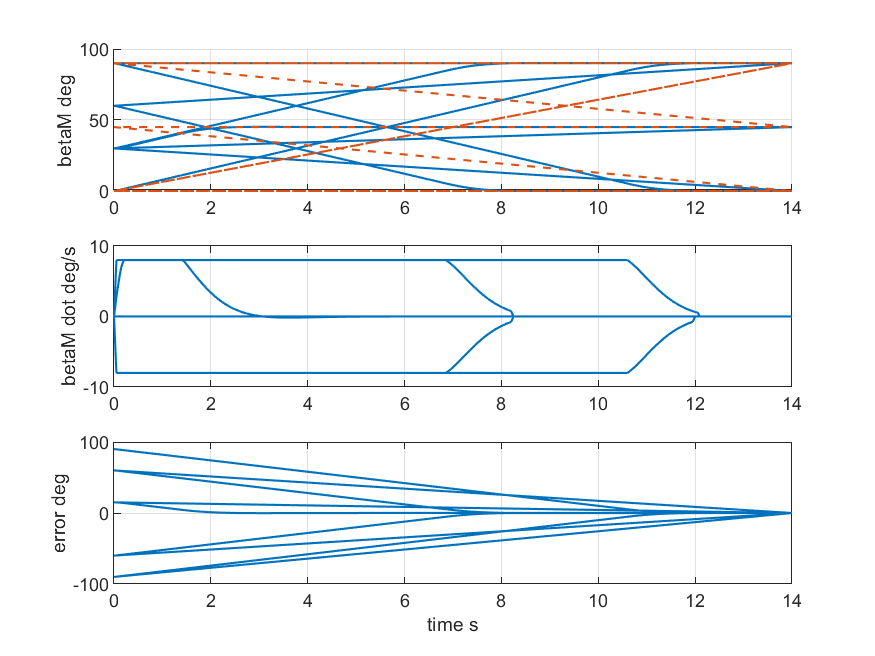
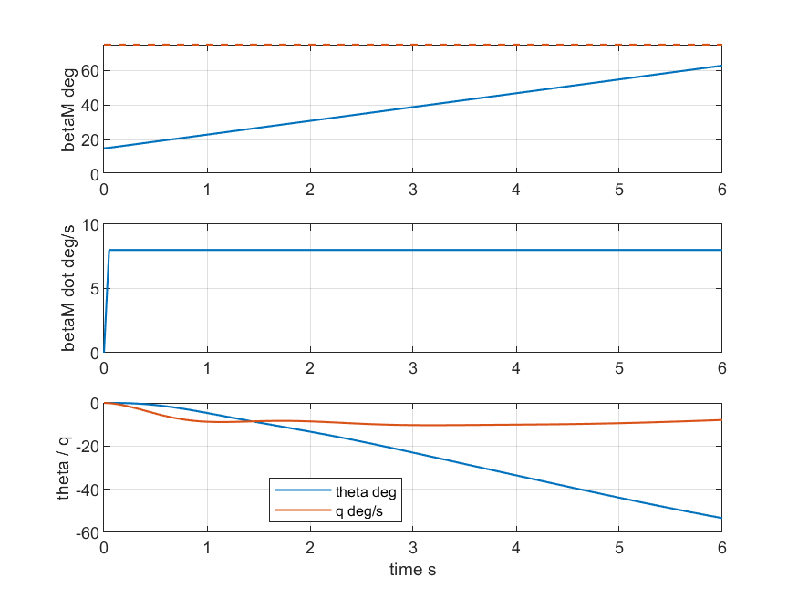

# Nacelle Dynamics Validation Report

Generated: 20260708T035937

This report validates the Phase 1 opt-in symmetric nacelle dynamic-state extension. It is not a Berger 51-state reproduction and not a complete real conversion-flight simulation.

## Scope

- Default remains disabled: `P.nacelleDynamics.enabled = false`.
- Legacy 9-state path remains the main path.
- Enabled path uses 11 states: `[u v w p q r phi theta psi betaM betaM_dot]`.
- betaM convention: 0 deg helicopter, 90 deg airplane.
- 8 deg/s is used as the default nacelle-rate scale reference.
- Endpoint betaM=0/90 deg linearization has medium clamp risk.

## Legacy Default Checks

| case | state dimension | EOM length | max abs diff | status |
|---|---:|---:|---:|---|
| default parameter | 9 | NaN | NaN | PASS |
| disabled EOM invariance | 9 | 9 | 0 | PASS |
| default trim dimension | 9 | 9 | NaN | PASS |
| default linearization dimension | 9 | 9 | NaN | PASS |

## Actuator Checks

| case | command deg | clamped command deg | min beta deg | max beta deg | max actual beta dot deg/s | max rate-state deg/s | status |
|---|---:|---:|---:|---:|---:|---:|---|
| 0_to_90_deg | 90 | 90 | 0 | 90 | 8 | 8.43 | PASS |
| 90_to_0_deg | 0 | 0 | -0.000717 | 90 | 8 | 8.43 | PASS |
| 30_to_45_deg | 45 | 45 | 30 | 45.2 | 8 | 11.4 | PASS |
| 30_to_120_deg | 120 | 90 | 30 | 90.1 | 8 | 8.38 | PASS |
| 60_to_-20_deg | -20 | 0 | -0.0013 | 60 | 8 | 8.38 | PASS |

`max actual beta dot` is the EOM output `d(betaM)/dt`; the raw internal rate state is reported separately for diagnostics.

## Quasi-Static Equivalence

| case | V m/s | betaM deg | max abs diff | relative diff | status | note |
|---|---:|---:|---:|---:|---|---|
| V10_beta0 | 10 | 0 | 0 | 0 | PASS | endpoint clamp: medium linearization risk |
| V30_beta0 | 30 | 0 | 0 | 0 | PASS | endpoint clamp: medium linearization risk |
| V70_beta0 | 70 | 0 | 0 | 0 | PASS | endpoint clamp: medium linearization risk |
| V100_beta0 | 100 | 0 | 0 | 0 | PASS | endpoint clamp: medium linearization risk |
| V10_beta15 | 10 | 15 | 0 | 0 | PASS |  |
| V30_beta15 | 30 | 15 | 0 | 0 | PASS |  |
| V70_beta15 | 70 | 15 | 0 | 0 | PASS |  |
| V100_beta15 | 100 | 15 | 0 | 0 | PASS |  |
| V10_beta45 | 10 | 45 | 0 | 0 | PASS |  |
| V30_beta45 | 30 | 45 | 0 | 0 | PASS |  |
| V70_beta45 | 70 | 45 | 0 | 0 | PASS |  |
| V100_beta45 | 100 | 45 | 0 | 0 | PASS |  |
| V10_beta75 | 10 | 75 | 0 | 0 | PASS |  |
| V30_beta75 | 30 | 75 | 0 | 0 | PASS |  |
| V70_beta75 | 70 | 75 | 0 | 0 | PASS |  |
| V100_beta75 | 100 | 75 | 0 | 0 | PASS |  |
| V10_beta90 | 10 | 90 | 0 | 0 | PASS | endpoint clamp: medium linearization risk |
| V30_beta90 | 30 | 90 | 0 | 0 | PASS | endpoint clamp: medium linearization risk |
| V70_beta90 | 70 | 90 | 0 | 0 | PASS | endpoint clamp: medium linearization risk |
| V100_beta90 | 100 | 90 | 0 | 0 | PASS | endpoint clamp: medium linearization risk |

## 11-State Linearization

| case | A size | B size | finite real | f0 norm | status |
|---|---|---|---|---:|---|
| V70_beta15 | 11x11 | 11x7 | 1 | 7.52 | PASS |
| V70_beta45 | 11x11 | 11x7 | 1 | 18.7 | PASS |
| V70_beta75 | 11x11 | 11x7 | 1 | 22.3 | PASS |

## Dynamic Response Demonstration

The response uses a representative open-loop state and fixed controls. It only validates nacelle-dynamics connection and quasi-static aero/load variation with betaM. It does not represent complete real conversion flight; real conversion requires flight-control, pilot, and control-scheduling logic.

## Non-Goals

- No rCG_dot or rCG_ddot terms.
- No I_dot*omega term.
- No nacelle gyroscopic or torque reaction moments.
- No left/right independent nacelle states.
- No PID or torque actuator model.
- No blade modal states or dynamic inflow states.
- No closed-loop flight controller.
